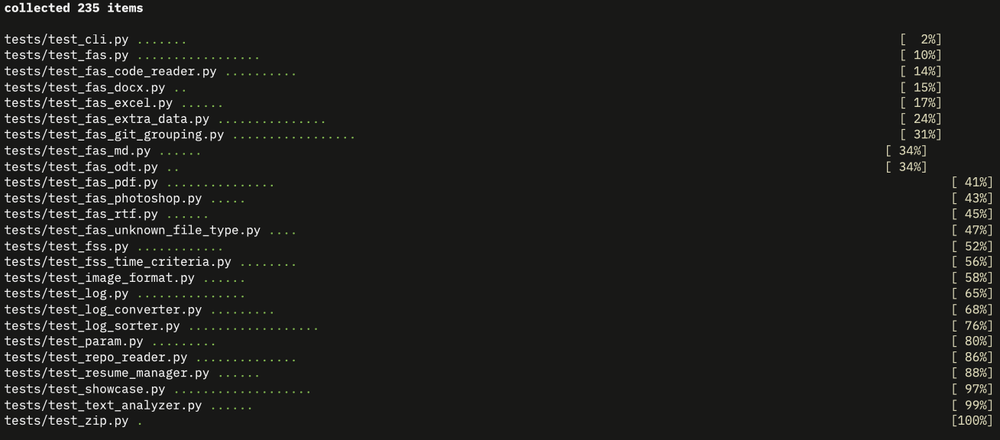

# Team 10 Capstone

## Authors

- Adam Badry
- Abdalla Abbas
- Bao Pham
- Brett Hardy
- Samuel Alexander
- Toby Nguyen

## Project Design Documents

- [System Architecture Diagram](docs/System%20Architecture%20Diagram.pdf)
  Outlines the structure of our project, highlighting the different services and processes and the relationships between them. The SAD shows how UI, File search, Analysis, and File export services communicate and interact with one another to mine and display file data.
- [Data Flow Diagram](docs/Data%20Flow%20Diagram.pdf) Illustrates the flow of data throughout the project components and data stores. The DFD shows where information is gathered from and the processes and data stores it flows through. The DFD includes data from user input, data gathered from user selected files, and formated and polished data ready to be displayed to the user.

- [Work Breakdown Structure](docs/Work%20Breakdown%20Structure.md)

our work breakdown structure is managed by our github issues. We start with our base requirements that are blocked by all tasks required to complete them. when all tasks underneath are completed the requirement may be marked as completed. this also means that when bugs are discovered we can mark the requirement as uncompleted and blocked by the new bug. this lets us clearly mark which bugs affect which requirements, and the steps needed to fulfill the high level requirements.

## Project Conventions and Guide for Contribution

### Naming Conventions

#### Variables & Functions:

Use snake_case (lowercase, words separated by underscores).
Example: user_name, calculate_total()

#### Classes:

Use PascalCase (capitalize each word, no underscores).
Example: UserProfile, DataProcessor

#### Constants:

Use UPPER_CASE with underscores.
Example: MAX_RETRIES, DEFAULT_TIMEOUT

#### Modules & Files:

Use snake_case.
Example: data_loader.py, utils.py

#### Private Members:

Prefix with a single underscore.
Example: \_internal_method, \_hidden_variable

### Readable Code Practices

#### Type Systems

- Each declaration shall have a explicit type hint for any variables, as well as function return types
  Example:

```python
def numbers_equal(number_1: int, number_2: int) -> bool:
    return number_1 == number_2
```

#### Indentation:

- Tab size shall be 4 spaces per indentation level.

#### Line Length:

- Avoid Text wrap where possible

#### Whitespace:

- Use blank lines to separate functions, classes, and logical sections.

#### Comments:

- Avoid descriptive comments where necessary to avoid comment drift.
  Code should be easily readable and understandable independent of comments

#### Descriptive Names:

- Use meaningful names that describe the purpose of the variable, function, or class.

#### NO Magic Numbers:

- Assign numbers to meaningfully named constants (no using i or j for loops)

### Pull requests

#### Link a ticket being closed

Each PR shall have in its description "closes #XX" Where #XX is the ticket the PR addresses.
This links the PR to the issue and automatically closes the issue when the PR is approved

#### PRs require at least two reviewers to close and merge.

at least two reviewers must leave comments on a PR before merging


## Executable 

https://drive.google.com/file/d/1nfOP5ydFjc_UchZCk-IQdJgh-n_Pbg0N/view?usp=sharing for Windows

https://drive.google.com/file/d/1OpmblqmcAyIjlX-BpohVbUaE9TVawXA1/view?usp=sharing for MacOS

Or navigate to utils/installation and use the appropriate batch file

NOTE - this will install the files in the folder that the batch file is currently in

## Setup

### WARNING: USE PYTHON 3.12.X OR NEWER

1. Clone the repo:
   git clone <repo-url>
   cd capstone-project-team-10

2. Create and activate a virtual environment:
   python3 -m venv venv
   source venv/bin/activate

3. Install dependencies:
   pip install -r requirements.txt

4. Install nltk
   Run the python script at utils/setup_nltk_data.py
   This will install all dependencies for the nltk library

5. Run the app or tests as needed, the app must be run as a module.

## Running the app

### With CLI

```sh
python src/main.py --cli

```

```sh

python -m src.main <file_path> [command-line-options] --cli

```

- `<file_path>`: Path to start scanning, or a zip file to extract.

---

#### Options

| Option                           | Description                                                                                                                     | Example                                         |
| -------------------------------- | ------------------------------------------------------------------------------------------------------------------------------- | ----------------------------------------------- |
| `<filepath>`                     | Extract the specified directory or file and scan its contents.                                                                  | `myprojects.zip`                                |
| `--exclude-paths <paths>`        | Space-separated list of absolute paths to exclude from the scan.                                                                | `--exclude-paths /path/to/folder /path/to/file` |
| `--file-types <types>`           | Space-separated list of file types to include (by extension, e.g. `py`, `md`, `pdf`).                                           | `--file-types py md pdf`                        |
| `-y`, `--yes`                    | Automatically grant file access permission (skip interactive prompt).                                                           | `-y`                                            |
| `-r`, `--resume_entries`         | Generate a PDF resume from scanned projects. Optionally specify a directory to save the result.                                 | `-r` or `-r /path/to/save`                      |
| `-p`, `--portfolio_entries`      | Generate a web portfolio from scanned projects. Optionally specify a directory to save the result.                              | `-p` or `-p /path/to/save`                      |
| `-t`, `--skill_timeline_entries` | Generate a PDF of key skills from scanned projects, ordered chronologically. Optionally specify a directory to save the result. | `-t` or `-t /path/to/save`                      |
| `-i`, `--no_image`               | Disable rendering of project images when generating resumes and portfolio pages. Enabled by default. Only use with -r or -p     | `-i -r` or `-p -i`                              |
| `-c`, `--clean`                  | Start a new log file instead of resuming the last one.                                                                          | `-c`                                            |
| `-s`, `--sort`                   | Indicates to prompt the sort after a log creation                                                                               | `python -m src.main /path/to/save -s --cli`     |
| `-b`, `--before <date>`          | Only include files created before the specified date (`YYYY-MM-DD`).                                                            | `-b 2023-01-01`                                 |
| `-a`, `--after <date>`           | Only include files created after the specified date (`YYYY-MM-DD`).                                                             | `-a 2022-01-01`                                 |
| `-q`, `--quiet`                  | Suppress output (except for log file location).                                                                                 | `-q`                                            |
| `-g`, `--github_username`        | When scanning git repos only scan commits related to this username.                                                             | `-g username`                                   |

---

#### Examples

##### Scan a Directory

```sh
python -m src.main /path/to/projects
```

##### Scan and Exclude Paths

```sh
python -m src.main /path/to/projects --exclude-paths /path/to/sub/projects /path/to/sub/projects2
```

##### Scan Only Python and Markdown Files

```sh
python -m src.main /path/to/projects --file-types py md
```

##### Scan Files Created After a Certain Date

```sh
python -m src.main /path/to/projects --after 2022-01-01
```

##### Extract a Zip File and Scan

```sh
python -m src.main --zip myprojects.zip
```

##### Generate Resume PDF

```sh
python -m src.main /path/to/projects -r
```

Or specify a directory to save the resume:

```sh
python -m src.main /path/to/projects -r /path/to/save
```

##### Generate Portfolio Website

```sh
python -m src.main /path/to/projects -p
```

Or specify a directory to save the portfolio:

```sh
python -m src.main /path/to/projects -p /path/to/save
```

##### Generate Key Skills

```sh
python -m src.main /path/to/projects -t
```

Or specify a directory to save key skills:

```sh
python -m src.main /path/to/projects -t /path/to/save
```

##### Suppress Output

```sh
python -m src.main /path/to/projects -q
```

---

#### Notes

- If you do not use `-y`/`--yes`, you will be prompted for file access permission.
- The log file location will be printed at the end of the scan.
- Resume and portfolio generation require valid output directories, the default storage location is set by the params. The users downloads folder is the current default.

---

#### Troubleshooting

- No output? Use `-q` only if you want minimal output.
- Permission denied? Use `-y` to skip the prompt.
- Date filters not working? Ensure dates are in `YYYY-MM-DD` format.
- File types not filtering? Use extensions without the dot (e.g., `py`, not `.py`).

### With GUI

```sh
python src/main.py

```

## Parameters

The parameter service works by keeping a JSON object to parse and read from during operation.
To add new parameters they must be added to the param_defaults.json file located in the param folder(src/param/param_defaults.json)

To new parameters must fall under a category as layed out in the param_defaults.json file, new categories may be added to the root of the JSON object as needed.

parameters may be read and written using the provided functions in the param.py file located in the param folder(src/param/param.py)
The Key string is delimited by periods to indicate category levels.
For example to read the "project_name" parameter under the "config" object can be addressed by config.project_name

### Functions

get(key: str)
set(key: str, value: Any)
remove(key: str)
clear()
load_defaults()

## Resume and Portfolio Outputs

the resume and web portfolio are managed by the showcase.py Modules.
They are saved to the users downloads folder by default, but that can be changed by changing the export_folder_path global variable in the params. This is done so that the export folder defaults back to downloads on start up but can be changed during runtime, according to the users preference.

either a resume or portfolio can be generated by calling the generate_resume() or generate_portfolio() functions in the showcase.py module.

This should only be called after Analysis is complete and the results have been post processed(sorted, ranked, etc). It just does a line by line output of the final results to build the resume and portfolio. so garbage in the analysis results will lead to garbage in the resume and portfolio outputs.

## Testing

### Writing Unit tests

Testing framework is pytest
All test files shall start with "test\_"
and follow the formatting below

```python
class TestExample:
    def test_example(self):
        # Test Content
    def test_example2(self):
        # Test Content
```

Each component under test shall have its own "test\_" file to make readability and searching for tests easier

### Running the Unit tests

Use the following command to run the test suite

```sh
python -m pytest -q
```

## Building (Incomplete)

This Project uses pyinstaller for its build path. This should have been installed if you ran the setup correctly

### Building the app (Incomplete)

The following command will need to be run on each operating system the app will be compiled for when releasing
The resulting app is packaged with the python interpretter making the end user experience very clean. It also makes the file size abnormally large

```sh
pyinstaller --onefile --add-data "resources:resources" src/main.py --windowed

```

## Other Notes

To run the text_analysis.py make sure you run setup_nltk_data.py first.

## Milestone 1 Compliance

### - [X] Require the user to give consent for data access before proceeding

    - The User must indicate consent via the CLI flag `-y` or `--yes` to proceed without prompt
    - if the user does not include the -y flag they will be prompted to give consent before proceeding

### - [X] Parse a specified zipped folder containing nested folders and files

    - The CLI flag `--zip <zipfile>` allows the user to specify a zip file to extract and scan

### - [X] Return an error if the specified file is in the wrong format

    - If the specified file is not a zip file an error message is returned and the program exits

### - [X] Request user permission before using external services (e.g., LLM) and provide implications on data privacy about the user's data

    - There are no external services used in Milestone 1

### - [X] Have alternative analyses in place if sending data to an external service is not permitted

    - All analyses are done locally in Milestone 1

### - [X] Store user configurations for future use

    - User configurations are stored using the param system, and stored in json format

### - [X] Distinguish individual projects from collaborative projects

    - Collaborative projects are identified by the presence of multiple authors in git commit history
    - Users can filter out their own commits using the -g flag to set their own username

### - [X] For a coding project, identify the programming language and framework used

    - Programming languages are identified by file extension
    - frameworks/libraries are identified by the imports used in the code files

### - [X] Extrapolate individual contributions for a given collaboration project

    - An individuals contributions to git projects are distinguished from othe contributors in the project such as
        - number of commits,
        - lines added/removed,
        - and commit objectives

### - [X] Extract key contribution metrics in a project, displaying information about the duration of the project and activity type contribution frequency (e.g., code vs test vs design vs document), and other important information

    - Contribution metrics are extracted from git commit history, including number of commits, lines added/removed, and commit objectives
    - Files tracked by the git project that were worked on by the user are scanned and included as skill indicators.

### - [X] Extract key skills from a given project

    - Skills are extracted using a combination of Natural Language processing and keyword matching from a predefined skill set (For programming libraries and frameworks)

### - [X] Output all the key information for a project

    - Key information is saved to a log file in csv for further processing

### - [X] Store project information into a database

    - Project information is stored in a local csv log that are managed by the log service. This acts as a simple database for storing project information

### - [X] Retrieve previously generated portfolio information

    - Previously generated portfolios are saved to the users drive, and may be retrieved by the user
    - Portfolio may be regenerated from previous logs

### - [X] Retrieve previously generated résumé item

    - Previously generated resumes are saved to the users drive, and may be retrieved by the user
    - Resumes may be generated from previous logs

### - [X] Rank importance of each project based on user's contributions

    - Git projects receive an importance based on the users contributions

### - [X] Summarize the top ranked projects

    - Projects can be sorted and displayed by importance

### - [X] Delete previously generated insights and ensure files that are shared across multiple reports do not get affected

    - The user may start a new log file using the -c or --clean flag, this will create a new log file and not affect any previously generated insights, or allow previous results to affect the current scan

### - [X] Produce a chronological list of projects

    - The user may generate a chronological list of projects using the -t or --skill_timeline_entries flag

### - [X] Produce a chronological list of skills exercised

    - The user may generate a chronological list of projects using the -t or --skill_timeline_entries flag

#### Tickets for "Functional Requirements" Have been closed if they have been met by current functionality

## Milestone 2 Compliance:

### "API" Compliance

Because of how our project design differs from other groups its very important that we highlight the seperation of the Backend functionality and the front-end processing. To fulfill this requirement we are required to use singular functions with arguments as entry points for functionality.

Good examples of this are the FSS and FAS usage, calling the function with arguments gives a single output that is usable by the GUI

Since we are not using a web-app we do not have to fulfill requirement #31 "Use a FastAPI to faciliate the communication between the backend and the frontend"

The API requirements we must fulfil are

#### POST /projects/upload:

- [x] the FSS must be reworked to call the zip extractor itself

Fulfilled by PR: https://github.com/COSC-499-W2025/capstone-project-team-10/pull/221

#### POST /privacy-consent

- [x] Fulfilled by the GUI call to display the privacy prompt

Fulfilled by PR: https://github.com/COSC-499-W2025/capstone-project-team-10/pull/177

#### GET /projects

- [x] Fulfilled by having the GUI access lines from the log file through the log API

Fulfilled by PR: https://github.com/COSC-499-W2025/capstone-project-team-10/pull/200

#### GET /projects/{id}

- [x] Fulfilled by having the GUI access lines from the log file through the log API and the showcase page

Fulfilled by PR: https://github.com/COSC-499-W2025/capstone-project-team-10/pull/250

#### GET /skills

Some additional work may need to be completed for this feature, as we could create a different log to store extracted skills but this may require a
non-trivial amount of rework for the CLI

- [x] Skills are viewable in the GUI

Fulfilled by PR: https://github.com/COSC-499-W2025/capstone-project-team-10/pull/240

#### GET /resume/{id}

- [x] completed

Fulfilled by PR: https://github.com/COSC-499-W2025/capstone-project-team-10/pull/219

#### POST /resume/generate

- [x] Fulfilled by Showcase functionality

PR: https://github.com/COSC-499-W2025/capstone-project-team-10/pull/251

#### POST /resume/{id}/edit

- [x] New Showcase functionality is needed to facilitate the editing of resume objects

Fullfilled by PRs:

- https://github.com/COSC-499-W2025/capstone-project-team-10/pull/220
- https://github.com/COSC-499-W2025/capstone-project-team-10/pull/207

#### GET /portfolio/{id}

- [x] completed

Fulfilled by PR: https://github.com/COSC-499-W2025/capstone-project-team-10/pull/219

#### POST /portfolio/generate

- [x] Fulfilled by Showcase functionality

#### POST /portfolio/{id}/edit

- [x] New Showcase functionality is needed to facilitate the editing of portfolio objects

Fullfilled by Log edit API and PR:

- https://github.com/COSC-499-W2025/capstone-project-team-10/pull/207

### Other Milestone 2 requirements

#### - [X] Allow incremental information by adding another zipped folder of files for the same portfolio or résumé that incorporates additional information at a later point in time

Logs allow for incremental scans.

#### - [X] Recognize duplicate files and maintains only one in the system

System does not maintain files from user-space in its own database

#### - [X] Allow users to choose which information is represented (e.g., re-ranking of projects, corrections to chronology, attributes for project comparison, skills to highlight, projects selected for showcase)

Fulfilled by PRs:

- https://github.com/COSC-499-W2025/capstone-project-team-10/pull/193
- https://github.com/COSC-499-W2025/capstone-project-team-10/pull/197

#### - [X] Incorporate a key role of the user in a given project

Uncertain what this means, but we do create user specific skills and outcomes for collaborative projects.

#### - [X] Incorporate evidence of success (e.g., metrics, feedback, evaluation) for a given project

Users measures of success (amount of contributions, and skills contributed) are recorded for collaborative projects

#### - [X] Allow user to associate a portfolio image for a given project to use as the thumbnail

Fulfilled by PR: https://github.com/COSC-499-W2025/capstone-project-team-10/pull/246

#### - [X] Customize and save information about a portfolio showcase project

Fulfilled by PR's:

- https://github.com/COSC-499-W2025/capstone-project-team-10/pull/197
- https://github.com/COSC-499-W2025/capstone-project-team-10/pull/193

#### - [X] Customize and save the wording of a project used for a résumé item

Fulfilled by PR's:

- https://github.com/COSC-499-W2025/capstone-project-team-10/pull/197
- https://github.com/COSC-499-W2025/capstone-project-team-10/pull/193

#### - [X] Display textual information about a project as a portfolio showcase

Fulfilled by PR: https://github.com/COSC-499-W2025/capstone-project-team-10/pull/207

#### - [X] Display textual information about a project as a résumé item

Fulfilled by PR: https://github.com/COSC-499-W2025/capstone-project-team-10/pull/207

#### - [X] You need to provide at least two zipped test data files for the same project, one as a snapshot at an earlier point in time, and another as a snapshot later in time that could have additional/modified files, with the following directory structure:

test-data.zip:
./code_collab_proj/app/
./code_collab_proj/test/
./code_collab_proj/doc/
etc.

PR: https://github.com/COSC-499-W2025/capstone-project-team-10/pull/205

#### - [X] You need to provide at least one zipped test data file that has multiple projects, showcasing individual and collaborative projects. If you have code and non-code projects, be sure to provide test data for those too. The directory structure should resemble the following:

test-data.zip:
./code_indiv_proj/
./code_collab_proj/
./text_indiv_proj/
./image_indiv_proj/
etc.

PR: https://github.com/COSC-499-W2025/capstone-project-team-10/pull/205

#### - [X] Your API endpoints must be tested as if they are being called over HTTP but without running a real server, ensuring the correct status code and expected data.

Unclear how this applies to us, but our Unit tests do check outputs from their function calls

#### - [X] Your system must have clear documentation for all of the API endpoints

Completed in the API Documentation section of this README

### Notes and Rework Required After Assessment:

After carefully combing over the functionality it appears that the main areas that require rewrites are:

#### - [X] FSS

- Rework the function calls to be more API like
- Make the FSS responsible for processing zipped folders

Completed in PR: https://github.com/COSC-499-W2025/capstone-project-team-10/pull/202

#### - [X] Project Grouping rewrites

- Grouping will have to be rewritten to allow for customized project grouping

Completed in PR: https://github.com/COSC-499-W2025/capstone-project-team-10/pull/203

#### - [X] Logging and FAS rewrites

- We may require rewriting how the logs/FileAnalysis objects are structured to allow for customized project grouping
  shift away from logging individual files and logging "Projects" that contain files. the file analysis can remain but must be encapsulated.
  Where this encapsulation happens is up to the developer, I do suggest moving it into the FAS though to keep the logging dynamic
- May require rewrites to support attaching an image to a project.

Completed in PR's:

- https://github.com/COSC-499-W2025/capstone-project-team-10/pull/197
- https://github.com/COSC-499-W2025/capstone-project-team-10/pull/193

#### - [X] Showcase rewrites

- Showcase may have to have its own logging system to allow for modification, without influencing the scan logs, or being overwritten by future updates. this depends on how modification is implemented, and can change. Two birds can be killed with one stone by implementing the versioning and saving of generated outputs inside the application data. This may have adverse effects on the user if saving lots of info, so I suggest implementing a hard ceiling of 10 resumes to persist, any new ones generated delete the oldest one. We can have this parameterized for user control.
- We are also going to have to make it more "resume" like with fields for the user to enter other information about themselves

#### - [X] All backend functionality

- Ensure that "backend" functions are API like in nature, every class shall only have one function that can be called by the GUI/CLI
- Ensure that "backend" functions are documented like an API, with inputs, and expected outputs defined. Specifically focus on
    - Success -> Output
    - Failure -> Output

Status:

- [x] FAS
- [x] FSS
- [x] Log
- [x] Showcase
- [x] Zip

### GUI Development:

The GUI development/planning shall begin when the design is finalized

## API Documentation

### POST /projects/upload

To upload a project simply call the FSS search function. The FSS search function takes in an FSS_Search object that can be configured with the following parameters:

- input_path: Which contains the file path of the zip/directory meant to be scanned, this is the only required parameter for the FSS search function, all other parameters have default values that can be used if the user does not wish to configure them.

- excluded_path: This is a set of file paths that the user wishes to exclude from the scan, this can be used to exclude files that may contain sensitive information, or files that the user does not wish to be included in the analysis. This is an optional parameter and defaults to an empty set.

- file_types: This is a set of file types that the user wishes to include in the scan, this can be used to only include certain types of files that may be relevant to the analysis. This is an optional parameter and defaults to an empty set, which means that all file types will be included in the scan.

- time_lower_bound: datetime | None = None, This is a datetime object that represents the lower bound of the time range for the files to be included in the scan. This can be used to only include files that were created or modified after a certain date. This is an optional parameter and defaults to None, which means that there is no lower bound on the time range for the files to be included in the scan.

- time_upper_bound: datetime | None = None, This is a datetime object that represents the upper bound of the time range for the files to be included in the scan. This can be used to only include files that were created or modified before a certain date. This is an optional parameter and defaults to None, which means that there is no upper bound on the time range for the files to be included in the scan.

### POST /privacy-consent

- Privacy consent is handled by the GUI and CLI, requiring user consent before proceeding with any file access or analysis. The user can provide consent via the CLI flag `-y` or `--yes` to proceed without prompt, or they will be prompted to give consent before proceeding if the flag is not used. In the GUI, a privacy consent prompt is displayed to the user, and they must provide consent before proceeding with any file access or analysis.

### GET /projects -> log.follow_log()

- Project information is retrieved from the log file through the logging API, which acts as a simple database for storing project information. The GUI can access lines from the log file through the log API to display project information to the user.

### GET /projects/{id} -> log.get_project(project_id)

- This is currently fulfilled by having the GUI access lines from the log file through the log API and the showcase page. The log API has a function get_project(project_id) that retrieves project information based on the project ID, which can then be displayed to the user in the GUI.

### GET /skills -> showcase.generate_skill_timeline()

- This is currently fulfilled by calling the generate_skill_timeline function in the showcase. This takes the current active log and translates it into a skill timeline, which is a chronological list of skills exercised in the projects. This is then saved to the users parameter for offload, and can be accessed by the GUI to display the skill timeline to the user.

### GET /resume/{id} -> resume_manager.get()

- This is fulfilled by calling the get function from the resume_manager with the resume id, the resume manager will then return the resume object with a matching ID.

### POST /resume/generate -> showcase.generate_resume()

- This is fullfilled by a call to the generate_resume() function in the showcase module, which generates a resume PDF from the scanned projects. The generated resume is saved to the user's parameter for offload "showcase_export_path". This path defaults to the users downloads folder but can be changed by the user..

### POST /resume/{id}/edit -> log.update()

- Using the log update function with the line you would like to write, the logs are updated and then showcase items can be regenerated by calling their respective function to reflect the changes made by the user. This allows for a more dynamic and interactive experience for the user when editing their resume information. the update function takes in a FileAnalysis type object.

The FileAnalysis object has the following parameters:

- file_path: str,
- file_name: str,
- file_type: str,
- last_modified: str,
- created_time: str,
- extra_data: Optional[Any] = None,
- importance: float = 0.0,
- customized: bool = False,
- project_id: Optional[str] = None,

### GET /portfolio/{id} -> resume_manager.get()

- This is fulfilled by calling the get function from the resume_manager with the resume id, the resume manager will then return the resume object with a matching ID.

### POST /portfolio/generate showcase.generate_portfolio()

- this is fullfilled by a call to the generate_portfolio() function in the showcase module, which generates a portfolio website from the scanned projects. The generated portfolio is saved to the user's parameter for offload "showcase_export_path". This path defaults to the users downloads folder but can be changed by the user.

### POST /portfolio/{id}/edit -> log.update()

- Using the log update function with the line you would like to write, the logs are updated and then showcase items can be regenerated by calling their respective function to reflect the changes made by the user. This allows for a more dynamic and interactive experience for the user when editing their resume information. the update function takes in a FileAnalysis type object.

The FileAnalysis object has the following parameters:

- file_path: str,
- file_name: str,
- file_type: str,
- last_modified: str,
- created_time: str,
- extra_data: Optional[Any] = None,
- importance: float = 0.0,
- customized: bool = False,
- project_id: Optional[str] = None,

## API Testing

API testing is currently done through unit tests, which test the functionality of the API endpoints by calling the respective functions and checking their outputs.

Our testing suite can be run using the following command:

```sh
python -m pytest -q
```

for more verbose output, simply remove the -q flag:

```sh
python -m pytest
```

All tests are stored in the src/tests folder, and are organized by API. Each test file starts with "test\_" and contains a class that also starts with "Test\_" followed by the name of the API being tested. Each test function within the class starts with "test\_" and tests a specific functionality of the API.

Milestone 2 Presentation link: https://docs.google.com/presentation/d/1M87aeStGNRQF6zvMkJJcOk76a_6EyGdyV-xHyRwfgJQ/edit?usp=sharing

## Testing Practices:

For this project, our primary focus was on automated unit and integration testing, ensuring that the results of any given action were well-defined and accurately reflected the intended functionality. In cases where automated testing was impractical or not cost-effective, we employed manual testing following the same rigorous standards. Manual testing was reserved for user-facing aspects of the application, allowing us to evaluate both user experience and functionality simultaneously. Below is a summary of our modules, test files, and what they test. We have a total of 235 tests, for more detail about how tests work, please refer to the linked files in the tests folder.

## Testing Summary:

### Cli Testing

#### Files:

- `tests/test_cli.py`

#### Testing Summary:

This test suite verifies the command-line interface (CLI) logic of the application. It uses mock classes and monkeypatching to isolate CLI behavior from external dependencies. The tests cover:

- **Argument Parsing:** Ensures CLI arguments (file path, excluded paths, file types, etc.) are parsed and assigned correctly.
- **User Prompts:** Checks that user input to permission prompts is handled as expected, including proper exit behavior.
- **Main CLI Workflow:** Simulates running the CLI with various argument combinations, verifying that output includes (or omits, in quiet mode) information about excluded paths, file types, resume/portfolio generation, date bounds, GitHub username, log file location, and completion messages.
- **Image Allowance Flag:** Confirms that the `--image_allow` flag and its absence correctly affect downstream resume and portfolio generation logic.

Overall, these tests ensure the CLI responds correctly to user input, arguments, and flags, and that it produces the expected output or suppresses it when requested.

### FAS Testing:

#### Files:

- `tests/test_fas.py`
- `tests/test_fas_code_reader.py`
- `tests/test_fas_docx.py`
- `tests/test_fas_excel.py`
- `tests/test_fas_extra_data.py`
- `tests/test_fas_git_grouping.py`
- `tests/test_fas_md.py`
- `tests/test_fas_odt.py`
- `tests/test_fas_pdf.py`
- `tests/test_fas_photoshop.py`
- `tests/test_fas_rtf.py`
- `tests/test_fas_unknown_file_type.py`
- `tests/test_image_format.py`
- `tests/test_text_analyzer.py`
- `tests/test_repo_reader.py`

#### Testing Summary:

This test suite validates the functionality and robustness of the File Analysis System (FAS) module. Key areas covered include:

##### test_fas

- **File Analysis Output:** Ensures `run_fas` returns a valid `FileAnalysis` object with correct file name, type, creation/modification times, and handles non-existent files gracefully.
- **Git Repository Analysis:** Mocks Git repository analysis to verify extraction and structure of metadata such as author, subject, commit stats, and extra data.
- **Importance & Extra Data:** Checks that the `importance` attribute exists and is numeric, and that `extra_data` is present and JSON serializable.
- **File Type Detection:** Tests detection of file types for files with/without extensions, dotfiles, and Makefile-style names, ensuring unknown types are handled as expected.
- **File Hashing:** Verifies that identical files produce the same hash, different files produce different hashes, and non-existent files return `None`.
- **Error Handling:** Ensures appropriate exceptions are raised for missing files and unknown file extensions.

##### test_fas_code_reader

- **Language Detection & Extraction:** Validates that the `CodeReader` correctly identifies file types and extracts relevant information for Python, JavaScript, C, C++, Java, TypeScript, Go, and Rust files.
- **Library Extraction:** Checks that imported libraries or dependencies are accurately detected for each language.
- **Complexity Analysis:** Verifies that the estimated algorithmic complexity is extracted and matches expected values.
- **OOP Structure Extraction:** Confirms that object-oriented programming elements (such as classes and functions, including a function named "helper") are correctly identified and parsed for each supported language.

##### test_fas_docx

- **Content Extraction:** Ensures that `extract_docx_data` correctly retrieves metadata (author, title, subject, creation/modification dates, etc.), document statistics (paragraphs, tables, characters, words, unique words, sentences), and advanced metrics (lexical diversity, top keywords, sentiment, summary, complexity, depth, structure, and sentiment insight).
- **Error Handling:** Confirms that attempting to extract data from an invalid or non-`.docx` file returns an error message in the result.

These tests ensure the FAS module reliably analyzes files, extracts metadata, handles edge cases, and produces consistent, serializable results.

##### test_fas_excel

- **Sheet Analysis:** Ensures correct detection of sheet count and names, and validates per-sheet statistics such as row/column counts, formula and merged cell counts, and chart detection.
- **Workbook Metadata:** Checks extraction of document properties including creator, last modified by, title, subject, keywords, category, and description.
- **Chart Detection:** Confirms that charts embedded in sheets are accurately counted and reported.
- **Key Skills Extraction:** Verifies that relevant skills (e.g., Analytical Skills, Excel Proficiency, Data Visualization) are identified based on workbook content.
- **Error Handling:** Ensures that invalid or corrupted Excel files return an appropriate error message.

##### test_fas_extra_data

- **Feedback-to-Skill Mapping:** Ensures that different feedback strings are correctly mapped to corresponding skill labels, including handling of unknown or empty feedback.
- **Code File Analysis:** Mocks code file analysis to verify extraction of language, libraries, key skills (such as OOP and algorithmic complexity), and ensures correct handling for code files.
- **Markdown Handling:** Mocks Markdown file analysis to check extraction of headers, word counts, paragraphs, and verifies the presence of expected metadata.
- **PDF/DOCX Metadata Processing:** Verifies that summary cleanup (removal of newlines) and skill extraction from complexity and sentiment metadata are performed correctly.
- **Unsupported File Types:** Ensures that unsupported file types return fallback data with key skills present.
- **JSON Serializability:** Confirms that the extra data produced for any file type is JSON serializable.

##### test_fas_git_grouping

- **Repository Addition:** Ensures repositories can be added with default or custom IDs, and that the resulting metadata includes authors, titles, creation/modification dates, commit analysis, and file analysis.
- **File Extraction:** Verifies correct extraction and filtering of repository files, including handling of `.git` suffixes and exceptions.
- **Date Extraction:** Tests extraction of repository creation and modification dates, including cases with no commits or exceptions.
- **Commit Analysis:** Validates calculation of total commits, insertions, deletions, net change, and categorization of commit messages (e.g., fix, feature, docs, refactor, style, other), including case-insensitive handling and empty input.
- **Internal State:** Confirms the correct initialization and updating of internal state for repositories, files, and commits, including handling multiple repositories.
- **Error Handling:** Ensures robust handling of exceptions and edge cases throughout repository and file analysis.

##### test_fas_md

- **Header Extraction:** Ensures that headers and their hierarchy (including text and level) are correctly identified and extracted.
- **Header Hierarchy:** Validates that the header structure is returned as a list of strings representing the document outline.
- **Word Count:** Checks that the total word count is accurately computed and is within a reasonable range.
- **Code Block Detection:** Confirms that code blocks are detected and their languages (e.g., Python, R) are correctly identified.
- **Paragraph Extraction:** Verifies that paragraphs or skill lists are extracted as lists of strings.
- **Integration & Data Structure:** Ensures that all extraction methods return data in the expected formats (dicts, lists, sets, integers) and that integration across methods is consistent.

##### test_fas_odt

- **Content Extraction:** Ensures that `extract_odt_data` correctly retrieves metadata (author, title, subject, creation/modification dates), document statistics (paragraphs, characters, words, unique words, sentences), and advanced metrics (lexical diversity, top keywords, sentiment, named entities, summary, complexity, depth, structure, and sentiment insight).
- **Error Handling:** Confirms that attempting to extract data from an invalid or non-`.odt` file returns an error message in the result.

##### test_fas_pdf

- **File Existence & Type Handling:** Ensures appropriate error messages are returned for missing or invalid files.
- **Metadata Extraction:** Validates extraction of file path, file size, and PDF metadata fields (author, creator, producer, title, subject, keywords).
- **Content & Structure Analysis:** Checks extraction of text, page count, word and character counts, and ensures that counts for images, tables, and hyperlinks match the actual lists extracted.
- **Multi-Page & Edge Case Handling:** Verifies correct handling of multi-page PDFs, PDFs with no tables/links/images, and ligature handling in text extraction.
- **Text Analysis:** Confirms extraction of top keywords, unique word count, sentence count, lexical diversity, filtered word count, sentiment, summary, complexity, depth, structure, and sentiment insight.
- **Integration & Consistency:** Ensures all extracted data is consistent and in the expected format.

##### test_fas_photoshop

- **Basic Metadata Extraction:** Ensures that basic metadata (such as width) is extracted and that the result is a dictionary containing expected keys.
- **ICC Profile & Compression:** Checks for the presence of ICC profile and compression fields in the extracted metadata, or appropriate error handling if unavailable.
- **Layer Metadata:** Verifies that layer information is extracted as a dictionary when present, or that errors are reported for unsupported or invalid files.
- **Document Info Fields:** Confirms extraction (or error reporting) of additional document information such as resolution info, XMP metadata, and thumbnail.
- **Error Handling:** Ensures that invalid or corrupted Photoshop files return an error message in the result.

##### test_fas_rtf

- **Datetime and Data Extraction:** Ensures correct extraction of creation/modification datetimes and specific metadata fields from RTF content, including handling of missing data.
- **Content Extraction:** Validates extraction of author, title, subject, creation/modification dates, character/word/paragraph counts, filtered and unique word counts, sentence count, lexical diversity, top keywords, sentiment, named entities, summary, complexity, depth, structure, and sentiment insight.
- **Error Handling:** Confirms that invalid or non-existent RTF files return an error message in the result.

##### test_fas_unknown_file_type

- **Generic Metadata Extraction:** Ensures that files with unknown extensions return safe, generic metadata instead of causing errors or returning `None`.
- **Empty File Handling:** Confirms that empty files with unknown types still return valid metadata with appropriate zero-length content.
- **Binary Content Handling:** Verifies that binary-like content in unknown file types does not raise exceptions and is handled gracefully.
- **JSON Serializability:** Ensures that the metadata produced for unknown file types is always JSON serializable for safe storage or transmission.

##### test_image_format

- **Metadata Extraction:** Ensures correct extraction of file size, image format, width, height, and type-specific metadata for JPEG, PNG, GIF, WEBP, and TIFF images.
- **Format-Specific Checks:** Confirms detection of format-specific properties, such as color type for PNG, animation and frame count for GIF, and appropriate fields for other formats.
- **Error Handling:** Verifies that invalid or non-existent image files result in appropriate warnings without causing crashes.

##### test_text_analyzer

- **Initialization & Structure:** Ensures that the `TextSummary` class correctly initializes with text content and produces lists of sentences and words.
- **Empty String Handling:** Confirms that empty input is handled gracefully, returning neutral sentiment, empty summaries, and zero statistics.
- **Common Words Extraction:** Verifies that the most frequent words are correctly identified and counted.
- **Sentiment Analysis:** Checks that sentiment detection returns valid categories (positive, negative, neutral) and appropriate scores.
- **Summary Generation:** Ensures that text summaries are generated as non-empty strings when appropriate.
- **Named Entity Recognition:** Validates extraction of named entities, confirming correct identification of entity names and types (e.g., PERSON, GPE).

##### test_repo_reader

- **Repository Analysis:** Ensures correct extraction of authors, commit counts, commit content, and language statistics from mocked commit data.
- **Author Filtering:** Verifies that filtering by author returns only relevant commits, and that non-existent authors yield empty commit lists.
- **Commit Content Structure:** Confirms that commit metadata (author, date, message, insertions, deletions) is correctly structured and populated.
- **Initialization & State:** Tests repository initialization with and without author filters, and validates correct internal state for authors, languages, and commit content.
- **Language Detection:** Checks that file extensions are mapped to the correct programming languages, and that unknown or extensionless files are handled as "Other."
- **Exception Handling:** Ensures that exceptions during repository analysis clear internal state and do not cause crashes.
- **Edge Cases:** Tests handling of multiple commits from the same author, commits with zero changes, and empty repository states.

### FSS Testing

#### Files:

- `tests/test_fss.py`
- `tests/test_fss_time_criteria.py`
- `tests/test_zip.py`

#### Testing Summary

##### test_fss

- **Single File and Folder Scanning:** Ensures correct file count results when scanning individual files or entire directories.
- **Exclusion Handling:** Verifies that excluded files and folders are properly omitted from scan results.
- **Invalid Path Handling:** Confirms that invalid paths are handled gracefully and return the expected error code.
- **Delta Scanning:** Tests that previously scanned files are skipped in subsequent scans, and that modifications to files trigger re-scans.
- **Duplicate Detection:** Checks that duplicate files are detected using file hashes, and that non-duplicates are not falsely flagged.
- **Zip Archive Scanning:** Ensures that files within zip archives are scanned correctly, including support for file type filters (e.g., `.txt`, `.md`).

##### test_fss_time_criteria

- **Path Conversion:** Ensures that string paths are correctly converted to `Path` objects and that existing `Path` objects are returned unchanged.
- **Creation and Modification Time Extraction:** Verifies that file creation and modification times are accurately extracted from file metadata, using both primary and fallback attributes.
- **Time-Based Filtering:** Tests the `time_check` function for correct behavior when filtering files with both lower and upper bounds, only upper or lower bounds, or no bounds at all, for both creation and modification times.
- **Mocking and Edge Cases:** Uses mocking to simulate file metadata and confirms that the logic works correctly across various scenarios.

##### test_zip

- **Zip Extraction:** Ensures that valid zip files are extracted to the correct directory, with the resulting path matching expected naming conventions and directory structure.
- **Existence and Structure:** Confirms that the extracted directory exists and is properly located relative to the program's file path.
- **Error Handling:** Verifies that invalid zip paths or attempts to extract non-zip files return `None` and do not cause errors.

### Log Testing

#### Files:

- `tests/test_log.py`
- `tests/test_log_converter.py`
- `tests/test_log_sorter.py`

#### Testing Summary

##### test_log

- **Log File Creation and Writing:** Ensures log files are created, written, and appended correctly, with proper CSV formatting and expected content.
- **Log Continuation and Rotation:** Verifies correct behavior when resuming logs, handling maximum log file counts, and rotating/deleting old logs as needed.
- **Updating Log Entries:** Confirms that log entries can be updated, with safeguards against updating entries marked as customized.
- **Thread Safety:** Tests concurrent writing and reading of log files from multiple threads to ensure data integrity and correct output.
- **Log Following:** Validates the `follow_log` functionality for real-time log reading, including handling of close signals and multi-threaded updates.
- **Duplicate and Project Entry Retrieval:** Checks that duplicate file entries can be found by hash and that project-specific entries are correctly retrieved.
- **Internal Utilities:** Ensures helper functions for cleaning, setup, and log file discovery work as intended.
- **Error Handling:** Confirms that the system gracefully handles missing files, blocked updates, and other edge cases.

##### test_log_converter

- **CSV Loading:** Ensures CSV files (including empty ones) are loaded correctly, with proper parsing of headers and data.
- **JSON Conversion:** Confirms that log data can be converted to JSON, the output file is created, and the content is valid and structured as expected.
- **Markdown Conversion:** Verifies that log data can be converted to Markdown, the output file is created, and the content includes expected headers and data.
- **PDF Conversion:** Checks that log data can be converted to PDF, the output file is created, and is non-empty.
- **Multiple Conversions:** Ensures that multiple conversions (to JSON, Markdown, and PDF) can be performed together and all output files are generated.
- **Output Naming:** Confirms that converted files have the correct naming convention (e.g., `_converted.json`).
- **Error Handling:** Validates that attempting to load a non-existent file raises a `FileNotFoundError`.
- **Idempotency:** Ensures repeated conversions produce the same output file path and do not duplicate files unnecessarily.

##### test_log_sorter

- **Initialization and CSV Loading:** Ensures correct loading of log data from CSV files, including handling of empty and non-existent files.
- **Available Columns:** Confirms that only valid columns are available for sorting, and that excluded columns (like "Extra data") are not included.
- **Sorting Parameter Validation:** Verifies that sorting parameters are validated for existence, non-emptiness, and correct length, and that invalid parameters raise appropriate errors.
- **Sorting Functionality:** Tests sorting by single and multiple columns, including tie-breaking and order (ascending/descending).
- **Previewing Sorted Data:** Ensures that previews of sorted data are generated correctly, with the original data remaining unmodified.
- **CSV Export:** Confirms that sorted data can be exported to a new CSV file with the correct naming convention and content.
- **Error Handling:** Validates that errors are raised when attempting to sort or preview without parameters, or when initializing with invalid files.

### Param Testing

#### Files:

- `tests/test_param.py`

#### Testing Summary

##### test_param

- **Initialization and Clearing:** Ensures parameters are properly initialized and can be cleared, resetting the configuration state.
- **Parsing and Loading:** Verifies that parameters are correctly loaded from files, including handling of corrupted or missing parameter files, and that default configuration values are restored as needed.
- **Saving and Persistence:** Confirms that parameters can be saved and reloaded, and that changes persist across sessions.
- **Get/Set/Remove Operations:** Tests retrieval, setting, and removal of parameters, including correct handling of invalid keys and unsuccessful operations.
- **Error Handling:** Ensures robust handling of invalid JSON, missing files, and invalid operations without causing crashes.

### Showcase Testing

#### Files:

- `tests/test_showcase.py`
- `tests/test_resume_manager.py`

#### Testing Summary

##### test_showcase

- **Resume and Portfolio Generation:** Ensures that resumes (PDF) and portfolios (HTML/ZIP) are generated correctly from log data, and that output files are created in the expected locations.
- **Skill Timeline Generation:** Confirms that skill timeline PDFs are generated and saved as expected.
- **ShowcaseProject and ShowcaseProjectManager:** Tests the aggregation and management of project data, including adding files, skill extraction and ranking, date range calculation, and project inclusion/exclusion logic.
- **Project Sorting and Ranking:** Verifies that projects are sorted by rank and insertion order, and that skill lists are limited and sorted as specified.
- **Project Entry Handling:** Checks that project entries correctly set fields such as title, description, skills, rank, and inclusion flag, and that date ranges are managed appropriately.
- **Edge Cases and Warnings:** Ensures that non-list skill data triggers warnings, and that overrides for project skills work as intended.
- **File and Directory Management:** Validates setup and cleanup of test directories and files, including handling of mock git projects and output artifacts.
- **Integration with External Libraries:** Confirms that generated PDFs and HTML files contain expected content and structure by parsing with libraries like `pdfplumber` and `BeautifulSoup`.

##### test_resume_manager

- **Initialization:** Ensures that initializing the manager creates the necessary storage directories and index file.
- **Resume Creation:** Confirms that creating a resume copies the file to the storage location, assigns a unique ID, and updates the index with metadata.
- **Resume Retrieval:** Verifies that resumes can be retrieved by ID, and that non-existent IDs return `None`.
- **Listing and Sorting:** Checks that all resumes can be listed and sorted by ID, and that the results are accurate and ordered as expected.
- **Deletion:** Ensures that deleting a resume removes both the file and its entry from the index, and that attempting to delete a non-existent resume returns `False`.
- **Metadata Handling:** Confirms that metadata is correctly stored and retrievable for each resume.

### GUI Testing

#### Testing Summary

Because our GUI testing needed to be manual, testing was done whenever changes were made to UI elements or their containers that could have resulted in visual bug or integration issues. All features were tested in the following manner

- Proper usage
- Improper usage
    - Invalid data
    - No Data
    - improper order
- Resizing the window

And the outcomes were evaluated by the usability, response, and error recovery after the input.
For further documentation on GUI testing, please refer to the relevant PR's for changes to the GUI

## Test Report



## Known Bugs:

### existence of a .git file doesnt block other files from being scanned

#### Cost of fix:

Low cost. FSS should stop recursive search for folders that contain git, this is how the FSS was initially supposed to work

Ticket: https://github.com/COSC-499-W2025/capstone-project-team-10/issues/282

### Resume/Portfolio page doesn't refresh when a project is added in Dashboard

#### Cost of fix:

Low cost. Project page should call a refresh on the resume/portfolio page
Ticket: https://github.com/COSC-499-W2025/capstone-project-team-10/issues/281

### Heatmap doesn't work on zip extracted files

#### Cost of fix:

Unfixable, the way zip extraction works on Mac and windows erases the typical way of checking how files are modified, still works on zipped Git files

Ticket: https://github.com/COSC-499-W2025/capstone-project-team-10/issues/280

### NLTK is used to scan incompatible files, and floods the log with large entries

#### Cost of fix:

Low cost, stop scanning unsupported files, it is not necessary

Ticket: https://github.com/COSC-499-W2025/capstone-project-team-10/issues/279

### Switching off the scan page during a scan does not allow the user to view the progress of the scan

#### Cost of fix:

Low cost, Scan page state management should be done properly

Ticket: https://github.com/COSC-499-W2025/capstone-project-team-10/issues/278

### Large projects break the logging

#### Cost of fix:

Medium cost. during the initial design we were unaware that the csv reader library had a maximum file size. This bug can be fixed by using a better CSV library, or replacing the traditional log with an SQLlite database manager. The major problem is how .git attributes are written to logs, reducing that will reduce log size fixing this bug.

Ticket: https://github.com/COSC-499-W2025/capstone-project-team-10/issues/276

### Portfolio heatmap cant handle large spreads of dates without overflowing

#### Cost of fix:

Low cost. Heatmap should be created in pages with dates.

Ticket: https://github.com/COSC-499-W2025/capstone-project-team-10/issues/295


## Updated System Architecture Diagram

System Architecture Diagram:
