# Term 2 Week 1 (01/05/2026 - 01/11/2026):

## Completed tasks

All in review features will be merged by the end of the week

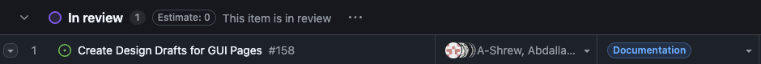

## Features

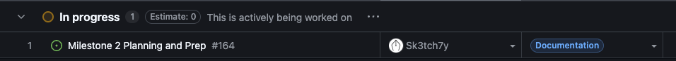

## Recap

#### 1. Created draft design for GUI.

The team was all asked to come up with ideas for how our GUI was going to look, this week we will be combining all the best ideas to make a
final design for the GUI layout

PR:
- https://github.com/COSC-499-W2025/capstone-project-team-10/pull/160

##### Tickets: 

1. https://github.com/COSC-499-W2025/capstone-project-team-10/issues/158

### For next week:

As we await finalized M2 and M3 requirements I will be doing project planning and creating a guide for how we can move forward improving our app.

Tickets and requirement adherence must be checked to ensure that we can move forward with milestone 2 and 3. I will be

- Selecting Code to be rewritten and creating tickets for it
- Creating Issues for new features and functionality that is needed in the backend
- Creating Issues for Non-compliance
- Creating Goals for GUI functionality (Outside of Course Requirements)

Ticket: https://github.com/COSC-499-W2025/capstone-project-team-10/issues/164

## Additional Context

No problems with my work

## Team Survey:

Survey completed

# Week 14 (11/30/2025 - 12/07/2025):

## Completed tasks

All in review features will be merged by the end of the week

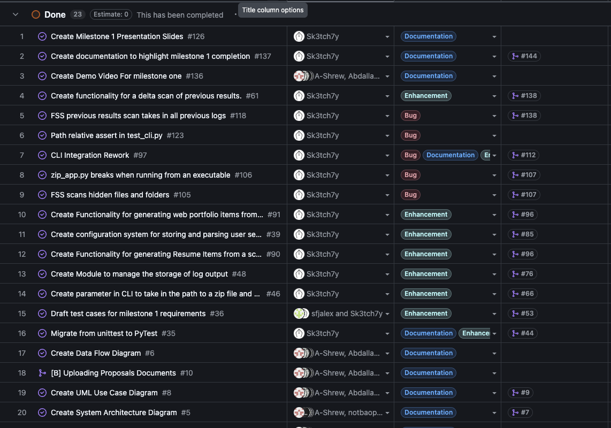
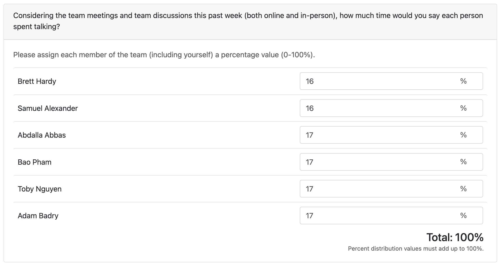

## Features

Nothing In progress - Winter break

## Recap

#### 1. PR: https://github.com/COSC-499-W2025/capstone-project-team-10/pull/144

- Created MD documentation for milestone compliance in the readme.md

#### 2. Video Demo.

- Recorded CLI --zip usage, error handling and -y/permission prompt usage

##### Tickets: 

1. https://github.com/COSC-499-W2025/capstone-project-team-10/issues/137
2. https://github.com/COSC-499-W2025/capstone-project-team-10/issues/136

### For next week:

Nothing - Winter Break

## Additional Context

No problems with my work

## Team Survey:

Survey completed

# Week 13 (11/23/2025 - 11/30/2025):

## Completed tasks

All in review features will be merged by the end of the week

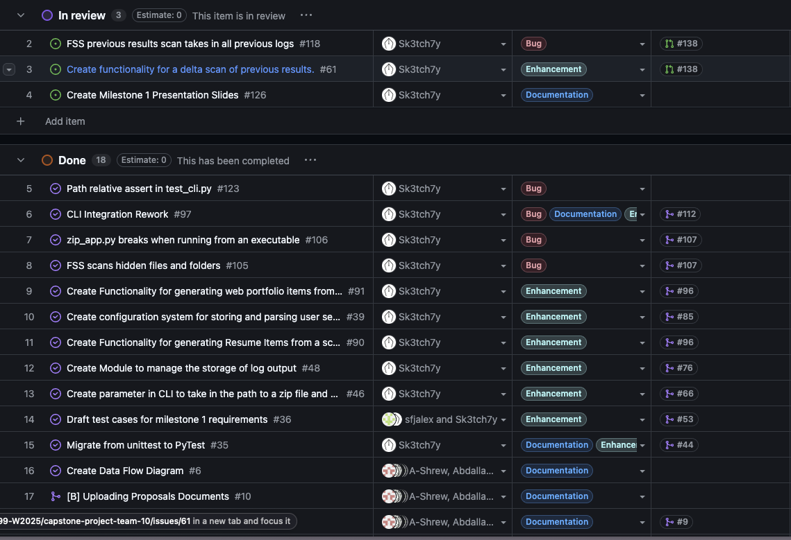

## Features

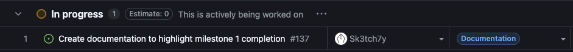

## Recap

#### 1. PR: https://github.com/COSC-499-W2025/capstone-project-team-10/pull/112

- Added logic to perform delta scanning in the search function, skipping files that have not changed since the last scan based on log data.
- Updated tests to cover delta scan scenarios and added setup/teardown for log files to ensure test isolation.

##### Tickets: 
- https://github.com/COSC-499-W2025/capstone-project-team-10/issues/118
- https://github.com/COSC-499-W2025/capstone-project-team-10/issues/61

#### 2. Milestone 1 presentation: https://github.com/COSC-499-W2025/capstone-project-team-10/issues/126

##### https://docs.google.com/presentation/d/1XbbpL8-pQWZaCGlv856EApih3Kqz07bX3TclOWLYgPc/edit?usp=sharing

I created the slides for our milestone 1 presentation, compiling a collection of examples and helpful images for us to present on. putting a 
focus on milestone 1 features

### For next week:

For the next week I will documenting our milestone 1 requirement compliance, in addition to ensureing that we are prepared for the next semester

#### Tickets

- https://github.com/COSC-499-W2025/capstone-project-team-10/issues/137

## Additional Context

No problems with my work, I did have to pick up some slack due to other teammates needing additional help. My original plan for this 
week was to complete a different ticket (https://github.com/COSC-499-W2025/capstone-project-team-10/issues/89) but another group member 
needed more coding work so I passed it off to them and took over the slides. I also rewrote a malfunctioning module for tickets
- https://github.com/COSC-499-W2025/capstone-project-team-10/issues/118 and 
- https://github.com/COSC-499-W2025/capstone-project-team-10/issues/61 

This was additional work that I was not expecting to be completing this week

## Team Survey:

Survey completed

# Week 12 (11/16/2025 - 11/23/2025):

## Completed tasks

## Features

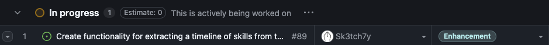

## Recap

#### 1. PR: https://github.com/COSC-499-W2025/capstone-project-team-10/pull/107

This PR's main goal was to fix bugs and issues found during testing of the FSS and CLI modules. in order to make our full test suite ready for review and the full pass testing it will have to undergo for the next two weeks.

Issues Fixed:

- zip extraction will now use the folder for files provided by the param service fixing bug with executable
- FSS now ignores hidden files, as they aren't useful for our purposes and break the search and search tests.
- Fixed paths in test files to be OS Relative with pathlib usage
- Removed Unused draft test files
- Added missing pandas library to requirements.txt
- Fixed code formatting(My editor does auto-formatting in accordance with the readme)

##### Ticket: https://github.com/COSC-499-W2025/capstone-project-team-10/issues/106

##### Ticket: https://github.com/COSC-499-W2025/capstone-project-team-10/issues/105

#### 2. PR: https://github.com/COSC-499-W2025/capstone-project-team-10/pull/112

The Purpose of this ticket was to tie in all the developed functionality into the CLI and ensure that all modules worked together as intended.

Changes made:

- Reworked CLI to use argparse for argument parsing
- Added support for new flags
- Added --help functionality
- Refactored FSS to use a search configuration object, added file type and time filtering to function call
- Integrated logging of file analysis results.
- Updated helper functions for type safety
- added file type checks.
- Adjusted tests and showcase generation functions to match new interfaces and return types.
- Updated param defaults to track current log file.
- added CLI options to filter files by creation date
- updated FSS to support time bounds,
- ensures all file and log operations use UTF-8 encoding.
- PDF resume generation now uses Noto Unicode fonts for better character support. Still doesn't support emojis
- Fixed Markdown bug with parsing when "header" key is not set or invalid
- Fixed bug with old param file overriding new defaults with updates.
- Fixed FSS not passing .git folders for analysis.
- Updated FSS Tests to match expectation of .git parsing
- rewrote tests for new cli implementation
- Modified get_file_name to return the parent directory name when the input path is a directory, This will name .git files according to their parents
- Changed expected values for .git files in test_fas to match new naming convention
- Updated readme to include new cli flags

##### Ticket: https://github.com/COSC-499-W2025/capstone-project-team-10/issues/97

### Planned Future Expansion Opportunities:

For the next week I will continue to coordinate final testing and integration of all modules, as well as working on final presentation materials and ensuring all documentation is up to date.

In addition I have a ticket for creating the functionality to export a timeline of skills. This ticket may be blocked depending on the team's progress on the extra data refinement.

### For next week:

#### Tickets

- https://github.com/COSC-499-W2025/capstone-project-team-10/issues/89

# Week 11 (11/9/2025 - 11/16/2025) -> Reading Week

## Completed tasks

#### In Review will be moved to completed after team review. I am writing this log ahead of time

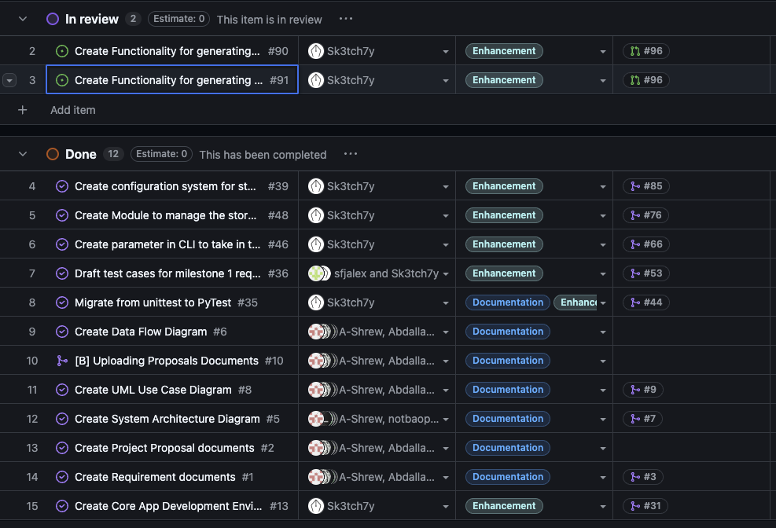

## Features

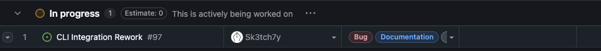

## Recap

#### PR: https://github.com/COSC-499-W2025/capstone-project-team-10/pull/96

- Created Functions for printing harvested file context
- Created Functions for creating a PDF with possible resume entries for a scan log
- Created Functions for creating a ZIP file containing a web portfolio for a scan log
- Created Param for default output location in the users Downloads folder. This is not a persistent param but is modifiable if the GUI would like to add the functionality
- Updated Readme with documentation for how to use the showcase module

### Planned Future Expansion Opportunities:

- Make more specific file type parsing to create more unique sections.
- Possible parsing of Photoshop files to produce an image to be included
- Split .git file extra data to be parsed more deeply, outlining outputs in a much cleaner way (The git parse is currently being rewritten)

### For next week:

For the next few weeks I will be coordinating our full implementation and tying together all the teams work into a final presentation as well as doing manual integration testing. I am trying to coordinate rewrites in the file analysis modules as lots of them dont produce very usable outputs, especially the .git analysis. I may be doing this rewrite myself if the team requires help.

My Primary task will be the consolidation of the CLI and related modules

#### Tickets

- https://github.com/COSC-499-W2025/capstone-project-team-10/issues/97

## Additional Context

No problems with my work, however attempting to direct the team in the right direction is difficult and consumes most of my time.

## Team Survey:

Team survey completed.

# Week 10 (11/2/2025 - 11/9/2025)

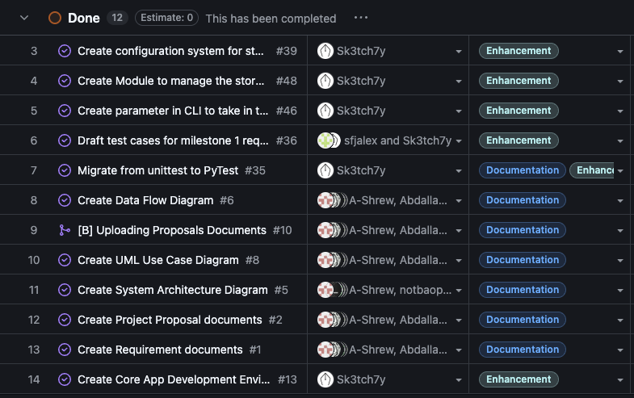

## Features

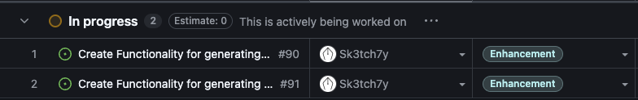

## Recap

I spent most of my week implementing the parameter functionality for our different modules to use. This module will manage the parameters being passed to different modules and ensure that they are persistent and globally available.

- Created param module
- Created param parsing for new parameters
- Created tests for param module
- Updated Readme with Param usage guide
- Created param_defaults.json with default parameter values to be loaded at runtime, or as a backup when user parameters are corrupted/missing

I also updated the CLI to be able to accept these parameters from the user in multi part parameters.

- Created tests for cli param parsing
- Updated Readme with new CLI flags

PR: https://github.com/COSC-499-W2025/capstone-project-team-10/pull/85

For the next week I will be working on the Portfolio and Resume exports for scan results

## Additional Context

The Team is working great together, the next phase of our project is the itegration of all our features into our commandline interface, as doing robust manual testing to iron out how we can improve product usability and functionality. as well as implementing the Resume and web portfolio exports

## Team Survey:

Team survey completed.

# Week 9 (10/26/2025 - 11/2/2025)

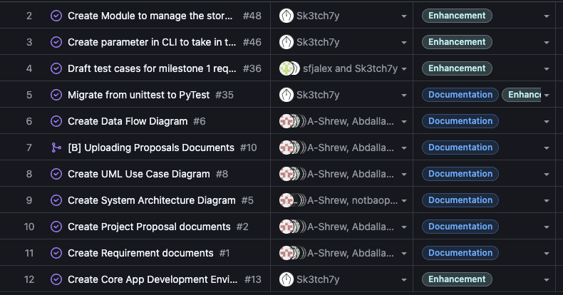

## Features

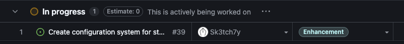

## Recap

I spent most of my week implementing the logging functionality for our File analysis to write to. This module manages the log files being written to and handling for log management.

The desire for this module is that our File Export service and eventually our GUI can extract any key insights about projects and such from the resulting logs in order to display/export them for the user.

## Additional Context

No additional notes

## Team Survey:

Team survey completed.

# Week 8 (10/19/2025 - 10/26/2025)

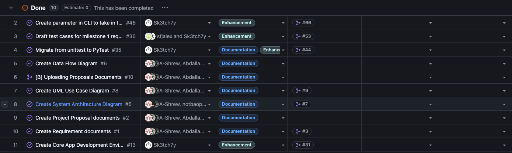

## Features

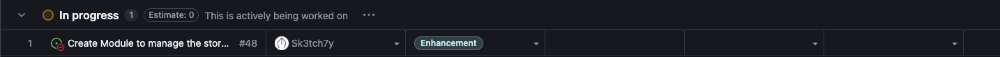

## Recap

I Spent most of my week planning out github tickets and adding flags to the CLI for implemented features

In the next sprint I will primarily be tackling designing and implementing our log output for each file search, as well as various project planning activities and coordinating implementation/integration

## Additional Context

No additional notes

## Team Survey:

Team survey completed.

# Week 7 (10/12/2025 - 10/19/2025)

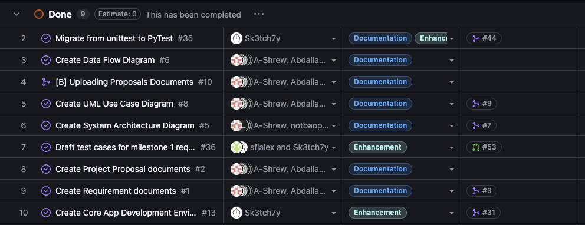

## Features

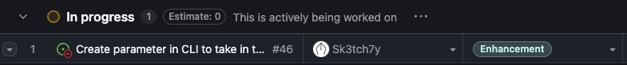

## Recap

I Spent most of my week outlining the path for our group forward, creating tickets, managing requirements, and developing draft test cases for developers to fill in as the features get fully developed, this allows us to have good expectations for what our inputs and outputs for our features should be, and the tests just require adaptation to the developers specific implementation. I also completed our teams WBS.

In the next sprint I will primarily be tackling project planning and documentation, as well as adding the flags and process to our CLI to allow for zip file processing.

## Additional Context

No additional notes

## Team Survey:

Team survey completed.

# Week 6 (10/05/2025 - 10/12/2025)

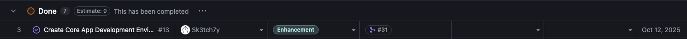

## Features

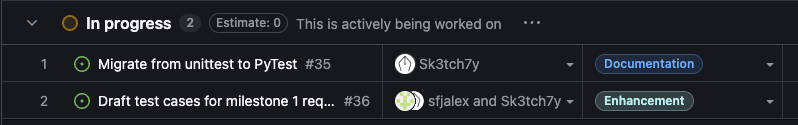

## Recap

I rewrote our application in Python minus the multithreading. Wrote the README with instructions for

- Running, Packaging, and Testing the Base app
    - Using PyQt5 for GUI
    - Using pyinstaller for build process
    - Using python unittest for testing framework
- Writing Tests
- Coding Conventions to be practiced
- Best Practices for submitting PRs
- Setting up python virtual environment,
- Writing unit tests, running the app, and building the app executable

In the next sprint I will primarily be tackling the drafting of test cases as well as reworking the testing library to use PyTest at the recommendation of our team member with lots of python experience

## Additional Context

## Team Survey:

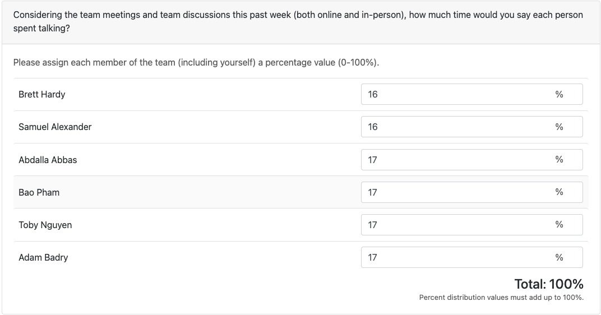

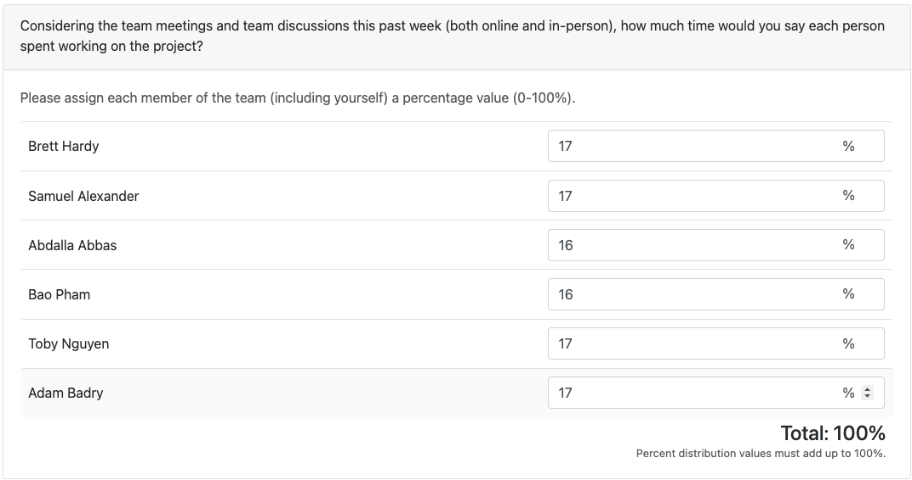

# Week 5 (9/28/2025 - 10/05/2025)

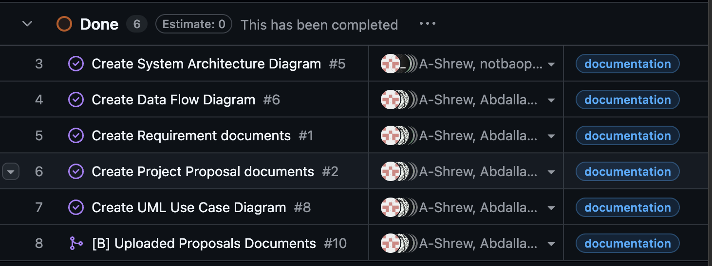

## Features

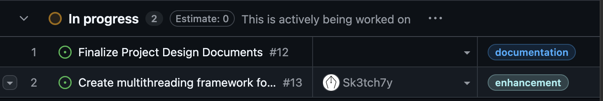

## Recap

Group collaboration on Data Flow Diagram.
I began working on the framework for our multithreaded Rust application, Familiarizing myself with Rust's concurrency model and setting up the project structure according to our DFD.

Began Work on DFD, System Architecture Diagram, Project proposal, and Requirement Documents require updating, Requirements shall also be codified into github issues

## Additional Context

## Team Survey:

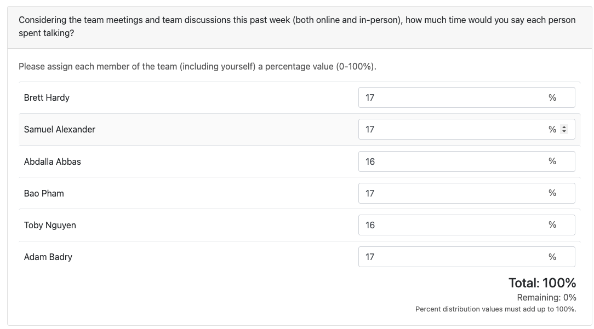
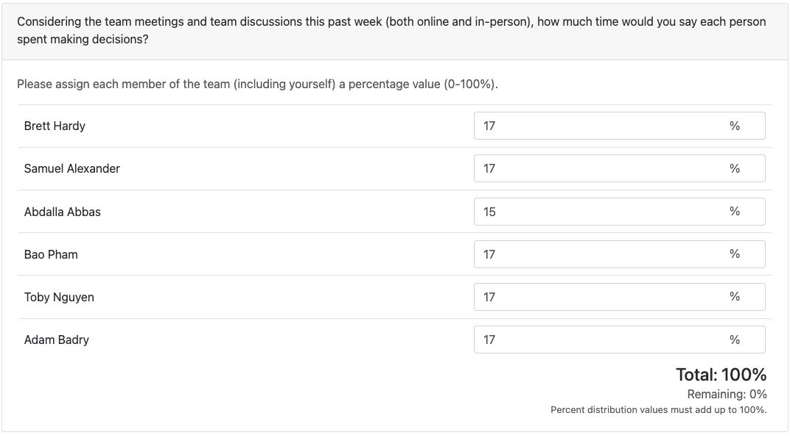
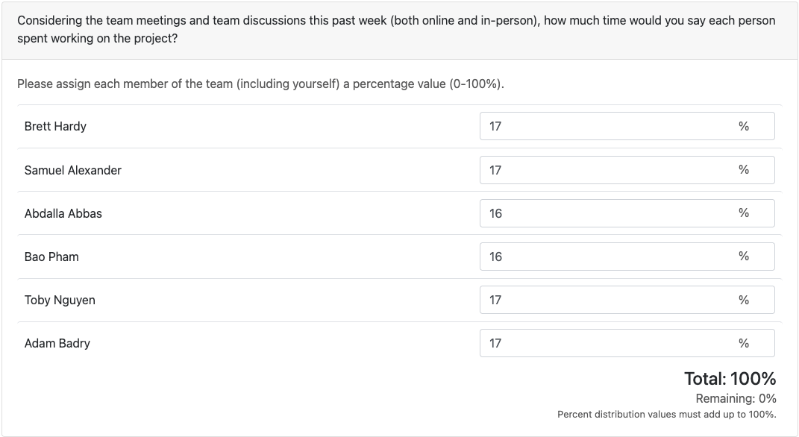

# Week 4 (9/21/2025 - 9/28/2025)

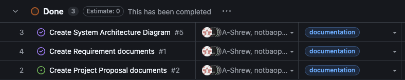

## Features

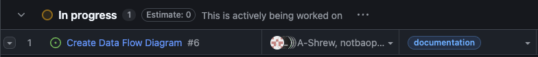

## Recap

Group collaboration on System Architecture diagram, and Project proposal with no individual tasks assigned. Completed documents and created starter code for Rust EGUI development. Beginning work on Data Flow Diagram

## Additional Context

## Team Survey:

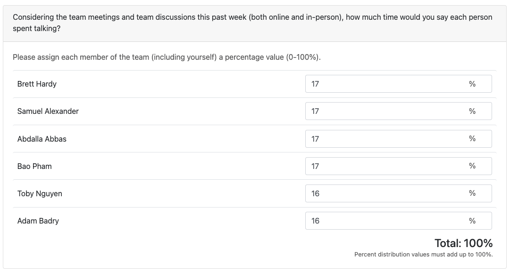

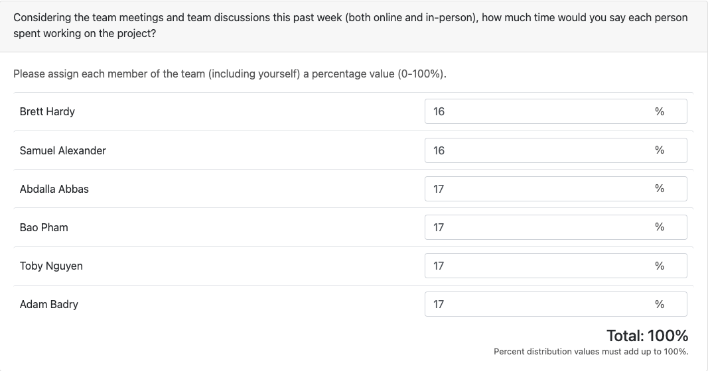

# Week 3 (9/14/2025 - 9/21/2025)

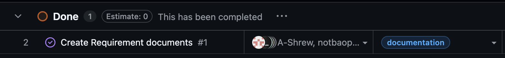

## Features

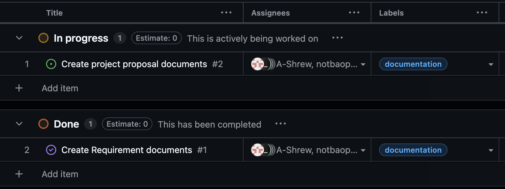

## Recap

Group collaboration on project requirements with no individual tasks assigned. Completed requirements document and researched technology options (Rust, Python, Java, C/C#). Leaning toward Rust but waiting for final project requirements before committing.

https://github.com/COSC-499-W2025/capstone-project-team-10/pull/3

## Additional Context

## Team Survey:

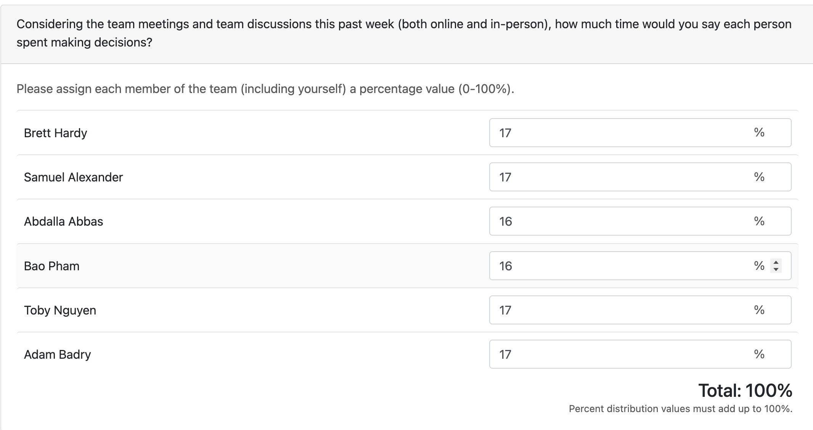
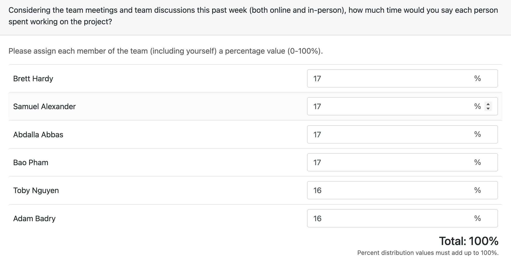
