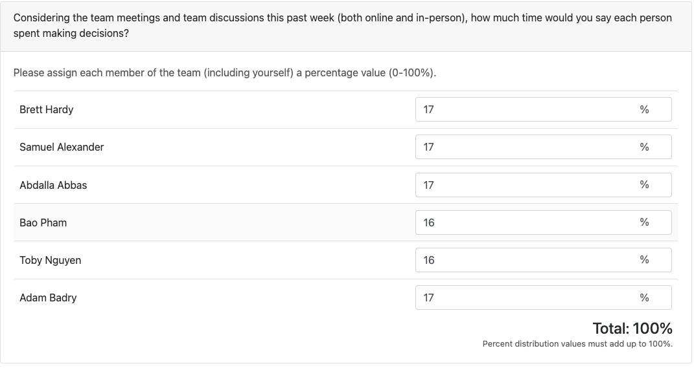

# Week 8 (10/19/2025 - 10/26/2025)

## Features

## Recap

I Spent most of my week planning out github tickets and adding flags to the CLI for implemented features

In the next sprint I will primarily be tackling designing and implementing our log output for each file search, as well as various project planning activities and coordinating implementation/integration

## Additional Context

No additional notes

## Team Survey:
Team survey completed.

# Week 7 (10/12/2025 - 10/19/2025)

## Features

## Recap

I Spent most of my week outlining the path for our group forward, creating tickets, managing requirements, and developing draft test cases for developers to fill in as the features get fully developed, this allows us to have good expectations for what our inputs and outputs for our features should be, and the tests just require adaptation to the developers specific implementation. I also completed our teams WBS. 

In the next sprint I will primarily be tackling project planning and documentation, as well as adding the flags and process to our CLI to allow for zip file processing. 

## Additional Context

No additional notes

## Team Survey:
Team survey completed.

# Week 6 (10/05/2025 - 10/12/2025)

## Features

## Recap

I rewrote our application in Python minus the multithreading. Wrote the README with instructions for
- Running, Packaging, and Testing the Base app
    - Using PyQt5 for GUI
    - Using pyinstaller for build process
    - Using python unittest for testing framework
- Writing Tests
- Coding Conventions to be practiced
- Best Practices for submitting PRs
- Setting up python virtual environment,
- Writing unit tests, running the app, and building the app executable

In the next sprint I will primarily be tackling the drafting of test cases as well as reworking the testing library to use PyTest at the recommendation of our team member with lots of python experience

## Additional Context

## Team Survey:

# Week 5 (9/28/2025 - 10/05/2025)

## Features

## Recap

Group collaboration on Data Flow Diagram.
I began working on the framework for our multithreaded Rust application, Familiarizing myself with Rust's concurrency model and setting up the project structure according to our DFD.

Began Work on DFD, System Architecture Diagram, Project proposal, and Requirement Documents require updating, Requirements shall also be codified into github issues

## Additional Context

## Team Survey:

# Week 4 (9/21/2025 - 9/28/2025)

## Features

## Recap

Group collaboration on System Architecture diagram, and Project proposal with no individual tasks assigned. Completed documents and created starter code for Rust EGUI development. Beginning work on Data Flow Diagram

## Additional Context

## Team Survey:

# Week 3 (9/14/2025 - 9/21/2025)

## Features

## Recap

Group collaboration on project requirements with no individual tasks assigned. Completed requirements document and researched technology options (Rust, Python, Java, C/C#). Leaning toward Rust but waiting for final project requirements before committing.

https://github.com/COSC-499-W2025/capstone-project-team-10/pull/3

## Additional Context

## Team Survey:

