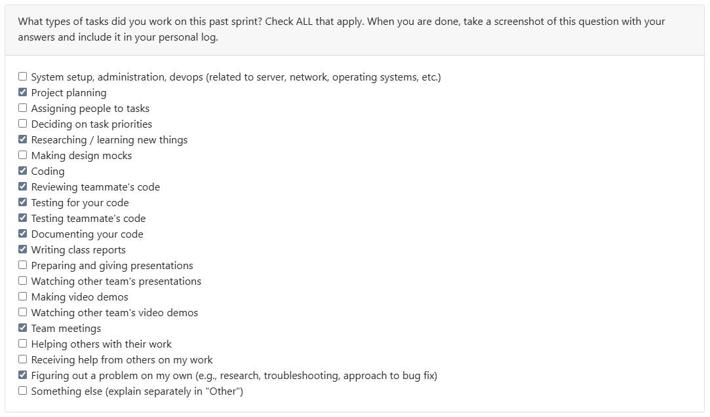

# Week 10 (2025/11/03 - 2025/11/09)

## Tasks

## Recap

| Feature/Component | Task | Status | Notes |
|---|---|---|---|
| Create Module for analysis of Markdown Files | [#60](https://github.com/COSC-499-W2025/capstone-project-team-10/issues/60) | Comppleted (In-Review) | Discussions are being made about the functionalities of the module - clarified and answered within the comments. Awaiting meetings and reply |
| Converting logs (CSV) to JSON | [#70](https://github.com/COSC-499-W2025/capstone-project-team-10/issues/70) | In-Progress (Next Week) | Functionality for outputting |
| Converting logs (CSV) to MD | [#72](https://github.com/COSC-499-W2025/capstone-project-team-10/issues/72) | In-Progress (Next Week) | Functionality for outputting |

## Additional Notes
- Hectic week and days - tests suite from last week were bugfixed (within PR for #60), but there is much more to be done, especially, after connecting the modules into the main loop of the program, namely FAS and FSS.
- Tests are to be reviewed, fact-check and added to examine the connectability of all of the modules
- Ticking of more of the PR, but, with extra consideration for compatibility of tests and connectability.
