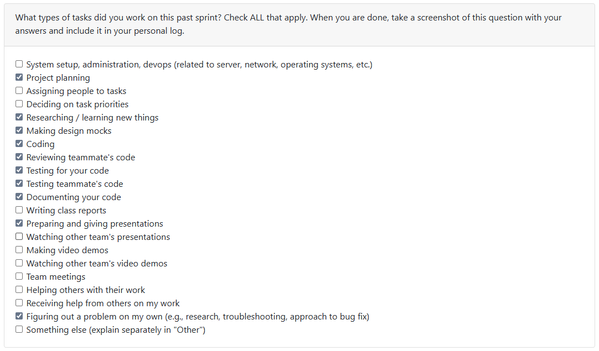

# Week 12 (and bonus 11 (2025/11/09 - 2025/11/22)

## Tasks

## Recap

| Feature/Component | Task | Status | Notes |
|---|---|---|---|
| .csv logs to .json | https://github.com/COSC-499-W2025/capstone-project-team-10/issues/70 | Completed | Done within reading week |
| .csv logs to .md | https://github.com/COSC-499-W2025/capstone-project-team-10/issues/71 | Completed | Refer to https://github.com/COSC-499-W2025/capstone-project-team-10/pull/113 |
| .csv logs to .pdf | https://github.com/COSC-499-W2025/capstone-project-team-10/issues/72 | Completed | Refer to https://github.com/COSC-499-W2025/capstone-project-team-10/pull/113 |

## Additional Notes

- Having finished all of the log converter module, we now shift towards the usability of the entire repo - mainly tuning up all of the parameters for the CLI, cleaning up redundancies, and trying to ship our product to be usable and demo-able
- Tasks will be assigned to work towards this goal, and more issues will be published to clear out the rest of the Milestones
- Overall, the team is working with utmost speed while ensuring efficiency, to be ready for the upcoming demo and Milestone 1
