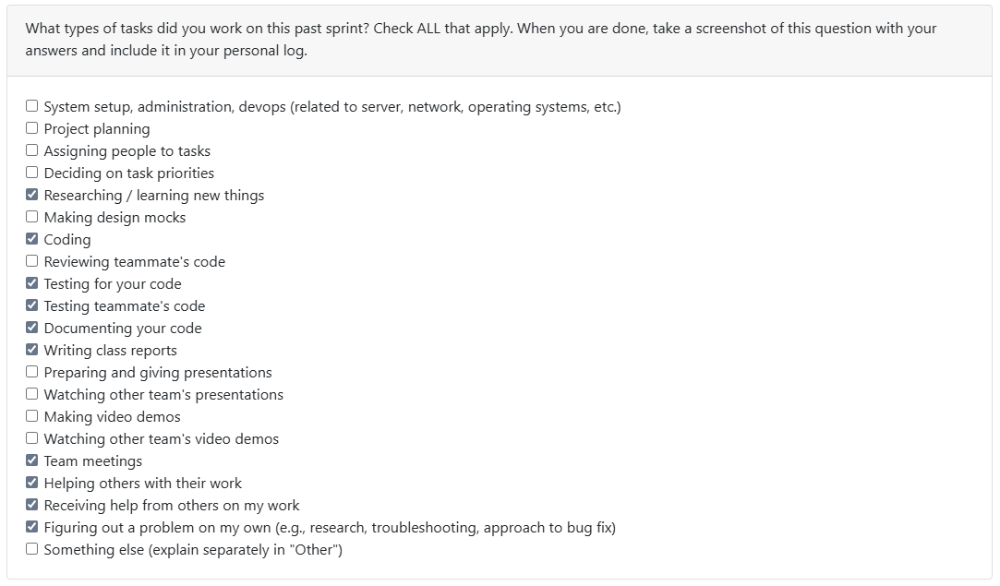

# Week 13 (2025/11/23 - 2025/11/30)

## Tasks

## Recap

| Feature/Component | Task | Status | Notes |
|---|---|---|---|
| Logs Sorter | https://github.com/COSC-499-W2025/capstone-project-team-10/pull/125 | Completed | Implemented the functionality to sort logs - currently out of the CLI loop |
| Logs Sorting Integration | https://github.com/COSC-499-W2025/capstone-project-team-10/pull/133 | In-Progress | Integration of the sorter into CLI - refactoring will be needed |
| Markdown Analysis update | https://github.com/COSC-499-W2025/capstone-project-team-10/pull/140 | In-Progress | Currently tracing down a bug downstream - will be discussed with the team |

## Additional Notes
- As stated within Week 12, updating *my* lacking behind modules, and integrating them into the CLI would be one of the highest priorities for the demo video to be published
- Sorting logs is used to order the logs, which fuel our exportations are working as expected, though being a bit decoupled right now
- Working more and asking for more help and confirmation should be practiced more, and definitely more for me
- Utmost care to not cause any bugs within the CLI, since that is our entire demonstration material
