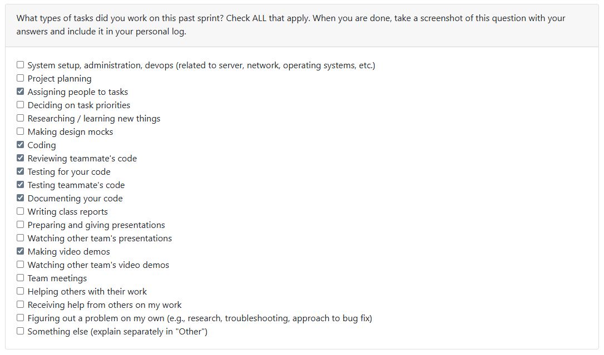

# Week 17 (2026/01/19 - 2026/01/25)

## Tasks

## Recap

| Feature/Component | Task | Status | Notes |
|---|---|---|---|
| Rework the project grouping system | https://github.com/COSC-499-W2025/capstone-project-team-10/issues/178 | In-Progress | Awaiting on-board changes to be made |
| Bugfixing for sorting | https://github.com/COSC-499-W2025/capstone-project-team-10/issues/196 | Completed | A misread - clarification within the comment thread |
| Create API functionality for iterating over a log file | https://github.com/COSC-499-W2025/capstone-project-team-10/issues/180 | Awaiting reviews | Already finished and properly made - at the time of typing this log, it harbours 1 review |

## Additional Notes
- Working in order to get the functionality up and running - lots of work to be done within the upcoming weeks, and more functionality work to be done
- We also have to review the team contract, to have more people on the review standby
- Delegation is to be expected for the frontend and backend, and should be working concurrently together
