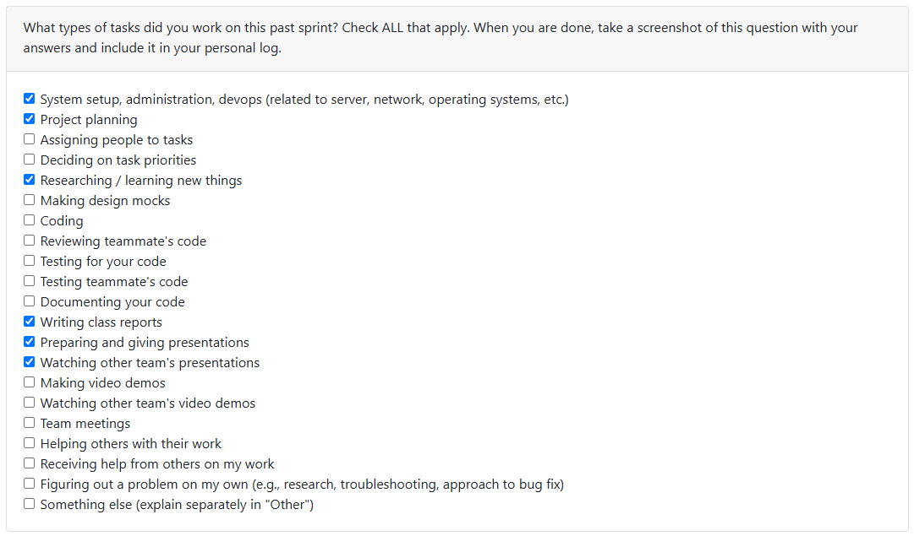

# Week 3 (2025/09/14 - 2025/09/21)

## Tasks

## Recap

| Feature/Component | Task | Status | Notes |
|---|---|---|---|
| Creating the Requirements for the Proj. | #1 | Completed | Discussions and results were fruitful |
| Creating Project Proposals | #2 | In-Progress | Is intended for the next Milestone |

## Additional Notes

- The base programming language were discussed, and **Rust** was landed as our default programming language
- More of the repo is needed to be customized, and standards + protocol on naming, hierarchy and types should and will be discussed in the upcoming class.

