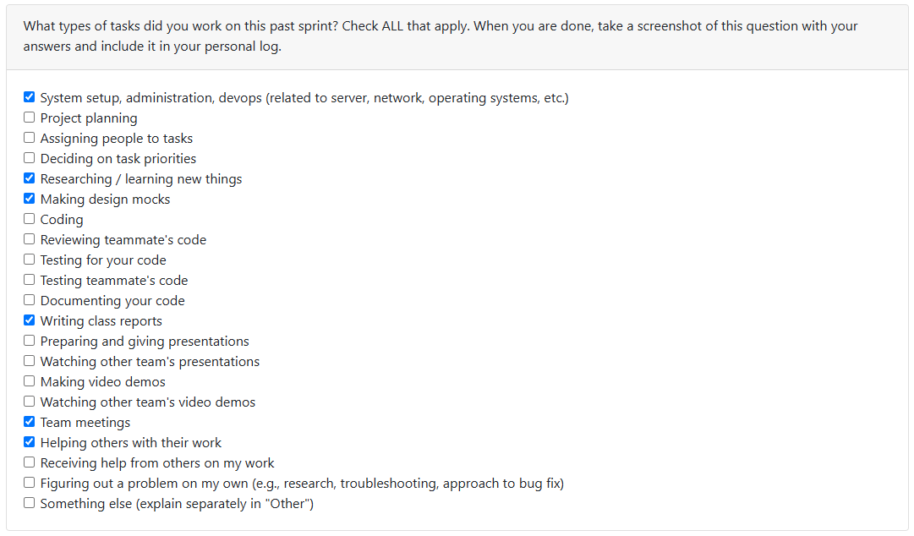

# Week 5 (2025/09/29 - 2025/10/05)

## Tasks

## Recap

| Feature/Component | Task | Status | Notes |
|---|---|---|---|
| Created and finalized DFDs | [#6](https://github.com/COSC-499-W2025/capstone-project-team-10/issues/6) | Finished | Team! |
| Congregating and Organizing Documents | [#12](https://github.com/COSC-499-W2025/capstone-project-team-10/issues/12) | In Progress | Should be a major housekeeping issue to do |

## Additional Notes

- Our repo is going under a mass reconstruction - cleaning up and populating issues, mandating branches for different purposes, and swapping the architecture to a Python-supported repo
- Should be a busy week next week - we will be having our repo completely revamped
