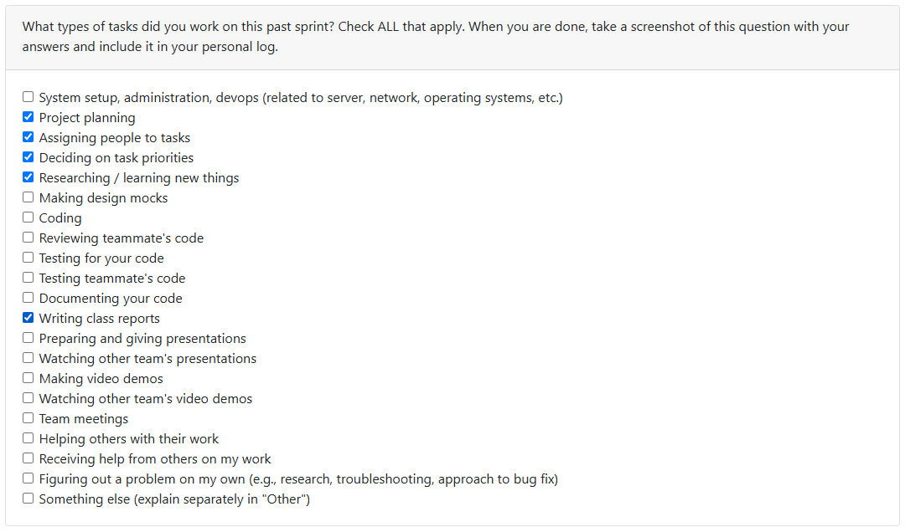

# Week 6 (2025/10/06 - 2025/10/12)

## Tasks

## Recap

| Feature/Component | Task | Status | Notes |
|---|---|---|---|
| Issues delegation and populating | [#32](https://github.com/COSC-499-W2025/capstone-project-team-10/issues/32) | In-progress | From the list of requirements and proposal documents, we should all take our time to populate issues |
| Repo housekeeping | [#34](https://github.com/COSC-499-W2025/capstone-project-team-10/issues/34) | In-Progress | Still ongoing - there is a lot to discuss with teammates to confirm and view on what can be done |

## Additional Notes

- First sprint week here - everyone should tune in and tuck your shirt to start actually coding
- The first iteration will focus on the functionality more than the GUI - after we get a few functionalities down, we can then develop the GUI accordingly
