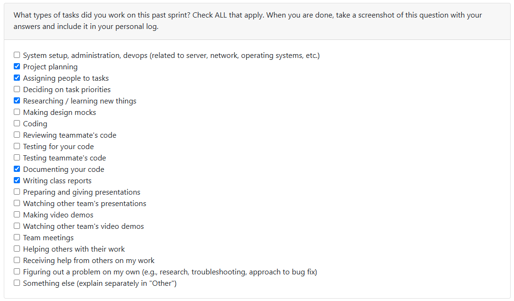

# Week 7 (2025/10/13 - 2025/10/19)

## Tasks

## Recap

| Feature/Component | Task | Status | Notes |
|---|---|---|---|
| Repo housekeeping | #34 | In-Progress | Haven't gotten to reach my teammates - will be doing so in the next meetings |
| Installing Ruff | #43 | In-Progress | Ruff is a linter library for Python - this should help with the overall uniformity of the repo |
| Starting programs | #54 | In-Progress | Creating starting programs, for example, on reading Python, the GUI library, and traversing files |

## Additional Notes

- Lots of work to do to get started, but it should be smooth sailing right after we get a few boulders rolling.
