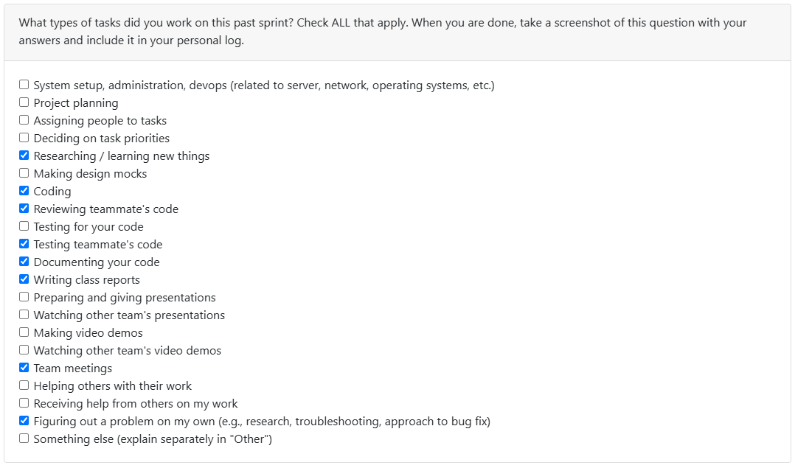

# Week 8 (2025/10/20 - 2025/10/26)

## Tasks

## Recap

| Feature/Component | Task | Status | Notes |
|---|---|---|---|
|Creating Modules for extracting statistics from local Git repo files|[#49](https://github.com/COSC-499-W2025/capstone-project-team-10/issues/49)|Completed|Additions of features are still in discussion - after conclusion, further features and tests will be added|
|Create module for processing analysis results into projects|[#62](https://github.com/COSC-499-W2025/capstone-project-team-10/issues/62)|In-Progress|Next week's task|

## Additional Notes
- In the construction phase of acquiring the building bricks to build the entirety of the program.
- Hoping to finish all of the functions and bricks in the next month
