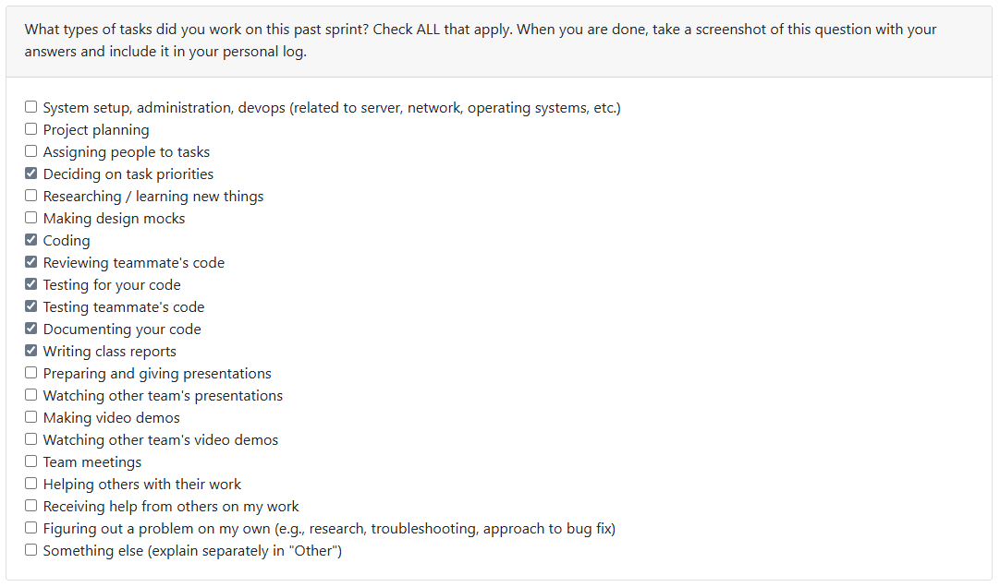

# Week 9 (2025/10/27 - 2025/11/02)

## Tasks

## Recap

| Feature/Component | Task | Status | Notes |
|---|---|---|---| 
| Added Creation and Modification Time filtering | [#69](https://github.com/COSC-499-W2025/capstone-project-team-10/issues/69) | Completed | Has also created a future proof solution for adding things into fss - a new fss_helper.py acts as a method library which will increase collaborarity and cleanliness |\
| Added test suite for Repository reader | [#79](https://github.com/COSC-499-W2025/capstone-project-team-10/pull/79) | Completed | Added tests for repo_reader.py after revising total functionality |

## Additional Notes
- A lightweight week - lots of creation (creating new codes and populating different modules of the repo).
- Suspected next week would be for congregating modules and finishing up tailoring the core functionality - fss, fas and the main program loop.
