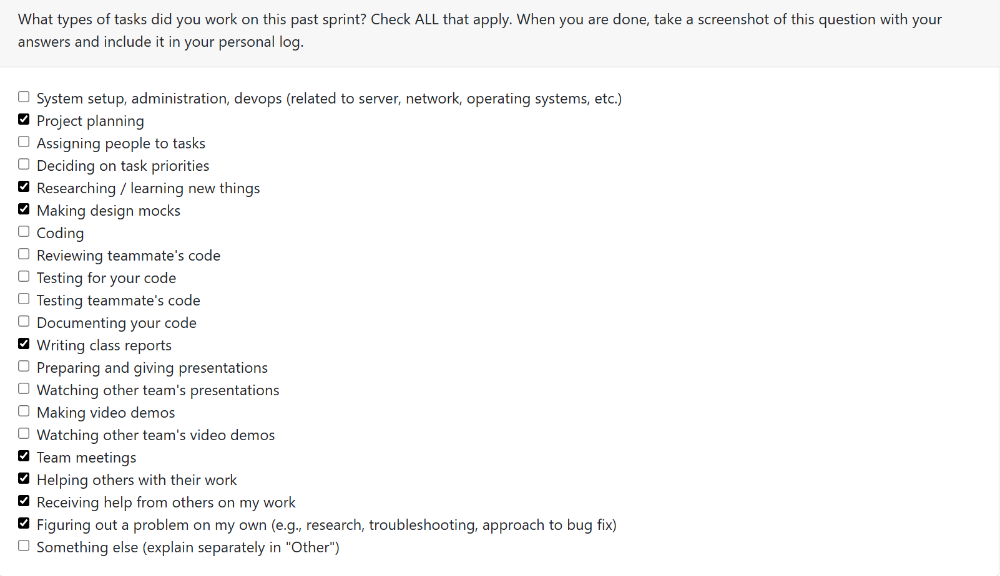
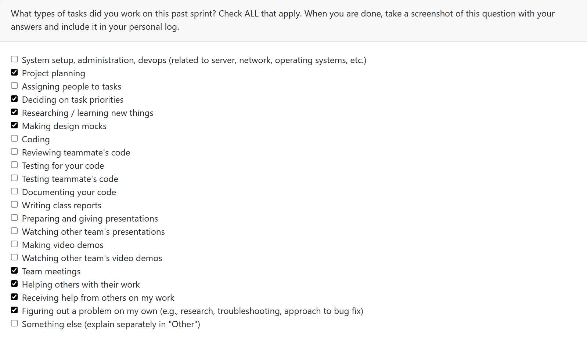
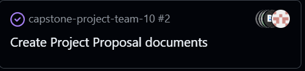
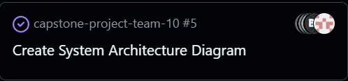
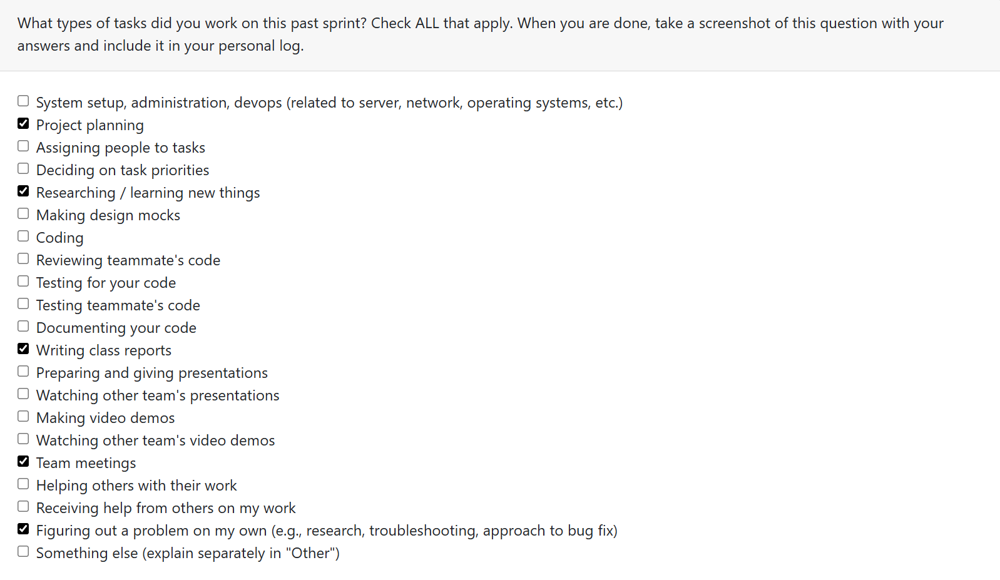

# Week 5 (9/29/2025-10/05/2025)

## Features

## Recap

Group collaboration on data flow diagram with no individual tasks assigned. We completed the diagram and made revisions after we got feedback in class. The team communicated about potential revisions we need to make in the design documents given the new requirements list. For example, including databases and use of LLMs. Also, we may need to switch to python.

# Week 4 (9/22/2025 - 9/28/2025)

## Features

## Recap

Group collaboration on project proposal and system architecture documents with no individual tasks assigned. Completed both documents and explored Rust code and started looking at implmenatations of our design documents. Created UML use case diagram.

# Week 3 (9/15/2025 - 9/21/2025)

## Features

## Recap

Group collaboration on project requirements with no individual tasks assigned. Completed requirements document and researched technology options (Rust, Python, Java, C/C#). Leaning toward Rust but waiting for final project requirements before committing.