# Week 18/19 (1/26/2026 = 2/8/2026) ** TERM 2 Week 4/5 **

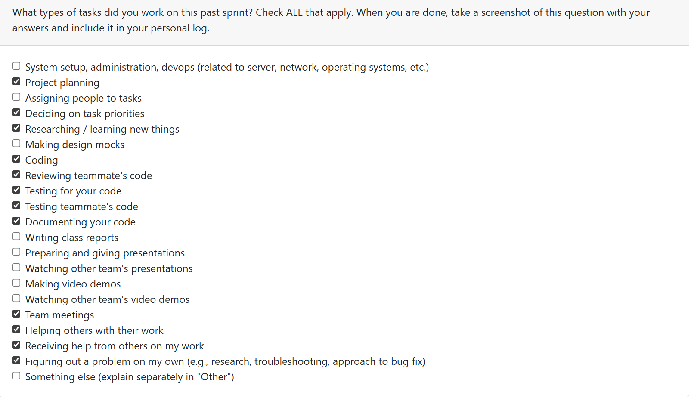

## Features

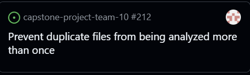
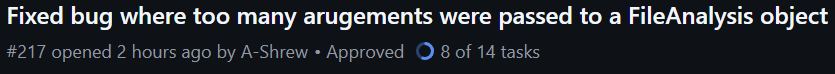
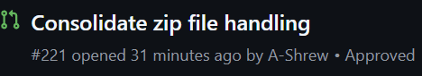

## Recap
The last two weeks we added more gui features and links with the backend. Last week I began work on a file hashing system to identify files based on their content. This allowed me to implement changes to the searching, analyzing, logging flow so that identical files are only analyzed once even if they are in a seperate log. Otherwise it pulls the data from the log instead. I also refactored the way zip files are handled by our client so they are handled without the need for the --zip flag building off of my work from week 17. Finally I fixed a bug in the showcase.py file that was causing scans to fail because of an incorrect number of arguements being passed to our FileAnalysis object. Next week I want to continue working on bug fixes to improve polish and catch edge cases. I also want to look at showcase.py to see if it can be refactored to reduce it from 700+ lines of code.

# Week 17 (1/19/2026 = 1/25/2026) ** TERM 2 **

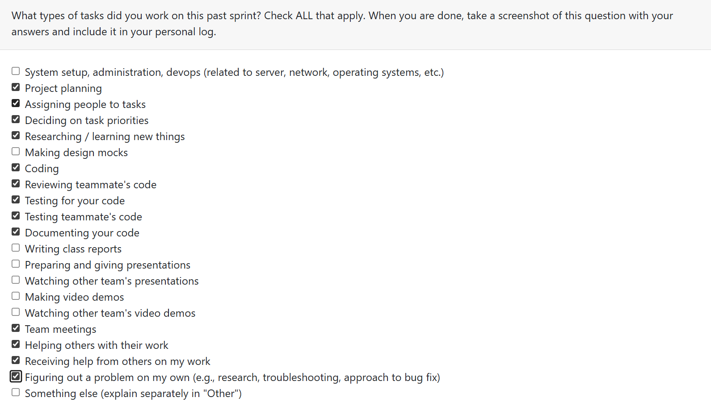

## Features

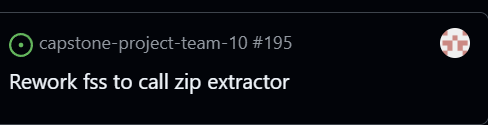
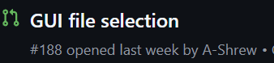

## Recap
This week we continued GUI work and more importantly worked towards completing the new requirements from milestone 2. I completed the integration of the zip_app.py module with the fss.py module. This now gives the fss the functionality of searching through zip files and passing them to the analysis service. I did not need to make changes to the zip_app.py module, but fixed a bug in the fss module generating windows permission errors. I also updated and integrated the file selection in the GUI to work with the new layout toby made. I was working on this last week but it did not conform to the gui design we built, but I updated it so it now should. Next week I want to add file hashing to detect files that have already been scanned.

# Week 16 (1/12/2026 = 1/18/2026) ** TERM 2 **

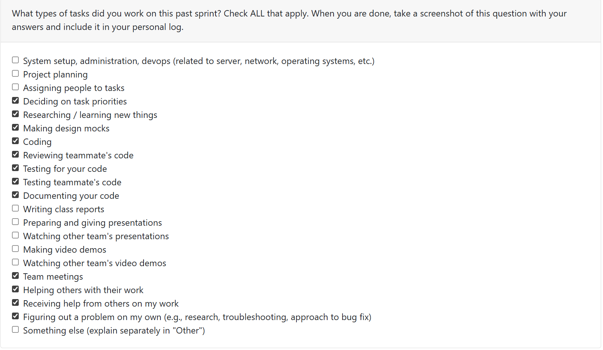

## Features

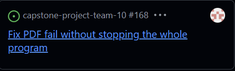
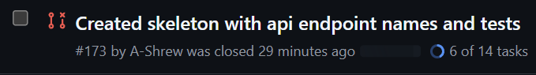
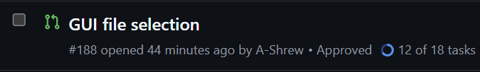

## Recap
We started working on the GUI and tasks for milestone 2. I created a skeleton for the fastAPI, but we are not using this directly and are instead mimicking it with functions to my understanding. I also made a minor bugfix to the pdf module to avoid crashing the program when an error was generated from the module. Finally, I added functionality to the GUI to support selecting files using the system's os file system and a drag and drop feature. Next week I want to continue adding new features to the GUI and work on integrating it with our backend systems. I have also been working on further improving our coding analysis module as I think it can also be improved to provide stronger analysis.

# Week 15 (1/5/2026 = 1/11/2026) ** TERM 2 **

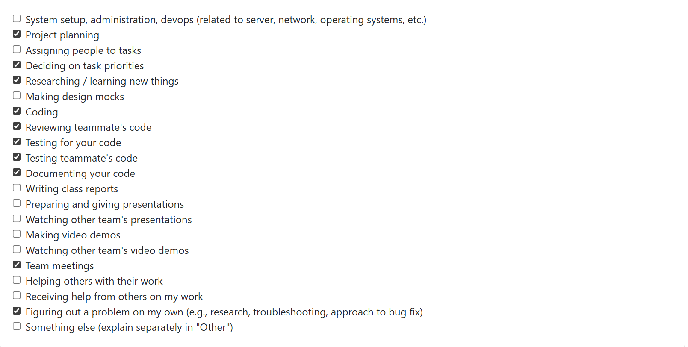

## Features

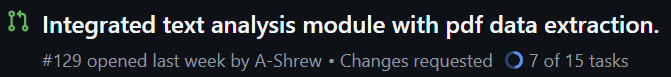
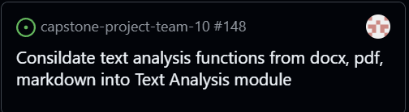

## Recap
We reconvened after the break and discussed our progress and the new milestone requirements for milestone 2. I completed an issue from before the break to include
deeper analysis in the fas_pdf.py module such as sentiment feedback, lexical diverstiy feedback, etc. This was already implemented but not merged into the dev branch. I also refactored the fas_test_analysis.py module to consolidate code from many different files into text_analysis.py to reduce code and keep concerns in their local modules. I included the refactored fas_pdf.py module and updated it so that it fixed both issues.

# Week 14 (12/1/2025 = 12/7/2025)

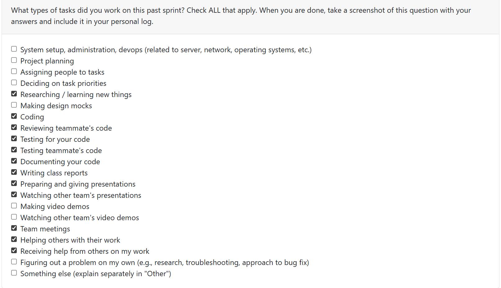

## Features

## Recap
We finished milestone 1 and all the deliverables this week. I completed the team log and we had our presentation this week. I also worked on adding feedback to the pdf module which is complete, but we wanted to avoid merging until after the milestone to ensure the build is stable. I also created a new issue to consolidate functions from the fas_docs.py module to the text_analysis.py module which I will work on over the holidays. I will also try to draft some new issues for the next milestone.

# Week 13 (11/24/2025 = 11/30/2025)

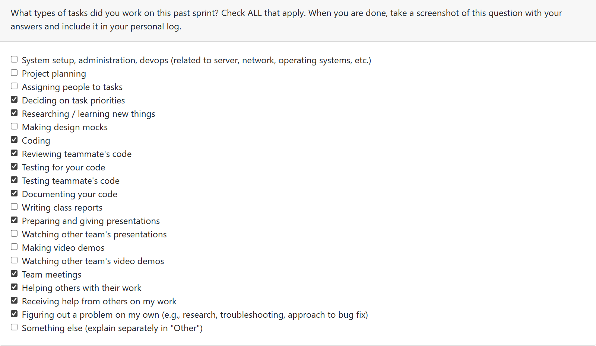

## Features

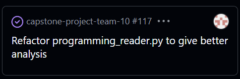

## Recap
This week the group continued refining analysis modules and improved the functionality of the log system. We implemented log sorting and refined the output documents
for markdown and pdf output. I refactored and improved the programming_reader.py module. It is now called code_reader.py and it now gathers libraries, time complexities, functions, loops, and oop basics. It does this for multiple supported language and is a significant improvement from the previous module which only found libraries. I also added the nltk fas_text_analysis.py module to the fas_pdf.py module to perform text analysis on the text found in pdfs. I still need to refine the output from the text analysis in the module as it does not interpret results from the data.

# Week 12 (11/17/2025 = 11/23/2025)

## Features

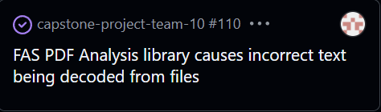
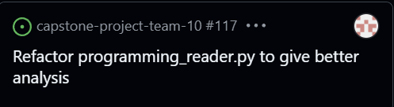

## Recap
We continued coding work and focused on linking modules together to create our working demo. I worked on bugfixing the pdf module which contained bugs for ligature/font issues with pdf formatting and encoding. I also worked on refactoring the programming_reader.py to improve the analysis and use packages instead of hardcoded regex for library imports. I also tested both modules and reviewed and helped teamates with code. We will continue with feature testing and ensuring everything is working properly with out demo and output docuements. Next week I will try and improve the efficiency of the nltk usage and pickup any new issues that might come from this weeks refactoring.

# Week 10 (11/3/2025 - 11/9/2025)

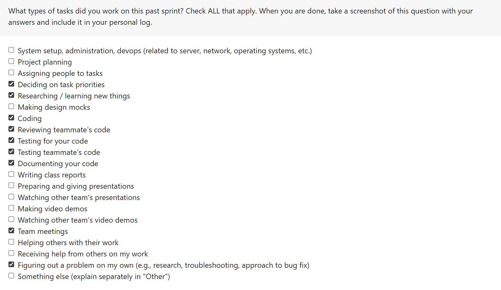

## Features

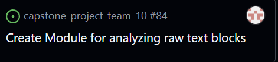

## Recap
We continued coding work expanding the type of files that we extract data from and improving the modules which connect eveything. I worked on a module for analyzing blocks of text and extracting key information such as keywords, summary, named entities, sentiment, and basic information (word count, sentence count, etc.). I revised some of my previous code and planning on doing more revisions over reading week.

# Week 9 (10/27/2025 - 11/2/2025)

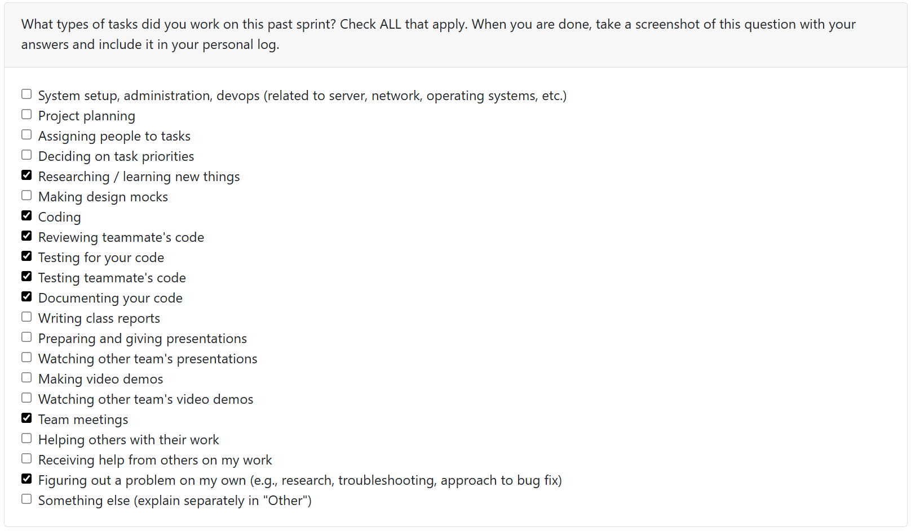

## Features

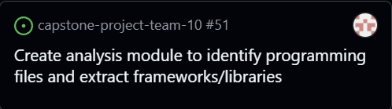

## Recap
We continued coding work expanding the type of files that we extract data from and improving the modules which connect eveything. I worked on the programming file extraction module and implemented file type identifying for coding files. I also implemented library extraction for several popular coding languages.

# Week 8 (10/20/2025 - 10/26/2025)

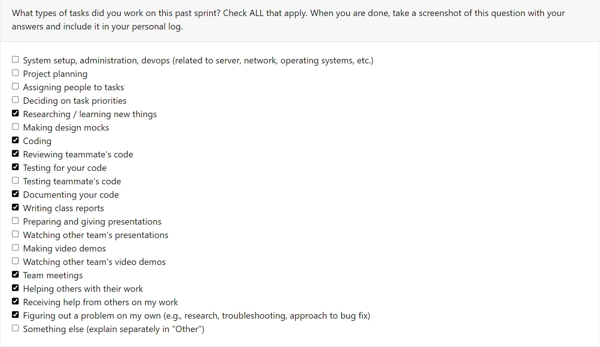

## Features

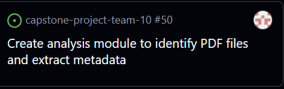

## Recap

This week we each took on a coding task and completed them before the end of the week. We made great progress in terms of adding functionality, but need to ensure the code integrates well with everyones differnt coding styles. I completed the PDF data extraction module which returns an object with many pdf data attributes given a filepath. 

# Week 7 (10/13/2025 - 10/19/2025)

## Features

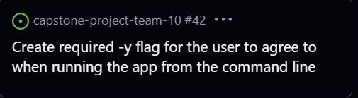

## Recap

We got started on the code this week. Group members completed test case drafting and the work breakdown structure. I added a permission request before launching the client and a -y flag to bypass the permission request. 

# Week 6 (10/06/2025 - 10/12/2025)

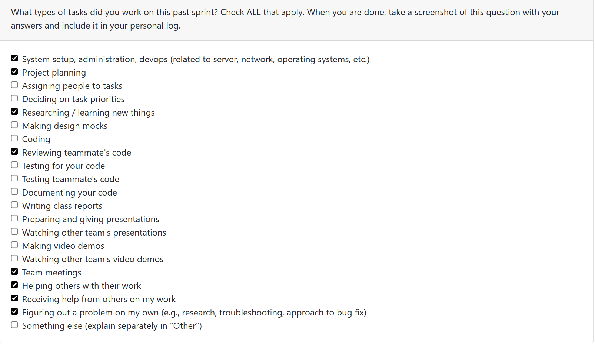

## Features

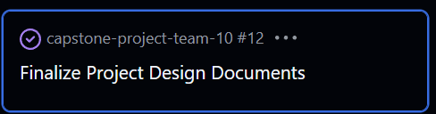

## Recap

Group discussion about switching from Rust to Python individual tasks have started to be assigned. Updated the README with revised project design documents and explanations. We need to start coding and working on the newly created issues for milestone #1.

# Week 5 (9/29/2025-10/05/2025)

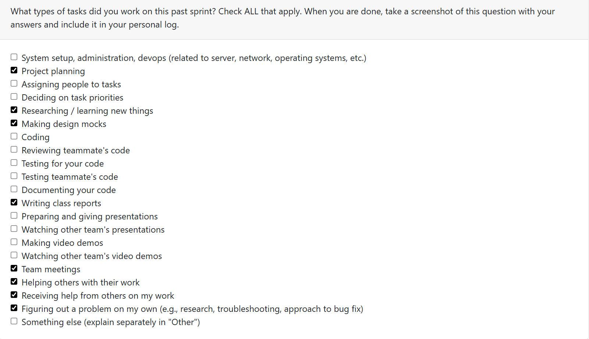

## Features

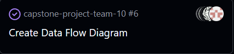

## Recap

Group collaboration on data flow diagram with no individual tasks assigned. We completed the diagram and made revisions after we got feedback in class. The team communicated about potential revisions we need to make in the design documents given the new requirements list. For example, including databases and use of LLMs. Also, we may need to switch to python.

# Week 4 (9/22/2025 - 9/28/2025)

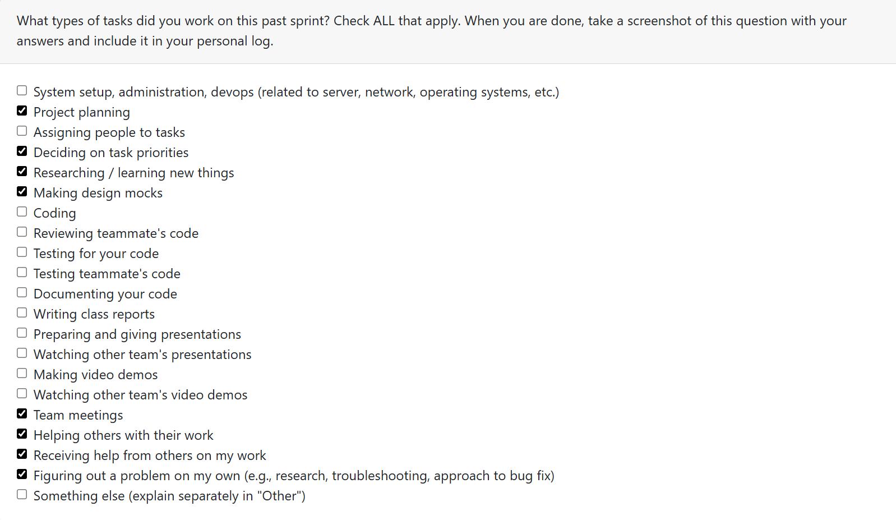

## Features

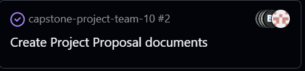
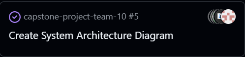
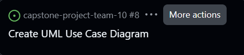

## Recap

Group collaboration on project proposal and system architecture documents with no individual tasks assigned. Completed both documents and explored Rust code and started looking at implmenatations of our design documents. Created UML use case diagram.

# Week 3 (9/15/2025 - 9/21/2025)

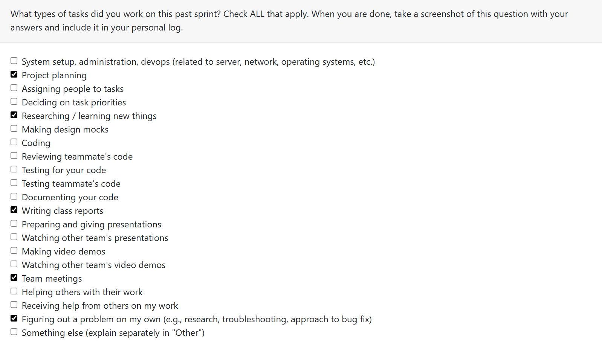

## Features

## Recap

Group collaboration on project requirements with no individual tasks assigned. Completed requirements document and researched technology options (Rust, Python, Java, C/C#). Leaning toward Rust but waiting for final project requirements before committing.