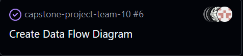

# Week 13 (11/24/2025 = 11/30/2025)

## Features

## Recap
This week the group continued refining analysis modules and improved the functionality of the log system. We implemented log sorting and refined the output documents
for markdown and pdf output. I refactored and improved the programming_reader.py module. It is now called code_reader.py and it now gathers libraries, time complexities, functions, loops, and oop basics. It does this for multiple supported language and is a significant improvement from the previous module which only found libraries. I also added the nltk fas_text_analysis.py module to the fas_pdf.py module to perform text analysis on the text found in pdfs. I still need to refine the output from the text analysis in the module as it does not interpret results from the data.

# Week 12 (11/17/2025 = 11/23/2025)

## Features

## Recap
We continued coding work and focused on linking modules together to create our working demo. I worked on bugfixing the pdf module which contained bugs for ligature/font issues with pdf formatting and encoding. I also worked on refactoring the programming_reader.py to improve the analysis and use packages instead of hardcoded regex for library imports. I also tested both modules and reviewed and helped teamates with code. We will continue with feature testing and ensuring everything is working properly with out demo and output docuements. Next week I will try and improve the efficiency of the nltk usage and pickup any new issues that might come from this weeks refactoring.

# Week 10 (11/3/2025 - 11/9/2025)

## Features

## Recap
We continued coding work expanding the type of files that we extract data from and improving the modules which connect eveything. I worked on a module for analyzing blocks of text and extracting key information such as keywords, summary, named entities, sentiment, and basic information (word count, sentence count, etc.). I revised some of my previous code and planning on doing more revisions over reading week.

# Week 9 (10/27/2025 - 11/2/2025)

## Features

## Recap
We continued coding work expanding the type of files that we extract data from and improving the modules which connect eveything. I worked on the programming file extraction module and implemented file type identifying for coding files. I also implemented library extraction for several popular coding languages.

# Week 8 (10/20/2025 - 10/26/2025)

## Features

## Recap

This week we each took on a coding task and completed them before the end of the week. We made great progress in terms of adding functionality, but need to ensure the code integrates well with everyones differnt coding styles. I completed the PDF data extraction module which returns an object with many pdf data attributes given a filepath. 

# Week 7 (10/13/2025 - 10/19/2025)

## Features

## Recap

We got started on the code this week. Group members completed test case drafting and the work breakdown structure. I added a permission request before launching the client and a -y flag to bypass the permission request. 

# Week 6 (10/06/2025 - 10/12/2025)

## Features

## Recap

Group discussion about switching from Rust to Python individual tasks have started to be assigned. Updated the README with revised project design documents and explanations. We need to start coding and working on the newly created issues for milestone #1.

# Week 5 (9/29/2025-10/05/2025)

## Features

## Recap

Group collaboration on data flow diagram with no individual tasks assigned. We completed the diagram and made revisions after we got feedback in class. The team communicated about potential revisions we need to make in the design documents given the new requirements list. For example, including databases and use of LLMs. Also, we may need to switch to python.

# Week 4 (9/22/2025 - 9/28/2025)

## Features

## Recap

Group collaboration on project proposal and system architecture documents with no individual tasks assigned. Completed both documents and explored Rust code and started looking at implmenatations of our design documents. Created UML use case diagram.

# Week 3 (9/15/2025 - 9/21/2025)

## Features

## Recap

Group collaboration on project requirements with no individual tasks assigned. Completed requirements document and researched technology options (Rust, Python, Java, C/C#). Leaning toward Rust but waiting for final project requirements before committing.