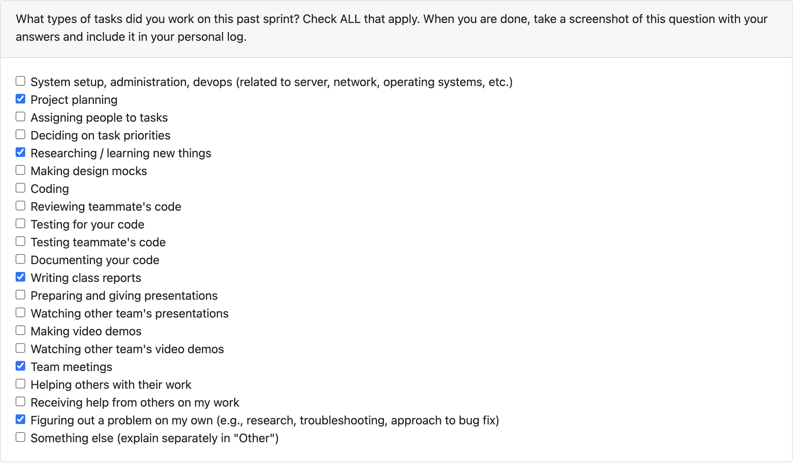
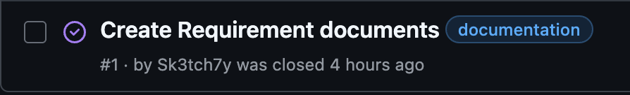

# Week 1 (9/14/2025 - 9/21/2025)

# Features

# Recap

Worked on and contributed to the creation and brainstorming of the group functional requirements as well as looking into and researching various language options (Java, Rust, Python, C/C#) as we plan to move forwards with one once the functional requirements are solidified.