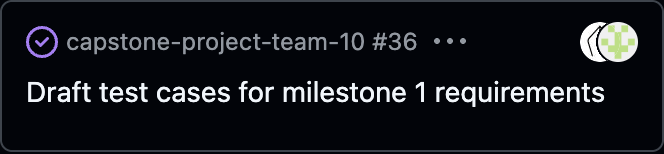
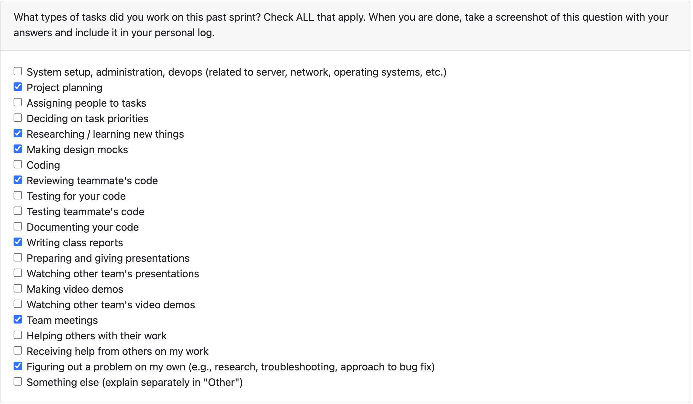
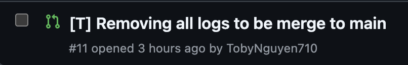
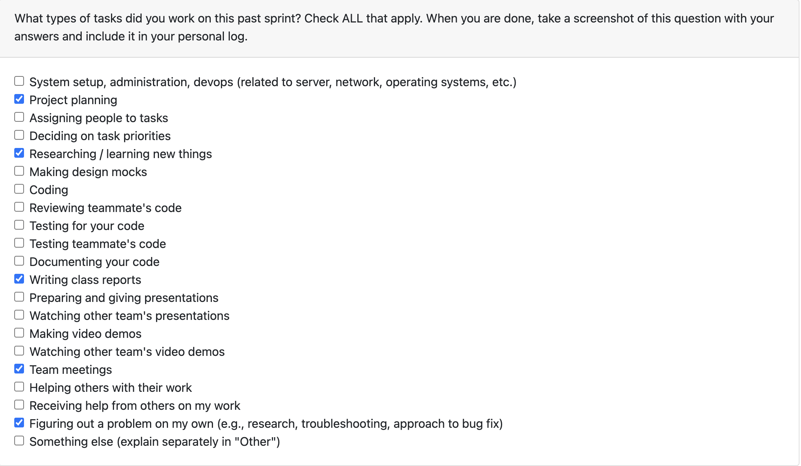
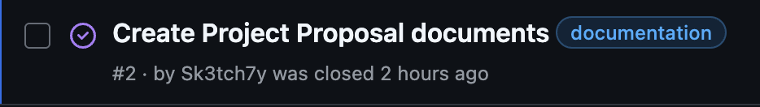
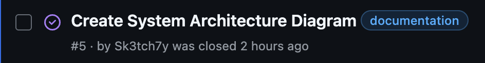
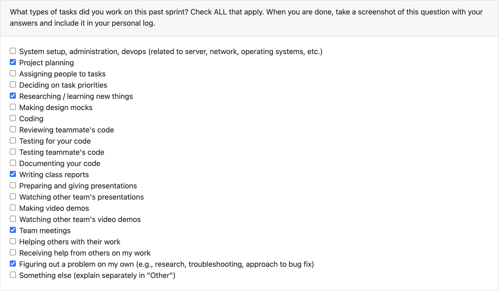
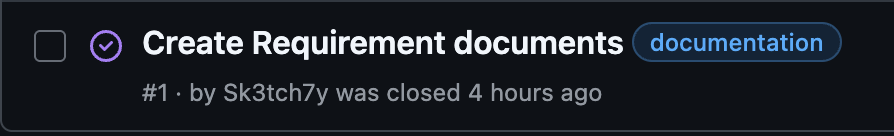

# Week 8 (10/20/2025 - 10/26/2025)

# Features

# Recap

This week I spent time setting up the initial file search service, that will take in a file or folder path as well as a set of excluded paths and compare against them to count or access only specific files.

Next week I plan to expand upon this and add more functionality to it, possibly by implementing aspects of the analysis service into the file search service or continuing to set up different types of specific file analysis services for currently uncovered file types.

# Week 7 (10/13/2025 - 10/19/2025)

# Features

# Recap

This week I began work on coding the basic tests to lay out the path for test driven development, I did this collaboratively with Adam. This task puts down the foundation to work from going forwards with other features and aspects of the project. As well, I have continued to look into and somewhat apply the basics of metadata extraction from files and .git folders that will need to be applied in the future within specific tests.

# Week 6 (10/06/2025 - 10/12/2025)

# Features

# Recap

Deliberated with the group and came to the consensus to switch languages based on the project requirements. Worked to update the repo to accomadte this change and looked into using Python and the libraries that will be required as well as looking into and setting up Docker.

# Week 5 (9/29/2025 - 10/05/2025)

# Features

# Recap

Worked on the data flow diagrams and participated in group discussion surrounding the best practice to proceed with regrading our project. Looked into possible coding languages and continued analysis of Rust syntax and cleaned up the current github repo.

# Week 4 (9/22/2025 - 9/28/2025)

# Features

# Recap

Worked on and contributed to the Project Proposal with no individual tasks assigned. Began looking into the Rust language as well as metadata for various file formats to prepare for coming necessary aspects of the project.

# Week 3 (9/14/2025 - 9/21/2025)

# Features

# Recap

Worked on and contributed to the creation and brainstorming of the group functional requirements as well as looking into and researching various language options (Java, Rust, Python, C/C#) as we plan to move forwards with one once the functional requirements are solidified.
