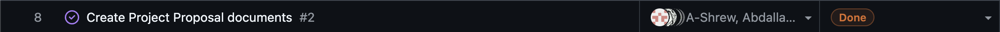

# Week 11 (11/10/2025 - 11/16/2025)

There is no week 11 (reading break) peer evaluation, so tasks image cannot be obtained.
Tasks:
- Coding
- Code Reviews
- Testing
- Researching

Worked on Refactoring and updating to use PyDriller over subprocesses.

# Features

# Recap

This week I fixed the Pytest import issue that I found last week, as well I refactored the repo_reader.py module to use PyDriller rather than subprocesses. In doing so I also refactored the git grouping to work with PyDriller as well to maintain consistency. As I had redone both the git grouping and repo reader modules I have also completely overhauled all of the respective tests. Next week I will be expanding on the reporting section of our analysis, as we can now extract details and output logs of different kinds, the information to be analyzed via the text analysis must be more focused, which is my next focus.

# Week 10 (11/03/2025 - 11/09/2025)

# Features

# Recap

This week I worked through how to group files by git repo association by associating them with a unique repo id that can later be used to aggregate them when outputting the analysis and logging it. However in doing so I had discovered an issue with an earlier module and its importing into other files, specifically the repo_reader.py file, which will block either the tests from running, or the code from running. As this was an undiscovered issue until now I will be fixing it within the next sprint as well as completing some refactoring and further work on the analysis of the data now that we have the majority of file types covered.

# Week 9 (10/27/2025 - 11/02/2025)

# Features

# Recap

This week I completed a module to extract data from various Microsoft Word specific files, including docx, rtf, and odt. This takes in a file of that kind and then returns metadata surrounding title, subject, author, creation date, modification date, length of the files, number of characters, words, and paragraphs as well as some specific data extraction for docx that the other files don't support.

Next week I plan to integrate these features into the overall file analysis system as well as expanding upon the actual analysis and generation of insights over the gathered and consolidated data from the previous modules we have set up as a group. I expect to keep working on this over the reading week as well using the time off to my advantage.

# Week 8 (10/20/2025 - 10/26/2025)

# Features

# Recap

This week I spent time setting up the initial file search service, that will take in a file or folder path as well as a set of excluded paths and compare against them to count or access only specific files.

Next week I plan to expand upon this and add more functionality to it, possibly by implementing aspects of the analysis service into the file search service or continuing to set up different types of specific file analysis services for currently uncovered file types.

# Week 7 (10/13/2025 - 10/19/2025)

# Features

# Recap

This week I began work on coding the basic tests to lay out the path for test driven development, I did this collaboratively with Adam. This task puts down the foundation to work from going forwards with other features and aspects of the project. As well, I have continued to look into and somewhat apply the basics of metadata extraction from files and .git folders that will need to be applied in the future within specific tests.

# Week 6 (10/06/2025 - 10/12/2025)

# Features

# Recap

Deliberated with the group and came to the consensus to switch languages based on the project requirements. Worked to update the repo to accomadte this change and looked into using Python and the libraries that will be required as well as looking into and setting up Docker.

# Week 5 (9/29/2025 - 10/05/2025)

# Features

# Recap

Worked on the data flow diagrams and participated in group discussion surrounding the best practice to proceed with regrading our project. Looked into possible coding languages and continued analysis of Rust syntax and cleaned up the current github repo.

# Week 4 (9/22/2025 - 9/28/2025)

# Features

# Recap

Worked on and contributed to the Project Proposal with no individual tasks assigned. Began looking into the Rust language as well as metadata for various file formats to prepare for coming necessary aspects of the project.

# Week 3 (9/14/2025 - 9/21/2025)

# Features

# Recap

Worked on and contributed to the creation and brainstorming of the group functional requirements as well as looking into and researching various language options (Java, Rust, Python, C/C#) as we plan to move forwards with one once the functional requirements are solidified.
