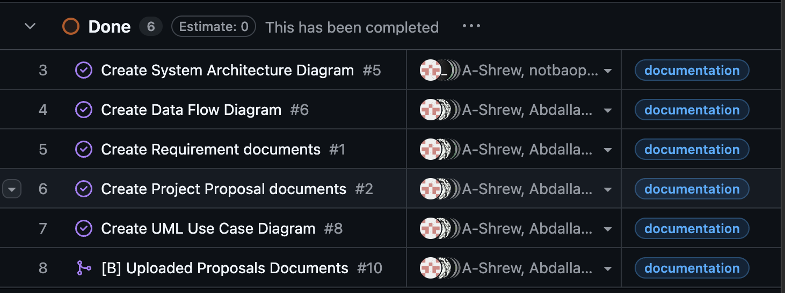
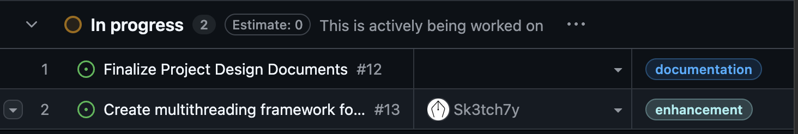
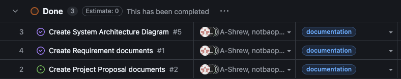
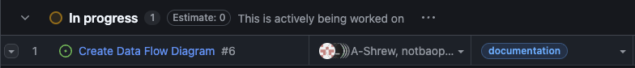
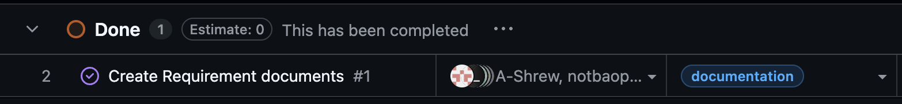
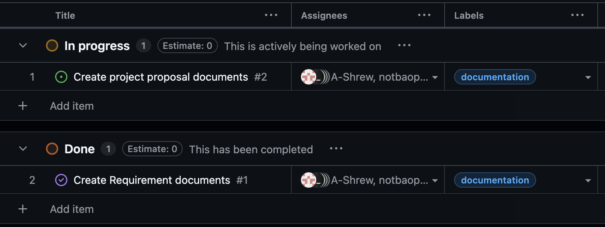

# Week 5 (9/28/2025 - 10/05/2025)

## Features

## Recap

Group collaboration on Data Flow Diagram.
I move all logs from main branch to a different branch ("Logs").

DFD, System Architecture Diagram, Project proposal, and Requirement Documents require updating, Requirements shall also be codified into github issues

## Additional Context
## Team Survey:

.png)
.png)
.png)

# Week 4 (9/21/2025 - 9/28/2025)

## Features

## Recap

Group collaboration on System Architecture diagram, and Project proposal with no individual tasks assigned. Completed documents and created starter code for Rust EGUI development. Beginning work on Data Flow Diagram
  

## Additional Context
## Team Survey:

.png)
.png)
.png)

# Week 3 (9/14/2025 - 9/21/2025)

## Features

## Recap

Group collaboration on project requirements with no individual tasks assigned. Completed requirements document and researched technology options (Rust, Python, Java, C/C#). Leaning toward Rust but waiting for final project requirements before committing.

https://github.com/COSC-499-W2025/capstone-project-team-10/pull/3

## Additional Context
## Team Survey:

.png)
.png)
.png)

