# T2 - Week 1 (1/5/2025 - 1/11/2025)

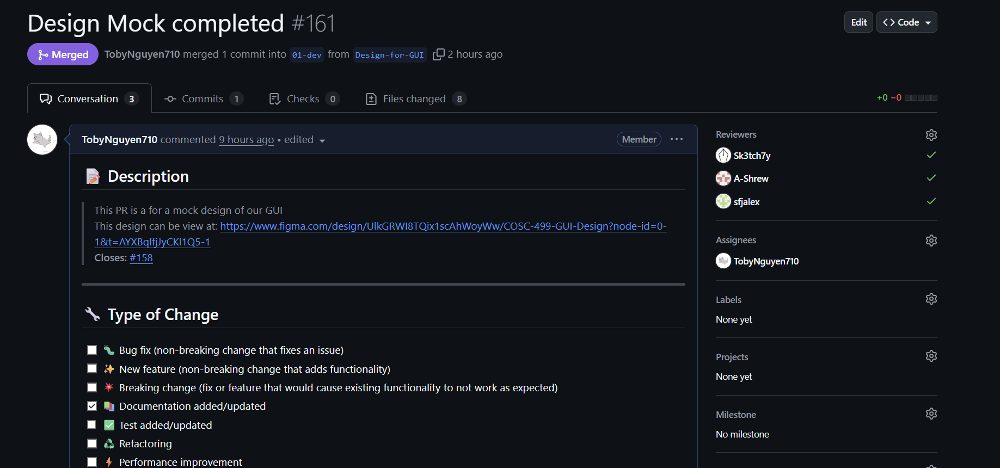
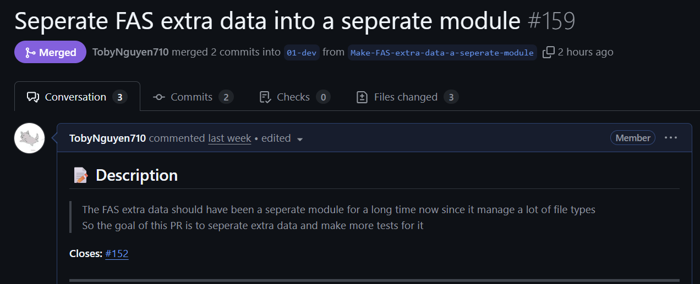

## Features

## Recap

- For term 2 week 1, I worked on the refactor of FAS extra data and mock design for the GUI (Milestone 2)
  - Since FAS extra data is getting bigger with more file types, it should be a seperate feature, which I made this week
  + Things that went well: The GUI is design with figma so it looks way better than expected
  - Things that did not went well: The refactor means that I have to redesign the test cases which is a lot (I still got it done)
- I will start work on milestone 2 starting next week with the given guidelines

## Additional Context
## Team Survey:

.png)
.png)
.png)

# Week 14 (11/23/2025 - 11/30/2025)

## Features

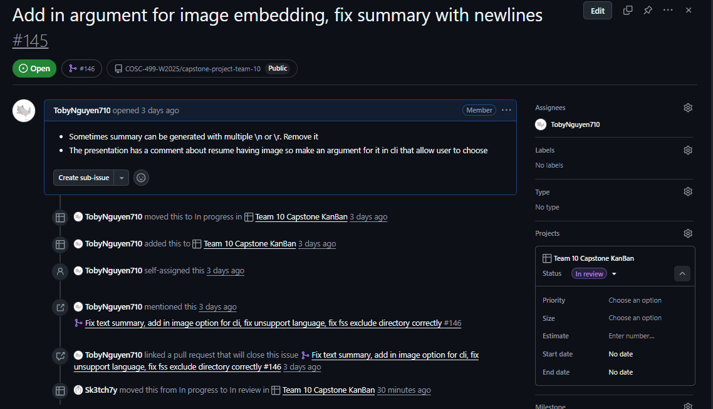
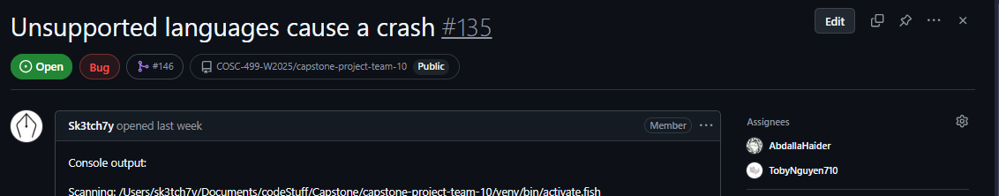

## Recap

- For week 14, I worked on the adding image arguments for our app since resume should be able to configure if image is embedded or not
  - Fix bug for summary printing out multiple \n or \r
  - Fix code reader to run unsupported language
  - Fix FSS should exclude correctly for directories
- I am preparing for final exam for week 15 and 16. See you on term 2!

## Additional Context
## Team Survey:

.png)
.png)
.png)
# Week 13 (11/23/2025 - 11/30/2025)

## Features

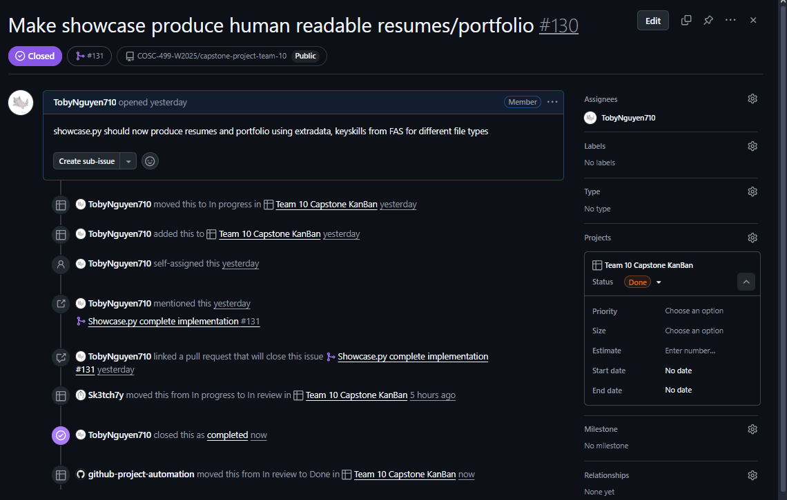

## Recap

- For week 13, I worked on the showcase module (generating resume and porfolio)
    - I made it so that the showcase.py now use the key skills of FAS to generate and display a human readable resume/portfolio
    - I have to change up FAS a bit since FAS has a lot of details so I have to take all that details and make it into key skills to output to showcase
- For week 14, it is our last week, I think we will go over everything to see if we miss anything

## Additional Context
## Team Survey:

.png)
.png)
.png)

# Week 12 (11/16/2025 - 11/23/2025)

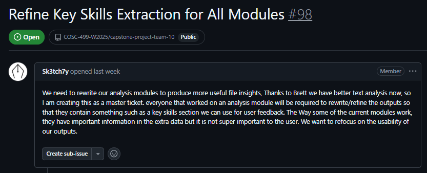

## Features

## Recap

- For week 12, I work on the master ticket with our teamate for FAS key skills
  - Specifically, I made FAS return a JSON instead of just string.
  - I also made fas excel give fas the skills of the user
  - I have also fixed the bug of log.py I encountered on Week 11
- For next week, I think we will connect our project together and make a demo.

## Additional Context
## Team Survey:

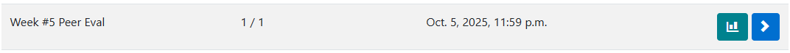
.png)
.png)
.png)

# Week 11 (11/09/2025 - 11/16/2025)

## Features

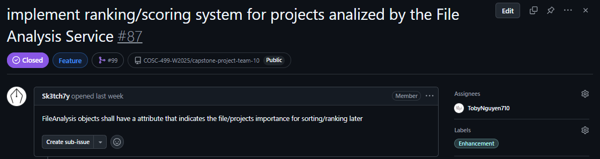

## Recap

- For week 11, I make a simple ranking/scoring system
  - It has come to my attention that log.py need to be changed in conjunction with the new scoring system.
- For next week, I plan to change the log.py and work on a new issue (not yet decided)

## Additional Context
## Team Survey:

There is no team survey on Reading Break

# Week 10 (11/02/2025 - 11/09/2025)

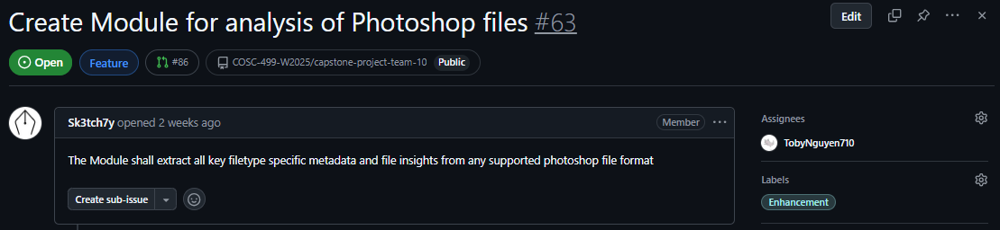

## Features

## Recap

- For week 10, I create excel analysis module that can extract extra data for my week 8 analyis module
  - This time I work on Photoshop data
- Update FAS to take in DOCX and Images (the last week's issue)
- Fully complete FAS and make it a fully working component
- For the next week I plan to work on the ranking system for FAS

## Additional Context
## Team Survey:

.png)
.png)
.png)

# Week 9 (10/26/2025 - 11/02/2025)

## Features

## Recap

- For week 9, I create excel analysis module that can extract extra data for my week 8 analyis module
  - Added Excel Data Extractor that will return a readable object for FAS to use as extra info.
- Update FAS to take in Excel and PDF (the last week's issue)
- Refactored old tests. (test_fas_key.py was moved to test_fas.py and some content was refactored)
- Helped out Adam with a pytest bug that makes it failed to pass on Window OS

## Additional Context
## Team Survey:

.png)
.png)
.png)

# Week 8 (10/19/2025 - 10/26/2025)

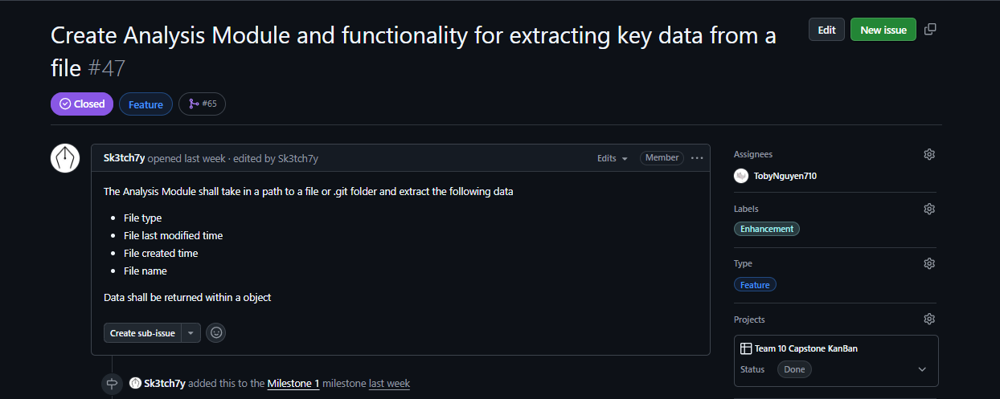

## Features

## Recap

- For week 8, I create analysis module that can extract key data and test cases for it.
  - File analysis that receives input (file path) and output an object that contains: file type, file last modified time, file created time, file name, extra file data (file data from specific extension such as pdf, docx, git,...) (currently a placeholder)

## Additional Context
## Team Survey:

.png)
.png)
.png)

# Week 7 (10/12/2025 - 10/19/2025)

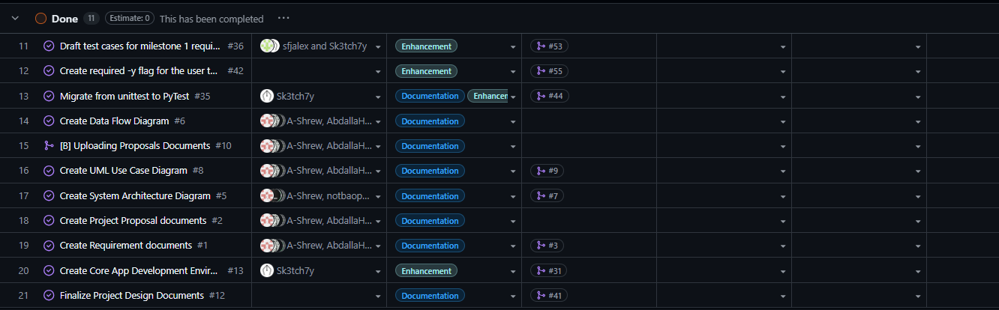

## Features

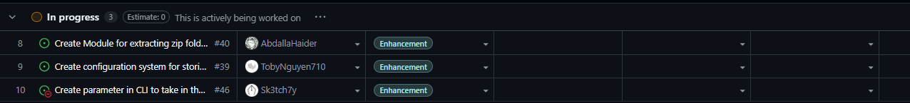

## Recap

- For week 7, I review code and changes of our team. I also finalize the readme file. We are trying to finalizing test cases draft before moving to week 8.

## Additional Context
## Team Survey:

.png)
.png)
.png)

# Week 6 (10/05/2025 - 10/12/2025)

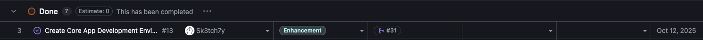

## Features

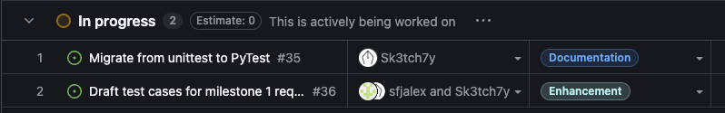

## Recap

- We have decided to use Python for our project now. Therefore the repo is in being rebuilt and currently not usable until the end of next week
- I am also rechecking every document we made before to match the new requirement

## Additional Context
## Team Survey:

.png)
.png)
.png)

# Week 5 (9/28/2025 - 10/05/2025)

## Features

## Recap

Group collaboration on Data Flow Diagram.
I move all logs from main branch to a different branch ("Logs").

DFD, System Architecture Diagram, Project proposal, and Requirement Documents require updating, Requirements shall also be codified into github issues

## Additional Context
## Team Survey:

.png)
.png)
.png)

# Week 4 (9/21/2025 - 9/28/2025)

## Features

## Recap

Group collaboration on System Architecture diagram, and Project proposal with no individual tasks assigned. Completed documents and created starter code for Rust EGUI development. Beginning work on Data Flow Diagram
  

## Additional Context
## Team Survey:

.png)
.png)
.png)

# Week 3 (9/14/2025 - 9/21/2025)

## Features

## Recap

Group collaboration on project requirements with no individual tasks assigned. Completed requirements document and researched technology options (Rust, Python, Java, C/C#). Leaning toward Rust but waiting for final project requirements before committing.

https://github.com/COSC-499-W2025/capstone-project-team-10/pull/3

## Additional Context
## Team Survey:

.png)
.png)
.png)

