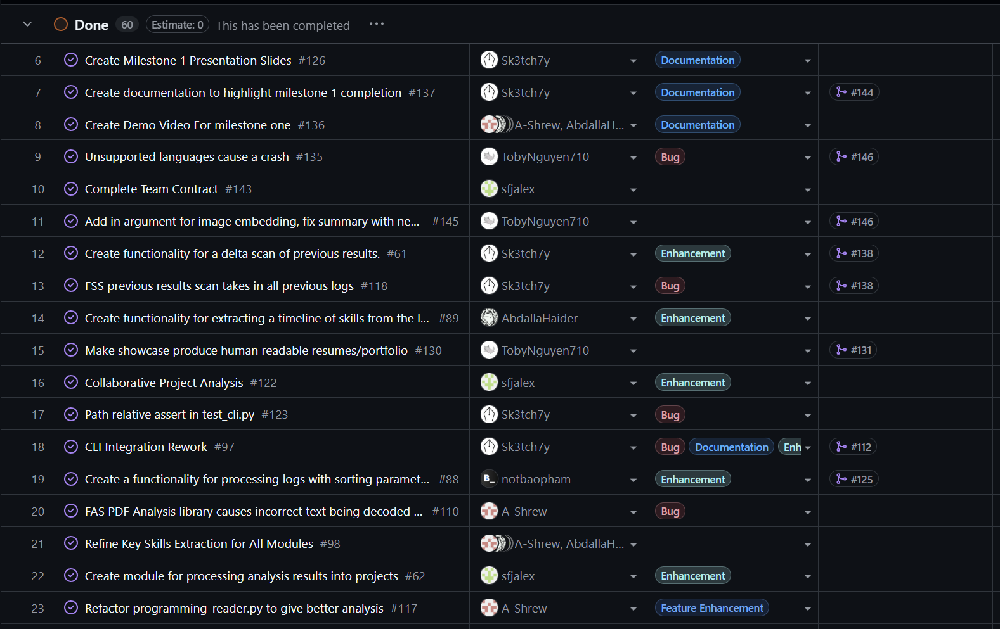
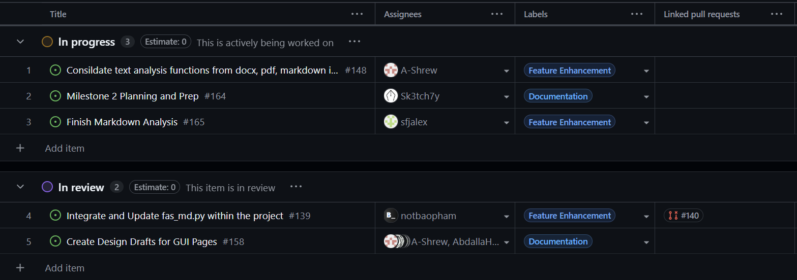
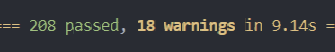

# Sprint for 1/5/25 -> 1/11/25

## Milestone Goals

https://github.com/COSC-499-W2025/capstone-project-team-10/issues/159 - Seperate FAS extra data into a seperate module  
https://github.com/COSC-499-W2025/capstone-project-team-10/issues/160 - Design draft completed  
https://github.com/COSC-499-W2025/capstone-project-team-10/issues/161 - Design Mock completed  
https://github.com/COSC-499-W2025/capstone-project-team-10/issues/162 - Text analysis feedback consolidation  
https://github.com/COSC-499-W2025/capstone-project-team-10/issues/163 - Update readme with setup steps for milestone 1  
https://github.com/COSC-499-W2025/capstone-project-team-10/issues/164 - Integrate text analysis with pdf extraction

## Burnup Chart

## Completed Tasks

## In-Progress

## Test Report
All tests pass

The new test specifics can be found in their relative PRs.

## Reflection / Additional Context

During Term 2 - week 1, our team focused on preparation and groundwork for the next phase of the project. We created an initial design mockup for the GUI, which helped align the team on layout, features, and overall user experience before implementation. At the same time, some team members refactored older sections of the codebase (text analysis, fas extra data) to improve readability, structure, and maintainability.

We plan to begin active development of the GUI next week based on the finalized mockups and guidelines, while continuing to iterate on code quality as needed.