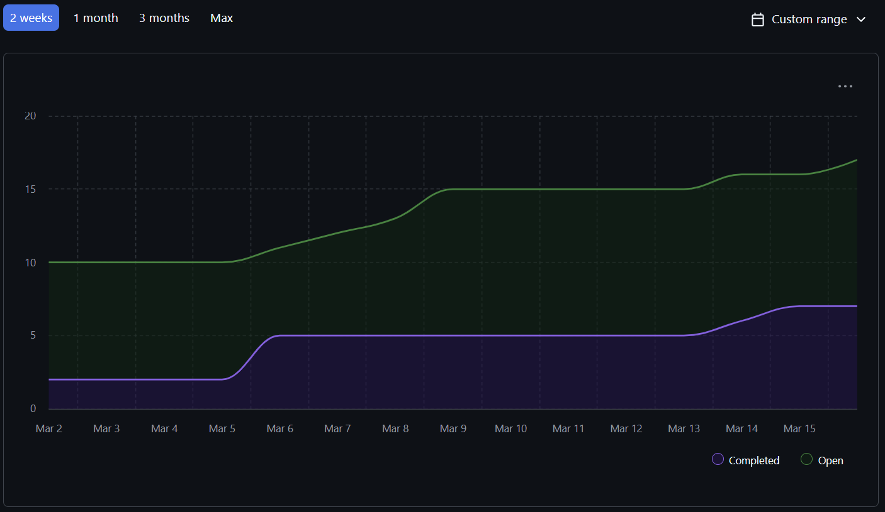

## Sprint for 2026/03/02 - 2026/03/08

### Milestone goals
- https://github.com/COSC-499-W2025/capstone-project-team-10/issues/265 Peer Testing 2
- https://github.com/COSC-499-W2025/capstone-project-team-10/issues/267 Milestone 3 Presentation preperation
- https://github.com/COSC-499-W2025/capstone-project-team-10/issues/269 Top 3 Project Showcase
- https://github.com/COSC-499-W2025/capstone-project-team-10/issues/256 Create Screen for adding work experience and modifying personal info
- https://github.com/COSC-499-W2025/capstone-project-team-10/issues/262 Implement Favourites Tab

## Burnup Chart

## Completed Tasks
- https://github.com/COSC-499-W2025/capstone-project-team-10/issues/252
- https://github.com/COSC-499-W2025/capstone-project-team-10/issues/251
- https://github.com/COSC-499-W2025/capstone-project-team-10/issues/258
- https://github.com/COSC-499-W2025/capstone-project-team-10/issues/260
- https://github.com/COSC-499-W2025/capstone-project-team-10/issues/261
- https://github.com/COSC-499-W2025/capstone-project-team-10/issues/255
- https://github.com/COSC-499-W2025/capstone-project-team-10/issues/264
- https://github.com/COSC-499-W2025/capstone-project-team-10/issues/257

## In progress
- https://github.com/COSC-499-W2025/capstone-project-team-10/issues/254
- https://github.com/COSC-499-W2025/capstone-project-team-10/issues/256
- https://github.com/COSC-499-W2025/capstone-project-team-10/issues/262
- https://github.com/COSC-499-W2025/capstone-project-team-10/issues/155

## Tests
All tests pass

## Recap
In week 10, our team focused on enhancing the user experience and preparing for upcoming presentations. We worked on implementing new GUI features, including a screen for adding work experience and modifying personal information, as well as a Favourites tab for easier project tracking. Additionally, we are preparing for our Milestone 3 presentation and making document for Peer Testing 2 to get feedback on our current build.

We also finalized tasks related to showcasing our project in the Top 3 Project Showcase. While the core functionality of the application is largely complete, we are continuing to refine the interface, polish features, and ensure everything is presentation-ready. Next, we will focus on finalizing the resume and portfolio feature sets, improving customization options, and performing further optimization and maintenance on the system.