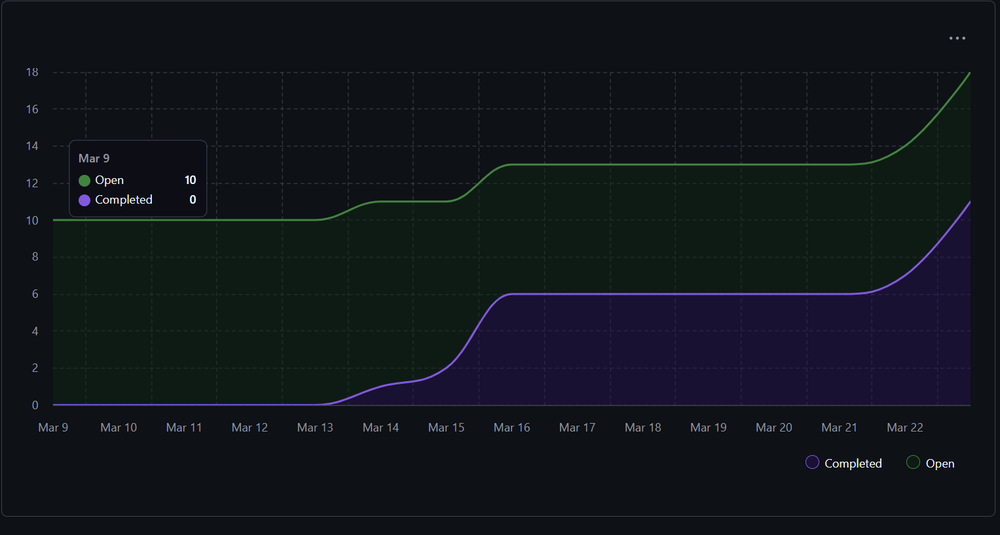
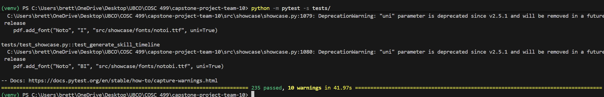

## Sprint for 2026/03/16 - 2026/03/022

### Milestone goals
- https://github.com/COSC-499-W2025/capstone-project-team-10/issues/288 Milestone 3 Video demo
- https://github.com/COSC-499-W2025/capstone-project-team-10/issues/267 Milestone 3 Presentation preperation
- https://github.com/COSC-499-W2025/capstone-project-team-10/issues/269 Top 3 Project Showcase
- https://github.com/COSC-499-W2025/capstone-project-team-10/issues/286 GUI Polish portfolio page
- https://github.com/COSC-499-W2025/capstone-project-team-10/issues/274 GUI Polish profile page

## Burnup Chart

## Completed Tasks
- https://github.com/COSC-499-W2025/capstone-project-team-10/issues/254
- https://github.com/COSC-499-W2025/capstone-project-team-10/issues/256
- https://github.com/COSC-499-W2025/capstone-project-team-10/issues/262
- https://github.com/COSC-499-W2025/capstone-project-team-10/issues/155
- https://github.com/COSC-499-W2025/capstone-project-team-10/issues/265
- https://github.com/COSC-499-W2025/capstone-project-team-10/issues/269
- https://github.com/COSC-499-W2025/capstone-project-team-10/issues/292
- https://github.com/COSC-499-W2025/capstone-project-team-10/issues/274
- https://github.com/COSC-499-W2025/capstone-project-team-10/issues/267

## In progress
- https://github.com/COSC-499-W2025/capstone-project-team-10/issues/286
- https://github.com/COSC-499-W2025/capstone-project-team-10/issues/288
- https://github.com/COSC-499-W2025/capstone-project-team-10/issues/289

## Tests
All tests pass

## Recap
In week 11 we conducted our peer review testing and gathered information on ways we could improve our project. We divided feedback into different issues and focused on fixing the problems raised in the reviews. Every page in our app received changes to improve usability and ease of access in direct response to peer feedback. The scan page got a visual update and added an option for users to specify if the folder is a project or contains mutiple projects. This carried over to the dashboard as the projects are now consistent and do not contain random folders labeled as projects. The dashboard also got a visual update making it easier to use and navigate through. The items page had been broken from merges and was fixed this week so it is now fully functional. Resume and portfolio generation was also improved and the page buttons are now easier to use and look nicer. 

We also continued work on preperations for the milestone 3 presentation. Next week we will finish our polish and bugfixing and work on the video demo. 