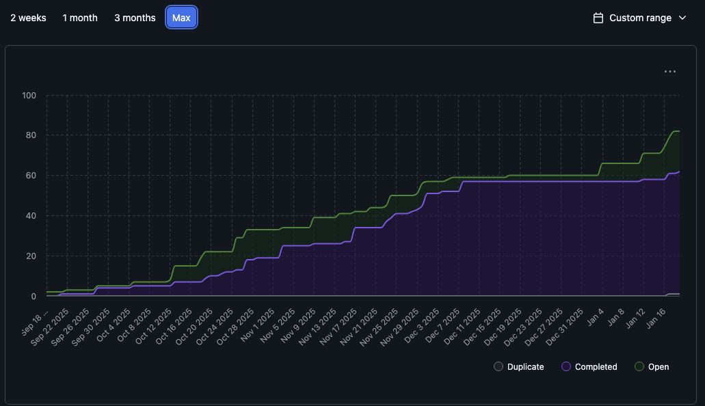
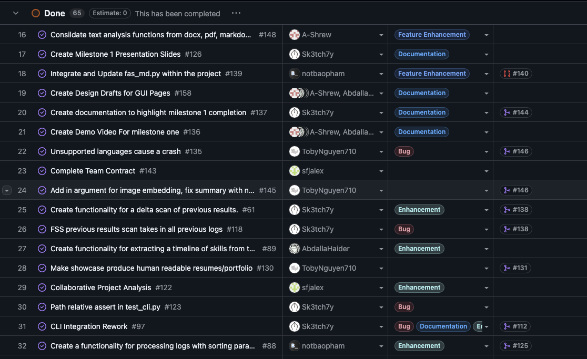
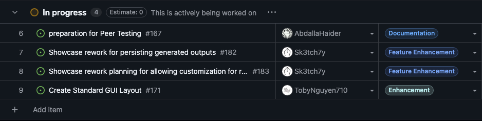
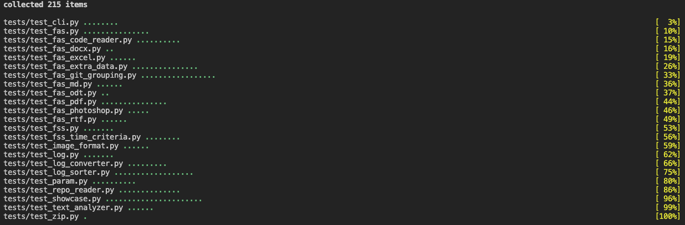

# Sprint for 1/11/25 -> 1/18/25

## Milestone Goals

- [PR #177 - Gui user agreement pop-up](https://github.com/COSC-499-W2025/capstone-project-team-10/pull/177)
- [PR #181 - Milestone 2 Compliance planning](https://github.com/COSC-499-W2025/capstone-project-team-10/pull/181)
- [PR #184 - Finalized GUI Draft](https://github.com/COSC-499-W2025/capstone-project-team-10/pull/184)
- [PR #185 - Fix FAS file extension bug](https://github.com/COSC-499-W2025/capstone-project-team-10/pull/185)
- [PR #186 - Fixed fas_pdf.py halting scan on error.](https://github.com/COSC-499-W2025/capstone-project-team-10/pull/186)
- [PR #187 - Created peer testing plan doc](https://github.com/COSC-499-W2025/capstone-project-team-10/pull/187)
- [PR #188 - GUI file selection](https://github.com/COSC-499-W2025/capstone-project-team-10/pull/188)
- [PR #189 - Markdown analysis improvement](https://github.com/COSC-499-W2025/capstone-project-team-10/pull/189)

## Burnup Chart

## Completed Tasks

## In-Progress

## Test Report
All tests pass

The new test specifics can be found in their relative PRs.

## Reflection / Additional Context

During Term 2 - week 2, our team focused on preparation and refactoring for the next phase of the project. We created a final design mockup for the GUI, which will help with consistent implementation going forward, standardizing features, and optimizing user experience. Some team members refactored older sections of the codebase (Markdown analysis) to improve maintainability and fix bugs (FAS Extension bug, PDF failed parsing Error), Abdallah began preparing for our peer testing, and Adam spent a portion of the week reading through the codebase and planning out our Milestone 2 compliance. 

We began some of the work on our GUI, creating the EULA acceptance view and limiting logic to prevent users from using the app without viewing and approving an up to date EULA agreement. before further development happens on the GUI, the finalized design must still be agreed upon.

Since the GUI draft design is being finalized this sprint we will be working more on creating the views from the design draft, before we start adding the functionality to the GUI. 

A big focus going forward is going to be the manual testing of GUI elements and ensuring that they work across all platforms. With our unique implementation, the group is also focusing on making sure our backend and frontend are distinct but clearly linked to satisfy the API requirements outlined in Milestone 2. 