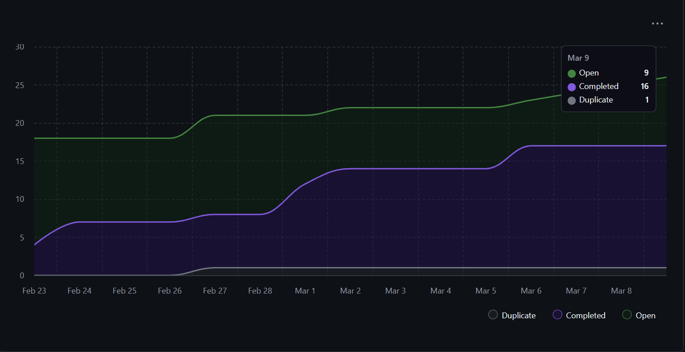
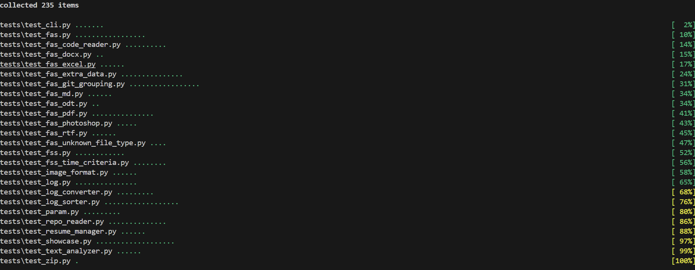

## Sprint for 2026/03/02 - 2026/03/08

### Milestone goals
- https://github.com/COSC-499-W2025/capstone-project-team-10/pull/251 Showcase rewrite
- https://github.com/COSC-499-W2025/capstone-project-team-10/pull/252 Resume/portfolio page rewrite as one page using project grouping
- https://github.com/COSC-499-W2025/capstone-project-team-10/pull/255 Milestone 2 demo video

## Burnup Chart

## Completed Tasks
- https://github.com/COSC-499-W2025/capstone-project-team-10/issues/252
- https://github.com/COSC-499-W2025/capstone-project-team-10/issues/251
- https://github.com/COSC-499-W2025/capstone-project-team-10/issues/258
- https://github.com/COSC-499-W2025/capstone-project-team-10/issues/260
- https://github.com/COSC-499-W2025/capstone-project-team-10/issues/261
- https://github.com/COSC-499-W2025/capstone-project-team-10/issues/255
- https://github.com/COSC-499-W2025/capstone-project-team-10/issues/264

## In progress
- https://github.com/COSC-499-W2025/capstone-project-team-10/issues/254
- https://github.com/COSC-499-W2025/capstone-project-team-10/issues/256
- https://github.com/COSC-499-W2025/capstone-project-team-10/issues/262
- https://github.com/COSC-499-W2025/capstone-project-team-10/issues/155

## Tests
All tests pass

## Recap
In week 9 our team worked on polishing the gui and improving features like the resume and portfolio generation. The resume generation system recieved an overhaul so now the output is a professional resume with proper formatting. The portfolio generation now has a heatmap tracking the timeframe of when projects were started. Our group also finished the demo video for milestone 2 and additional gui visual improvements (styles, formatting, etc). We also had our quiz this week so we prepared for that by reviewing our api compliance. 

We are almost finished with the project, but are still working on adding more polish and reviewing what we have built. The tasks we will work on next are bulding the final resume and web portfolio feature sets, adding more customization settings to the gui, and other maintenance/optimization improvements.
