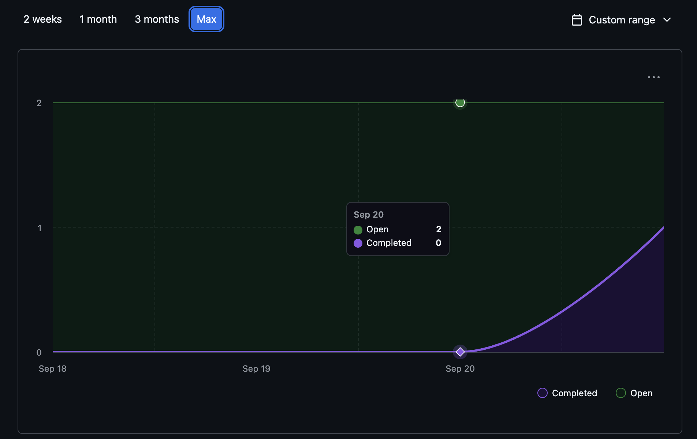
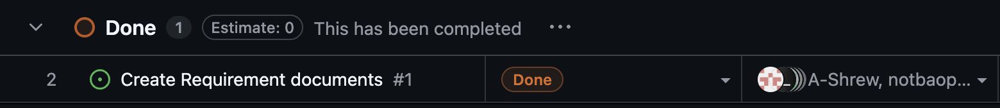

# Weekly Group Report
## Team Members and Github Alias:
- Abdalla: @rayhan-ahmed91
- Adam: @Sk3tch7y
- Brett: @A-Shrew
- Bao: @notbaopham
- Sam: @sfjalex
- Toby: @TobyNguyen710
## Sprint for 09/15/2025 -> 09/22/2025
## Milestone Goals
 - Complete Draft of Project Requirements
    https://github.com/COSC-499-W2025/capstone-project-team-10/issues/1
## Project Status
- Draft of Project Requirements completed and submitted
    - https://github.com/COSC-499-W2025/capstone-project-team-10/issues/1
    
## Burnup Chart

## Completed Tasks

- Requirements Draft
    - https://github.com/COSC-499-W2025/capstone-project-team-10/pull/3

## In-progress

- Project Proposal
    - https://github.com/COSC-499-W2025/capstone-project-team-10/issues/2

## Test Report
- No Testing required for Project requirements (No Code)

## Additional Notes

No Additional Notes