# Weekly Group Report Team #10

## Team Members and Github Alias:

- Abdalla: @AbdallaHaider
- Adam: @Sk3tch7y
- Brett: @A-Shrew
- Bao: @notbaopham
- Sam: @sfjalex
- Toby: @TobyNguyen710

# Sprint for 09/15/2025 -> 09/21/2025

## Milestone Goals

- Complete [Project Requirements Draft](https://github.com/COSC-499-W2025/capstone-project-team-10/issues/1)

## Burnup Chart

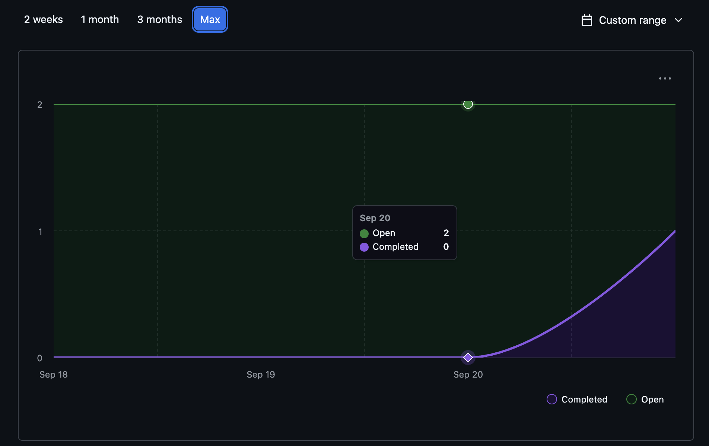

## Completed Tasks

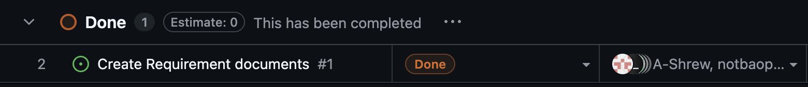

- [Project Requirements Draft](https://github.com/COSC-499-W2025/capstone-project-team-10/pull/3)

## In-progress

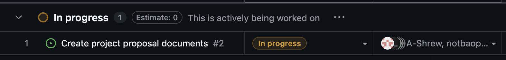

- [Project Proposal Document](https://github.com/COSC-499-W2025/capstone-project-team-10/issues/2)

## Test Report

- No Testing required for Project requirements (No Code)

## Reflection/Additional Context

- For Week 3 we collaborated to create the first draft of the requirements. Together we delivered a solid set of requirements in class and finished the revision before uploading the documents to GitHub. Our next task will be to work on the project proposal documents.

# Sprint for 09/22/2025 -> 09/28/2025

## Milestone Goals

- Complete [Project Proposal Document](https://github.com/COSC-499-W2025/capstone-project-team-10/issues/2)
- Complete [System Architecture Diagram](https://github.com/COSC-499-W2025/capstone-project-team-10/issues/5)
- Complete [UML Use Case Diagram](https://github.com/COSC-499-W2025/capstone-project-team-10/issues/8)

## Burnup Chart

## Completed Tasks

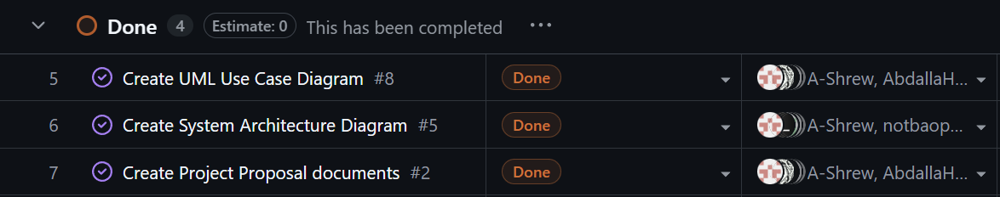

- [Project Proposal Document](https://github.com/COSC-499-W2025/capstone-project-team-10/issues/2)
- [System Architecture Diagram](https://github.com/COSC-499-W2025/capstone-project-team-10/issues/5)
- [UML Use Case Diagram](https://github.com/COSC-499-W2025/capstone-project-team-10/issues/8)

## In-progress

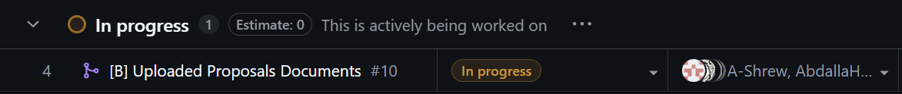

- [Upload Proposals Documents](https://github.com/COSC-499-W2025/capstone-project-team-10/issues/10)

## Test Report

- No Testing required for Project requirements (No Code)

## Reflection/Additional Context

- For Week 4 we collaborated to create our system architecture diagram. After receiving feedback in class we updated the diagram to give more insight into the intended functionality of our analysis service. Then we each worked on a part of the project proposal document until it was complete.

# Sprint for 09/29/2025 -> 10/5/2025

## Milestone Goals

- Complete [Data Flow Diagram](https://github.com/COSC-499-W2025/capstone-project-team-10/issues/6)

## Burnup Chart

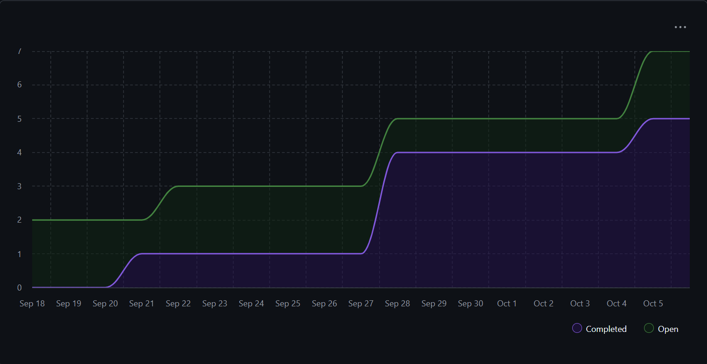

## Completed Tasks

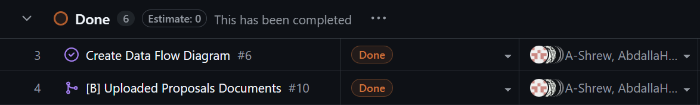

- [Data Flow Diagram]()

## In-progress

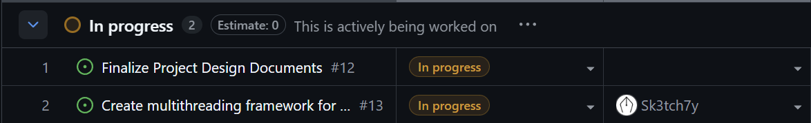

- [Project Design Document Finalization](https://github.com/COSC-499-W2025/capstone-project-team-10/issues/12)
- [Multithreading Framework](https://github.com/COSC-499-W2025/capstone-project-team-10/issues/13)

## Test Report

- No Testing required for Project requirements (No Code)

## Reflection/Additional Context

- For Week 5 we collaborated to create our data flow diagram. After receiving feedback in class we updated our diagram to use verb-noun format for processes and nouns for data flows. Next we will finalize the project design documents with the new requirements list.

# Sprint for 10/06/25 -> 10/12/25

## Milestone Goals

- Complete [Core App Development Environment](https://github.com/COSC-499-W2025/capstone-project-team-10/issues/13)
- Complete [Finalize Project Design Documents](https://github.com/COSC-499-W2025/capstone-project-team-10/issues/12)

## Burnup Chart

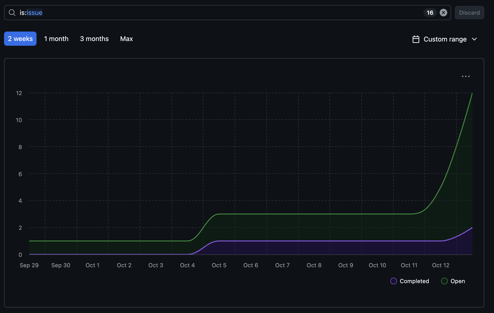

## Completed Tasks

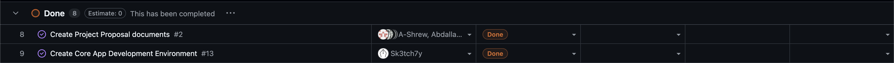

- [Core App Development Environment](https://github.com/COSC-499-W2025/capstone-project-team-10/issues/13)
- [Finalized Project Proposal Documents](https://github.com/COSC-499-W2025/capstone-project-team-10/issues/2)

## In-Progress

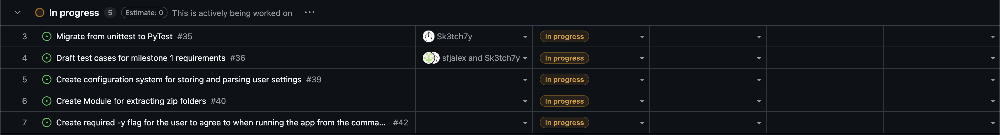

- [Migrate from unittest to PyTest](https://github.com/COSC-499-W2025/capstone-project-team-10/issues/35)
- [Draft test cases for milestone 1](https://github.com/COSC-499-W2025/capstone-project-team-10/issues/36)
- [Create configuration system for user settings](https://github.com/COSC-499-W2025/capstone-project-team-10/issues/39)
- [Create Module for extracting ZIP folders](https://github.com/COSC-499-W2025/capstone-project-team-10/issues/40)
- [Create -y flag for command line users](https://github.com/COSC-499-W2025/capstone-project-team-10/issues/42)

## Test Report

- No Testing Required Yet

## Reflection / Additional Context

- For week six we deliborated over the choice of coding languages due to the updated system requirement and switched languages to Python. We then updated the coding environment to reflect this as well as completing other requirements for week six with the readme file. Next we plan to break down test cases and configurations to give us a solid starting point for launching the project.

# Sprint for 10/13/25 -> 10/19/25

## Milestone Goals

- Complete [Draft test cases for milestone 1](https://github.com/COSC-499-W2025/capstone-project-team-10/issues/36)

## Burnup Chart

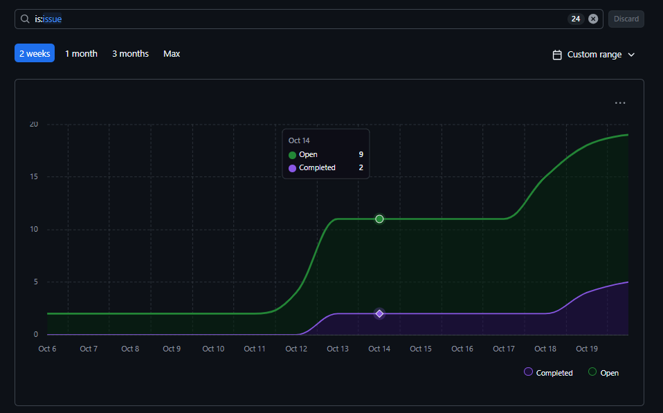

## Completed Tasks

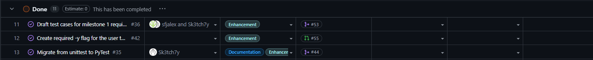

- [Migrate from unittest to PyTest](https://github.com/COSC-499-W2025/capstone-project-team-10/issues/35)
- [Draft test cases for milestone 1 requirements](https://github.com/COSC-499-W2025/capstone-project-team-10/issues/36)
- [Create required -y flag for the user to agree to when running the app from the command line](https://github.com/COSC-499-W2025/capstone-project-team-10/issues/42)
- [Update test example and Readme](https://github.com/COSC-499-W2025/capstone-project-team-10/issues/44)
- [Created Work breakdown structure](https://github.com/COSC-499-W2025/capstone-project-team-10/pull/52)

## In-Progress

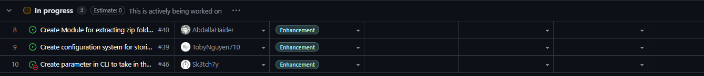

- [Create configuration system for user settings](https://github.com/COSC-499-W2025/capstone-project-team-10/issues/39)
- [Create Module for extracting ZIP folders](https://github.com/COSC-499-W2025/capstone-project-team-10/issues/40)
- [Create parameter in CLI to take in the path to a zip file and scan it](https://github.com/COSC-499-W2025/capstone-project-team-10/issues/46)

## Test Report

- No Testing Required Yet

## Reflection / Additional Context

- For week 7, most tasks are similar to week 6 as we completed the remaining tasks from the README.md started in week 6. We also added a pull request template and created new issues/tickets to divide upcoming tasks among team members for next week’s work.

# Sprint for 10/20/25 -> 10/26/25

## Milestone Goals

- Complete [Basic File Scan Functionality](https://github.com/COSC-499-W2025/capstone-project-team-10/issues/68)
- Complete [Create --zip flag and Refactor Flag Code](https://github.com/COSC-499-W2025/capstone-project-team-10/issues/66)
- Complete [Basic File Analysis Functionality](https://github.com/COSC-499-W2025/capstone-project-team-10/issues/65)
- Complete [Added Module of Tools to Extract Stats from .git projects](https://github.com/COSC-499-W2025/capstone-project-team-10/issues/56)
- Complete [Added Module to Extract Stats from PDF files](https://github.com/COSC-499-W2025/capstone-project-team-10/issues/73)
- Complete [Added Module to Extract Zip Files](https://github.com/COSC-499-W2025/capstone-project-team-10/issues/67)

## Burnup Chart

## Completed Tasks

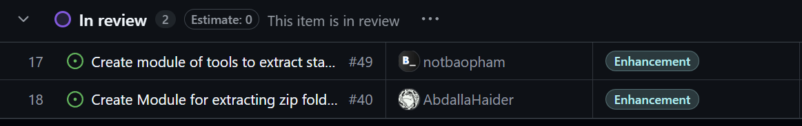
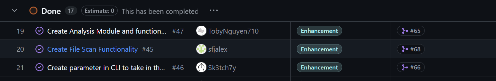

- [Basic File Scan Functionality](https://github.com/COSC-499-W2025/capstone-project-team-10/issues/68)
- [Create --zip flag and Refactor Flag Code](https://github.com/COSC-499-W2025/capstone-project-team-10/issues/66)
- [Basic File Analysis Functionality](https://github.com/COSC-499-W2025/capstone-project-team-10/issues/65)
- [Added Module of Tools to Extract Stats from .git projects](https://github.com/COSC-499-W2025/capstone-project-team-10/issues/56)
- [Added Module to Extract Stats from PDF files](https://github.com/COSC-499-W2025/capstone-project-team-10/issues/73)
- [Added Module to Extract Zip Files](https://github.com/COSC-499-W2025/capstone-project-team-10/issues/67)

## In-Progress

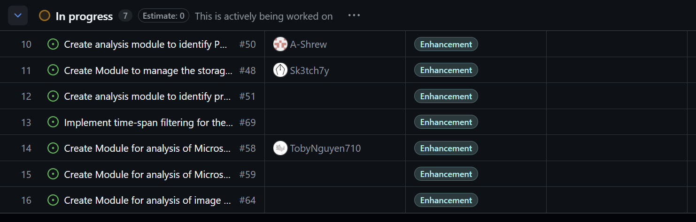

- [Create Module for analysis of Microsoft excel files](https://github.com/COSC-499-W2025/capstone-project-team-10/issues/58)
- [Create Module for analysis of Microsoft word files](https://github.com/COSC-499-W2025/capstone-project-team-10/issues/59)
- [Create Module for analysis of image formats](https://github.com/COSC-499-W2025/capstone-project-team-10/issues/64)
- [Implement time-span filtering for the FSS](https://github.com/COSC-499-W2025/capstone-project-team-10/issues/69)
- [Create analysis module to identify programming files and extract frameworks/libraries](https://github.com/COSC-499-W2025/capstone-project-team-10/issues/51)
- [Create Module to manage the storage of log output](https://github.com/COSC-499-W2025/capstone-project-team-10/issues/48)

## Test Report

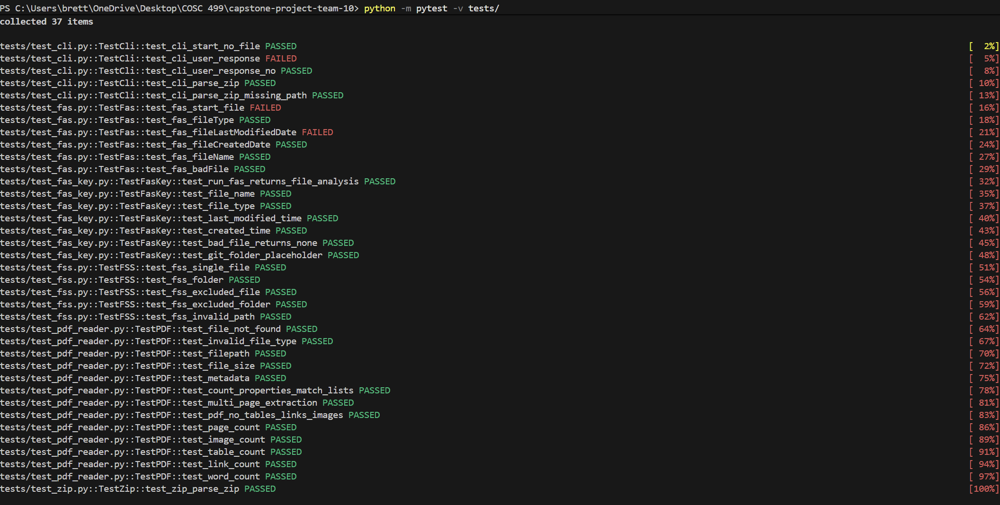

- Some tests fail as the implementations have not yet been built. Additioanlly other tests are implemented, but not shown in this report as they generate errors when running all tests at once.

## Reflection / Additional Context

- Week 8 was a very strong week in terms of delivery and individual work from all group members. Each member took on an issue from the GitHub and completed their task before the end of the week. As a team, we were able to knock six items off our issues board and already have tasks lined up for the next week. One thing we will need to review is how we can integrate our respective work with one another. We have added a lot of code from different coders, so it will be necessary to review it together to make sure the code is compatible with each other's code. Overall, it was a solid week and a great start to the coding aspect of this project.

# Sprint for 10/27/25 -> 11/02/25

Please refer to [Team Log 9](https://github.com/COSC-499-W2025/capstone-project-team-10/blob/02-logs/logs/team%20log/Week%209/team_log.md) (or team_log.md within the Week 9 folder)

# Sprint for 11/02/25 -> 11/09/25

Please refer to [Team Log 10](https://github.com/COSC-499-W2025/capstone-project-team-10/blob/02-logs/logs/team%20log/Week%201-/team_log.md) (or team_log.md within the Week 10 folder)

# Sprint for 11/09/25 -> 11/16/25

Please refer to [Team Log 11](https://github.com/COSC-499-W2025/capstone-project-team-10/blob/02-logs/logs/team%20log/Week%2011/team_log.md) (or team_log.md within the Week 11 folder)

# Sprint for 11/17/25 -> 11/23/25

Please refer to [Team Log 12](https://github.com/COSC-499-W2025/capstone-project-team-10/blob/02-logs/logs/team%20log/Week%2012/team_log.md) (or team_log.md within the Week 12 folder)

# Sprint for 11/23/25 -> 11/30/25

Please refer to [Team Log 13](https://github.com/COSC-499-W2025/capstone-project-team-10/blob/02-logs/logs/team%20log/Week%2013/team_log.md) (or team_log.md within the Week 13 folder)

# Sprint for 12/1/25 -> 12/7/25

Please refer to [Team Log 14](https://github.com/COSC-499-W2025/capstone-project-team-10/blob/02-logs/logs/team%20log/Week%2014/team_log.md) (or team_log.md within the Week 14 folder)

# Sprint for 1/5/25 -> 1/11/25
Please refer to [Team Log T2 - 1](https://github.com/COSC-499-W2025/capstone-project-team-10/blob/02-logs/logs/team%20log/T2%20-%20Week%201/team_log.md) (or team_log.md within the T2 - Week 1 folder)