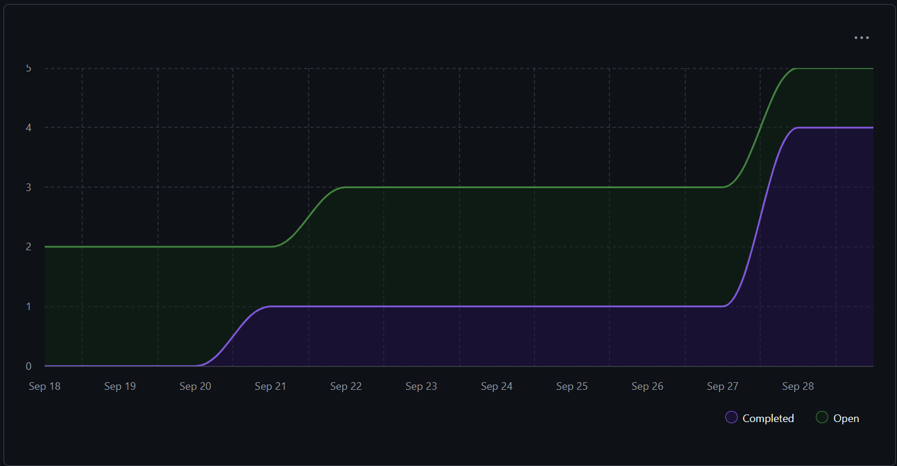

# Weekly Group Report Team #10
## Team Members and Github Alias:
- Abdalla: @AbdallaHaider
- Adam: @Sk3tch7y
- Brett: @A-Shrew
- Bao: @notbaopham
- Sam: @sfjalex
- Toby: @TobyNguyen710

# Sprint for 09/15/2025 -> 09/21/2025
## Milestone Goals
 - Complete [Project Requirements Draft](https://github.com/COSC-499-W2025/capstone-project-team-10/issues/1)

## Burnup Chart

## Completed Tasks

- [Project Requirements Draft](https://github.com/COSC-499-W2025/capstone-project-team-10/pull/3)

## In-progress

- [Project Proposal Document](https://github.com/COSC-499-W2025/capstone-project-team-10/issues/2)

## Test Report
- No Testing required for Project requirements (No Code)

## Reflection/Additional Context
- For Week 3 we collaborated to create the first draft of the requirements. Together we delivered a solid set of requirements in class and finished the revision before uploading the documents to GitHub. Our next task will be to work on the project proposal documents.

# Sprint for 09/22/2025 -> 09/28/2025
## Milestone Goals
 - Complete [Project Proposal Document](https://github.com/COSC-499-W2025/capstone-project-team-10/issues/2)
 - Complete [System Architecture Diagram](https://github.com/COSC-499-W2025/capstone-project-team-10/issues/5)
 - Complete [UML Use Case Diagram](https://github.com/COSC-499-W2025/capstone-project-team-10/issues/8)

## Burnup Chart

## Completed Tasks

- [Project Proposal Document](https://github.com/COSC-499-W2025/capstone-project-team-10/issues/2)
- [System Architecture Diagram](https://github.com/COSC-499-W2025/capstone-project-team-10/issues/5)
- [UML Use Case Diagram](https://github.com/COSC-499-W2025/capstone-project-team-10/issues/8)

## In-progress

- [Upload Proposals Documents](https://github.com/COSC-499-W2025/capstone-project-team-10/issues/10)

## Test Report
- No Testing required for Project requirements (No Code)

## Reflection/Additional Context
- For Week 4 we collaborated to create our system architecture diagram. After receiving feedback in class we updated the diagram to give more insight into the intended functionality of our analysis service. Then we each worked on a part of the project proposal document until it was complete.

# Sprint for 09/29/2025 -> 10/5/2025
## Milestone Goals
- Complete [Data Flow Diagram](https://github.com/COSC-499-W2025/capstone-project-team-10/issues/6)

## Burnup Chart

## Completed Tasks

- [Data Flow Diagram]()

## In-progress

- [Project Design Document Finalization](https://github.com/COSC-499-W2025/capstone-project-team-10/issues/12)
- [Multithreading Framework](https://github.com/COSC-499-W2025/capstone-project-team-10/issues/13)

## Test Report
- No Testing required for Project requirements (No Code)

## Reflection/Additional Context
- For Week 5 we collaborated to create our data flow diagram. After receiving feedback in class we updated our diagram to use verb-noun format for processes and nouns for data flows. Next we will finalize the project design documents with the new requirements list.

# Sprint for 10/06/25 -> 10/12/25
## Milestone Goals
- Complete [Core App Development Environment](https://github.com/COSC-499-W2025/capstone-project-team-10/issues/13)
- Complete [Finalize Project Design Documents](https://github.com/COSC-499-W2025/capstone-project-team-10/issues/12)

## Burnup Chart

## Completed Tasks

- [Core App Development Environment](https://github.com/COSC-499-W2025/capstone-project-team-10/issues/13)
- [Finalized Project Proposal Documents](https://github.com/COSC-499-W2025/capstone-project-team-10/issues/2)

## In-Progress

- [Migrate from unittest to PyTest](https://github.com/COSC-499-W2025/capstone-project-team-10/issues/35)
- [Draft test cases for milestone 1](https://github.com/COSC-499-W2025/capstone-project-team-10/issues/36)
- [Create configuration system for user settings](https://github.com/COSC-499-W2025/capstone-project-team-10/issues/39)
- [Create Module for extracting ZIP folders](https://github.com/COSC-499-W2025/capstone-project-team-10/issues/40)
- [Create -y flag for command line users](https://github.com/COSC-499-W2025/capstone-project-team-10/issues/42)

## Test Report
- No Testing Required Yet

## Reflection / Additional Context
- For week six we deliborated over the choice of coding languages due to the updated system requirement and switched languages to Python. We then updated the coding environment to reflect this as well as completing other requirements for week six with the readme file. Next we plan to break down test cases and configurations to give us a solid starting point for launching the project.
