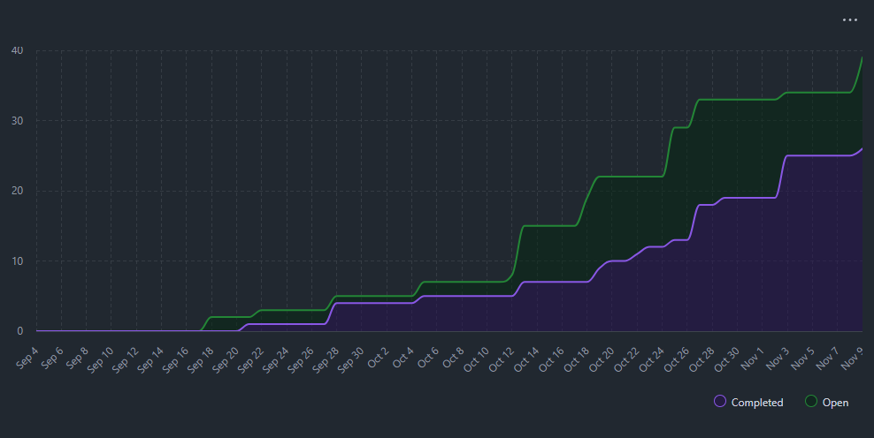
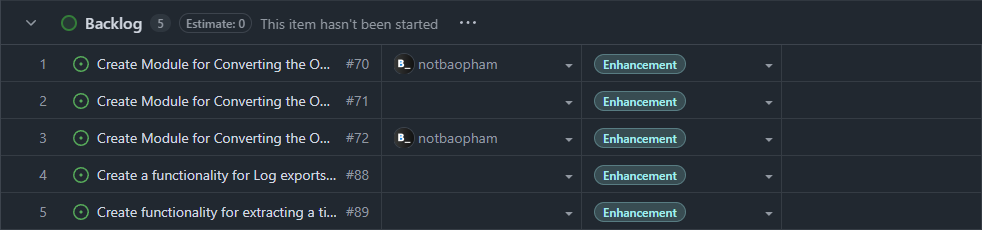

# Sprint for 11/03/25 -> 11/09/25

## Milestone Goals

Completed:
- https://github.com/COSC-499-W2025/capstone-project-team-10/issues/60 - Create module for analysis of .md files
- https://github.com/COSC-499-W2025/capstone-project-team-10/issues/62 - Create module for processing analysis results into projects (Grouping files by .git)
- https://github.com/COSC-499-W2025/capstone-project-team-10/issues/63 - Create module for analysis of Photoshops related files
- https://github.com/COSC-499-W2025/capstone-project-team-10/issues/39 - Create configuration system for storing and parsing user settings
- https://github.com/COSC-499-W2025/capstone-project-team-10/issues/84 - Create module for analysis of raw text blocks

## Burnup Chart

## Completed Tasks

> Below are the issues that were being in-review

## In-Progress

## Test Report

  
Initialization (less errored tests from before)

    

  
Compiler dependency

    

  
Ghost files are being mentioned within the test suite - possible typo?

    

## Reflection / Additional Context
- Week 10 successfully accomplished the tasks of knocking out file types analyzing - basically, FAS is readily to be "sew" together, into an actual master service.
- Bugs from tests are being culled, as stated. But, problems of appearing ghost files within the test suite (please refer to the screenshot) is being investigated - but different parts of everybody's PR are guaranteed to have ran, and pass succesfully, as before
- We will now proceed to works towards:
    - Stabilizing the repo, making the tests runnable and more compatible
    - Integrating the modules into an actual program
    - Shifting gears towards the "output" bulk of the program
- And we would have to update the .readme for more requirements (this time, the psd-tools needs another compiler)
