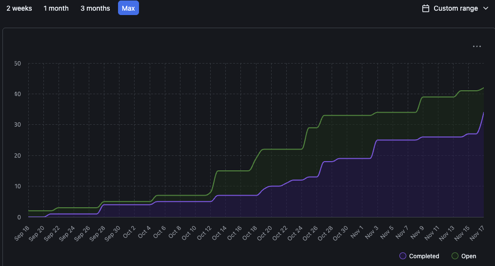
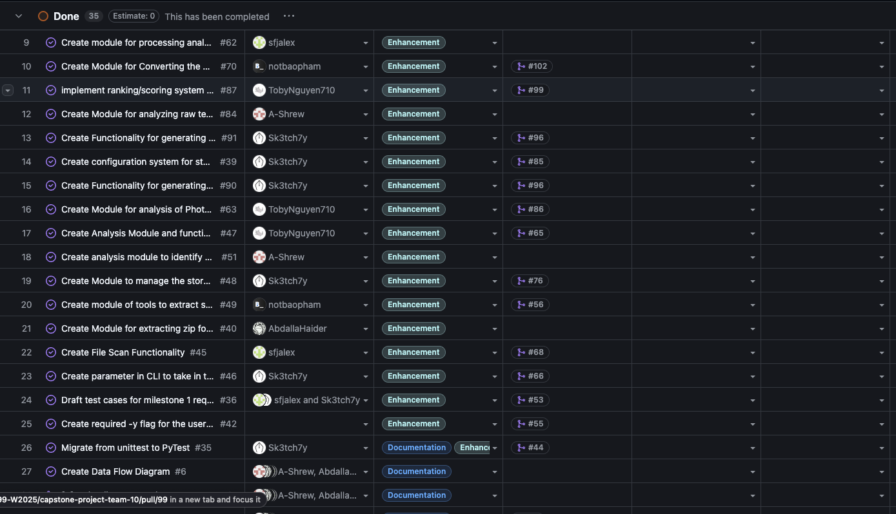
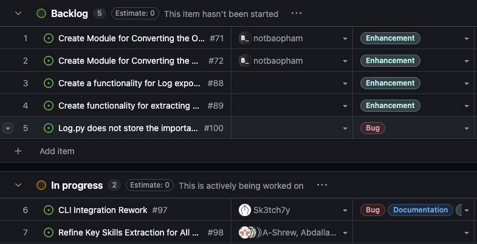
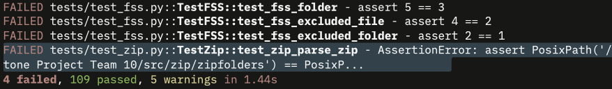

# Sprint for 11/03/25 -> 11/09/25

## Milestone Goals

Completed:
https://github.com/COSC-499-W2025/capstone-project-team-10/issues/62 - Create module for processing analysis results into projects
https://github.com/COSC-499-W2025/capstone-project-team-10/issues/61 - Create functionality for a delta scan of previous results.
https://github.com/COSC-499-W2025/capstone-project-team-10/issues/84 - Create Module for analyzing raw text blocks
https://github.com/COSC-499-W2025/capstone-project-team-10/issues/70 - Create Module for Converting the Output into a JSON file
https://github.com/COSC-499-W2025/capstone-project-team-10/issues/87 - implement ranking/scoring system for projects analized by the File Analysis Service
https://github.com/COSC-499-W2025/capstone-project-team-10/issues/90 - Create Functionality for generating Resume Items from a scan log
https://github.com/COSC-499-W2025/capstone-project-team-10/issues/91 - Create Functionality for generating Web Portfolio Items from a scan log

## Burnup Chart

## Completed Tasks

## In-Progress

## Test Report
All expected tests pass, with the exception of the FSS which is currently being refactored to fit our new functionality. 
This results in failing tests on MacOS

The new tests that vary from our current were all logged in their relevent PR's

## Reflection / Additional Context

This week was very successful, with significant progress made on several core modules and features. The team completed key milestones, including modules for processing and analyzing results, delta scanning, and generating both resume and web portfolio items. Our burnup and completion charts reflect this strong momentum.

Looking ahead, our focus will shift toward making the product more usable and integrated. We plan to enhance the user experience and ensure all components work seamlessly together. Additionally, we will prioritize comprehensive testing, especially as we refactor the FSS and address platform-specific issues on MacOS. This will help us deliver a robust and reliable product as we approach the final stages of Milestone 1 development. Bug fixes and rewrites of problematic modules remain our priority. 