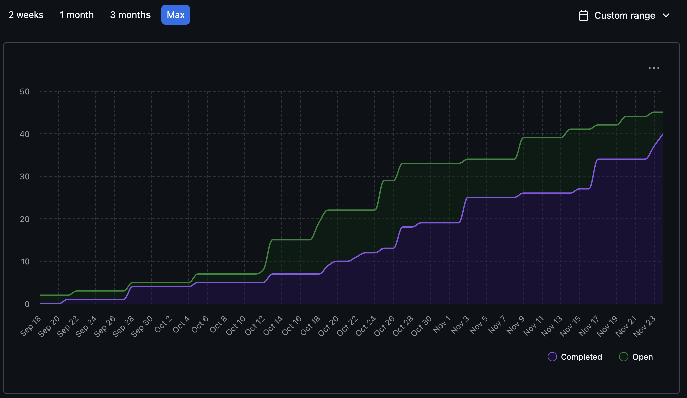
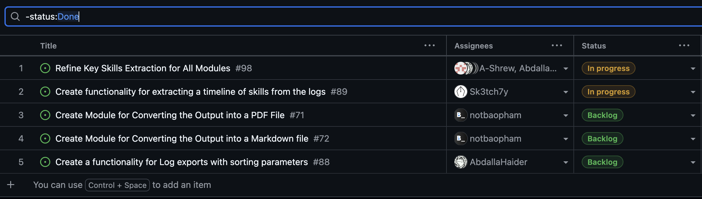
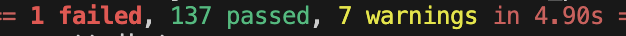

# Sprint for 11/17/25 -> 11/23/25

## Milestone Goals

Completed:
https://github.com/COSC-499-W2025/capstone-project-team-10/issues/98 - Refine Key Skills Extraction for All Modules
https://github.com/COSC-499-W2025/capstone-project-team-10/issues/110 - FAS PDF Analysis library causes incorrect text being decoded from files
https://github.com/COSC-499-W2025/capstone-project-team-10/issues/61 - Create functionality for a delta scan of previous results.
https://github.com/COSC-499-W2025/capstone-project-team-10/issues/71 - Create Module for Converting the Output into a PDF File
https://github.com/COSC-499-W2025/capstone-project-team-10/issues/72 - Create Module for Converting the Output into a Markdown file
https://github.com/COSC-499-W2025/capstone-project-team-10/issues/97 - CLI Integration Rework
https://github.com/COSC-499-W2025/capstone-project-team-10/issues/100 - Log.py does not store the importance of a FileAnalysis Object
https://github.com/COSC-499-W2025/capstone-project-team-10/issues/105 - FSS scans hidden files and folders
https://github.com/COSC-499-W2025/capstone-project-team-10/issues/106 - zip_app.py breaks when running from an executable

## Burnup Chart

## Completed Tasks

## In-Progress

## Test Report
All expected tests pass, with the exception of a single FSS test, this will be looked into next week as on the individual branch it passed, but upon merging it failed.

The new test specifics can be found in their relative PRs.

## Reflection / Additional Context

This week was excellent, we have made signifigant strides to accomplish what we have set out to and have gotten down a large majority of all analysis refinement this week. We now have a functioning cache, refined analysis on docx, rtf, odt, excel, json, and refactoring for better FSS, PDF reading, logging, and CLI usage. This can be seen within the sharp rise in our burn up chart and completed to uncompleted ratio for milestone one.

Going into the next sprint we will be focusing on tying it all together. We have started on doing this already but now we will integrate the last few modules together to be able to present a functioning demo for the milestone delivery. Our priority remains on producing robust tests as well as refactoring any problematic code we find from further developement.