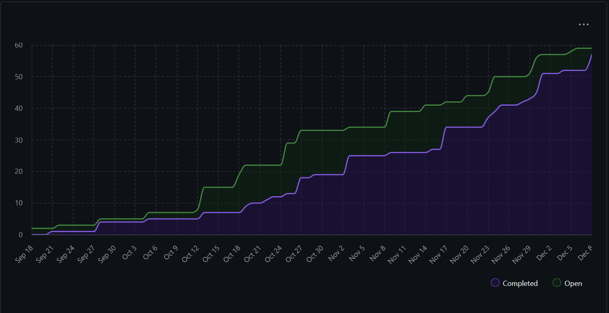
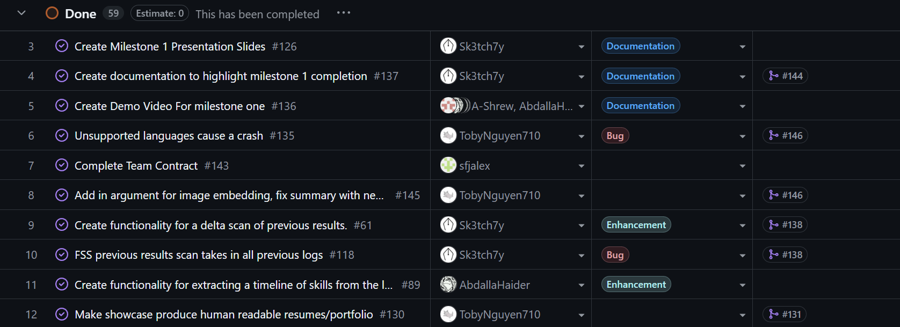
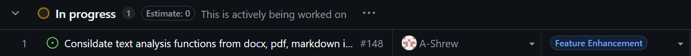
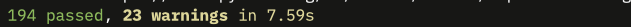

# Sprint for 11/17/25 -> 11/23/25

## Milestone Goals

https://github.com/COSC-499-W2025/capstone-project-team-10/issues/151 - Added Team Contract
https://github.com/COSC-499-W2025/capstone-project-team-10/issues/150 - Cli invalid parse bug fix  
https://github.com/COSC-499-W2025/capstone-project-team-10/issues/147 - Integrate sort to cli  
https://github.com/COSC-499-W2025/capstone-project-team-10/issues/146 - Fix text summary
https://github.com/COSC-499-W2025/capstone-project-team-10/issues/144 - Update readme with setup steps for milestone 1  
https://github.com/COSC-499-W2025/capstone-project-team-10/issues/129 - Integrate text analysis with pdf extraction

## Burnup Chart

## Completed Tasks

## In-Progress

## Test Report
All tests pass

The new test specifics can be found in their relative PRs.

## Reflection / Additional Context

The team finished work for milestone 1 including our group presentation which went very well. We completed the demo video, team contract, and finished our work to turn in our milestone 1 deliverable. Members completed their self reflections and as a group we discussed what went well and what we can improve on for the next milestone. For the code side of things this week the group fixed bugs with the cli, added sorting to our log system, added flags to the cli, improved out output summary, and revised the documentation to reflect the changes. 

We plan on continuing work over the holidays while also making sure to rest and get ready for the next milestone. We will draft issues for milestone 2 requirements and plan out the next part of the year.