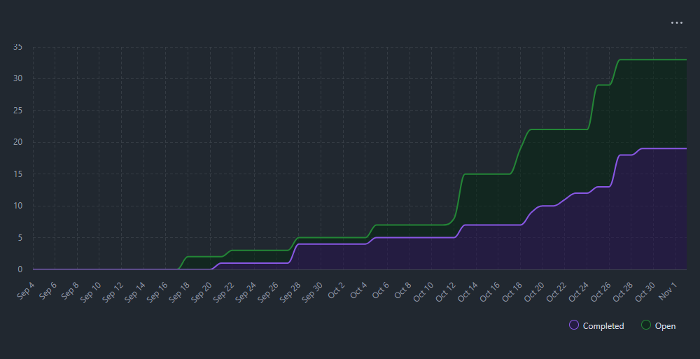
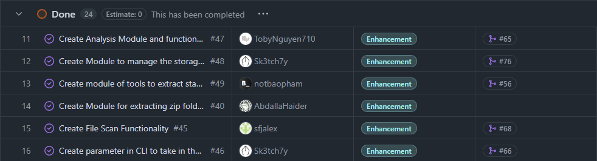
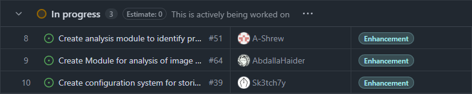

# Sprint for 10/26/25 -> 11/02/25
## Milestone Goals

Completed:
- https://github.com/COSC-499-W2025/capstone-project-team-10/issues/69 - Implement time-span filtering for the FSS
- https://github.com/COSC-499-W2025/capstone-project-team-10/issues/64 - Create Module for analysis of image formats
- https://github.com/COSC-499-W2025/capstone-project-team-10/issues/59 - Create Module for analysis of Microsoft Word files
- https://github.com/COSC-499-W2025/capstone-project-team-10/issues/58 - Create Module for analysis of Microsoft Excel files
- https://github.com/COSC-499-W2025/capstone-project-team-10/issues/51 - Create analysis module to identify programming files and extract frameworks/libraries
- https://github.com/COSC-499-W2025/capstone-project-team-10/issues/48 - Create Module to manage the storage of log output

## Burnup Chart

## Completed Tasks

## In-Progress

> Note that these are tasks that are being moved to development right before this Team Log screenshot

## Test Report

  
Initialization

    
    

  
Runnable tests

    
    
    

## Reflection / Additional Context
- Week 9 was another active week for the group. As before, every member was assigned an equal share of tasks and resolved many issues directly related to the core functionality.
- The progress will continue in this manner, focusing on resolving remaining core functionality issues and completing more of the core features listed under Milestone 1.
- Regarding the test reports, we suspect that the test errors arise from our testing library (pytest) having trouble synchronizing with the src paths when run in a global environment. Specifically, it cannot recognize the src/ directory, where the main program functionality resides (see Initialization), but it can correctly execute many tests when run individually (see Runnable Tests section above). Therefore, a team meeting will be arranged for next week to:
  - __Update standardnization__ and
  - __Refactor the tests and the testing module__ to properly recognize paths.
(An issue will be added to the Kanban board to reflect this for the upcoming team meeting.)
